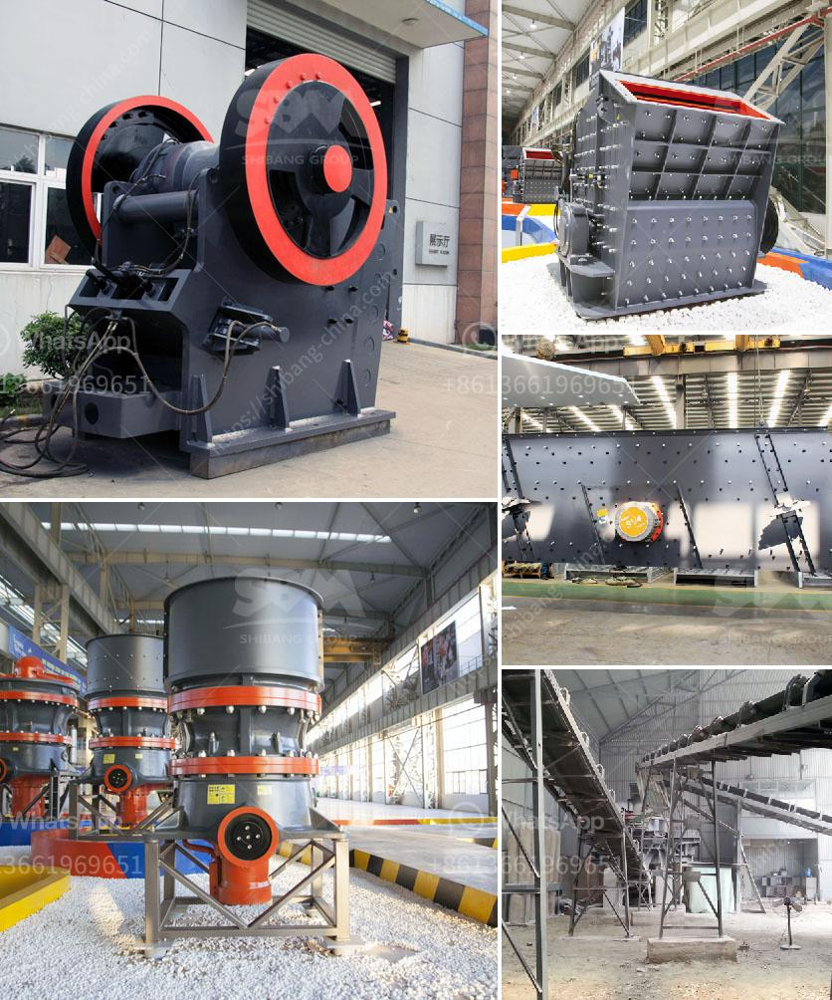

<h3>مطحنة المطرقة لتركيز السعر</h3>
تُعتبر مطحنة المطرقة أداة أساسية في صناعة التعدين ومعالجة المواد الخام. تستخدم هذه الأداة لتحطيم المواد الخام إلى حجم صغير قبل أن تدخل في عملية التركيز. تكون المطرقة المستخدمة في هذه المطاحن عادةً مصنوعة من الصلب المقوى، وقد تكون بأحجام وأوزان مختلفة حسب الاحتياجات الخاصة بعملية التركيز.

تعمل مطحنة المطرقة عن طريق تطبيق قوة الصدمة على المادة الخام عند المرور خلالها. يتم تحميل المادة في الكسارة وتدويرها عندما تدور الأسطوانة المحورية. تُرتبط المطرقة بواسطة ذراع ، وتتحرك في اتجاه دوران الأسطوانة. عندما تصطدم المادة الخام بالمطرقة، يتم تحطيمها وتقليلها إلى جزيئات أصغر.

تعتبر رؤوس المطارق الثقيلة والمساند الصلبة أحد العوامل الرئيسية التي تجعل مطحنة المطرقة قوية وفعالة. تمتاز هذه المطاحن بقدرتها على التعامل مع مجموعة متنوعة من المواد الخام بكفاءة وفي وقت قصير. ومع ذلك ، فإن حجم المطرقة وسرعة الدوران يؤثران أيضًا على كفاءة العملية. يجب أن تكون سرعة الدوران متوافقة مع حجم المطرقة ونوع المواد الخام المستخدمة.

تُستخدم مطاحن المطارق على نطاق واسع في صناعات مختلفة مثل التعدين ومعالجة المواد الغذائية والتحبيب وصناعة الكيماويات. إذ تستخدم في تحطيم المواد مثل الحبوب والفحم والخامات المعدنية وغيرها. تساعد هذه المطاحن في تقليل حجم المواد الخام وزيادة سطح التلامس المتاح لعملية التركيز أو التحبيب.

باختصار ، تعد مطاحن المطارق لتركيز السعر أداة أساسية وفعالة في صناعة التعدين ومعالجة المواد الخام. تعمل هذه المطاحن عن طريق تحطيم المواد الخام إلى جزيئات أصغر ، مما يساعد في زيادة سطح التلامس المتاح لعملية التركيز. تستخدم مطاحن المطارق في صناعات متنوعة وتلبي مجموعة متنوعة من الاحتياجات.
<h3>Contact us</h3><ul><li><strong>Whatsapp:&nbsp;<a href="https://wa.me/8613661969651">+8613661969651</a></strong></li><li><a href="https://swt.shibang-china.com/?git&amp;zhl&amp;مطحنة المطرقة لتركيز السعر"><strong>Online Service(chat now)</strong></a></li></ul><h3>Related</h3><ul><li><a href='كوماتسو بي آر كسارة للبيع.md'>كوماتسو بي آر كسارة للبيع</a></li><li><a href='مطحنة كرات صغيرة للبيع.md'>مطحنة كرات صغيرة للبيع</a></li><li><a href='مصنع معالجة التنغستن في الهند.md'>مصنع معالجة التنغستن في الهند</a></li><li><a href='مطحنة البنتونيت المستعملة من اليد الثانية.md'>مطحنة البنتونيت المستعملة من اليد الثانية</a></li><li><a href='تجار الكسارات المحمولة في جنوب أفريقيا.md'>تجار الكسارات المحمولة في جنوب أفريقيا</a></li></ul>