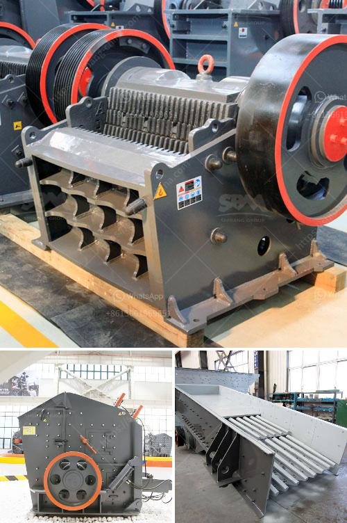

<h3>مطحنة المطرقة للجبس</h3>
تعد مطحنة المطرقة للجبس أحد الأدوات المهمة في صناعة الجبس ومعالجته. تستخدم هذه المطحنة لطحن الجبس إلى حجم معين وتحطيمه إلى جزيئات صغيرة تستخدم في صناعة المواد الإنشائية مثل الإسمنت والأسقف والديكورات الداخلية.

تتكون مطحنة المطرقة للجبس من غرفة طحن وآلية دوارة تضم مطارق تدور بسرعة عالية. عند تشغيل المطحنة، يتم تغذية الجبس في الغرفة وتتم عملية الطحن بواسطة المطارق الدوارة. تقوم المطارق بتكسير الجبس وطحنه حتى يتم الحصول على حجم الجسيمات المطلوب.

تتميز مطاحن المطرقة للجبس بعدة مزايا. أحد هذه المزايا هو قدرتها على معالجة الجبس وتحقيق الحجم المرغوب بسرعة وكفاءة عالية. بفضل التكنولوجيا المتقدمة، يمكن أن تعمل هذه المطاحن بسرعة تصل إلى آلاف الدورات في الدقيقة، مما يتيح طحن كميات كبيرة من الجبس في وقت قصير.

واحدة من أهم مزايا مطاحن المطرقة للجبس هي قدرتها على تحقيق حجم جسيمات متجانس ومتوازن. تعمل المطارق الدوارة على تكسير الجبس بطريقة متوازنة ومتساوية، مما يجعل الحصول على حجم الجسيمات المرغوب سهلاً ودقيقاً. هذا يعني أن الجبس الناتج من مطحنة المطرقة للجبس يمتاز بجودة عالية وقدرة تفوق التوقعات.

هناك أيضًا نوعان رئيسيان من مطاحن المطرقة للجبس المتاحة في الأسواق: المطاحن ذات الدوران العالمي والمطاحن ذات الدوران المحدود. تختلف هاتين النوعين من حيث طريقة الطحن وسرعة دوران المطارق، وكلاهما يتم تكييفه بحسب حجم وتركيبة الجبس المراد طحنه.

في الختام، فإن مطحنة المطرقة للجبس هي أداة مهمة في صناعة الجبس ومعالجته. تقوم هذه المطاحن بطحن الجبس وتحطيمه إلى حجم الجسيمات المرغوب، مما يسهم في صناعة المواد الإنشائية عالية الجودة. مثل الإسمنت والأسقف والديكورات الداخلية. تعتبر مطاحن المطرقة للجبس كفاعلة، سريعة وكفاءة، وهذا يجعلها خيارًا ممتازًا لمعالجة الجبس بشكل فعال واقتصادي.
<h3>Contact us</h3><ul><li><strong>Whatsapp:&nbsp;<a href="https://wa.me/8613661969651">+8613661969651</a></strong></li><li><a href="https://swt.shibang-china.com/?git&amp;zhl&amp;مطحنة المطرقة للجبس"><strong>Online Service(chat now)</strong></a></li></ul><h3>Related</h3><ul><li><a href='آلات كسارة الصخور.md'>آلات كسارة الصخور</a></li><li><a href='مصانع معالجة الذهب في الصين للبيع.md'>مصانع معالجة الذهب في الصين للبيع</a></li><li><a href='بدء عمل كسارة الجرانيت.md'>بدء عمل كسارة الجرانيت</a></li><li><a href='كسارة مخروطية في المملكة العربية السعودية.md'>كسارة مخروطية في المملكة العربية السعودية</a></li><li><a href='بيع كسارة الحجر للبيع.md'>بيع كسارة الحجر للبيع</a></li></ul>