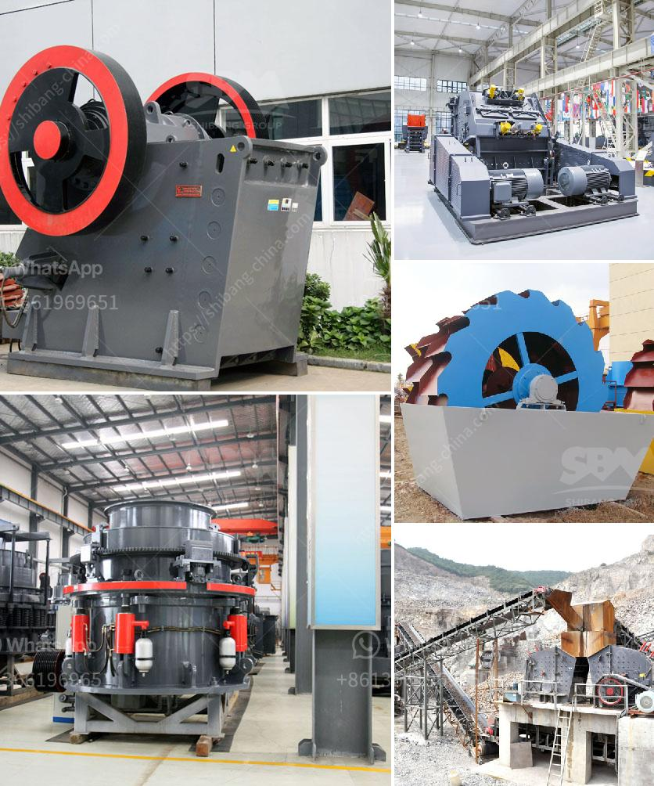

<h3>مطحنة الهامر 20 طن شبكة الشاشة</h3>
تعتبر مطحنة الهامر 20 طن بشبكة شاشة 200-400 أحد أهم وأكثر الأدوات استخدامًا في صناعة الطحين وهضم الحبوب. تعد هذه المطحنة أو آلة الهامر أداة قوية تتميز بالقدرة على سحق المواد الخام مثل الحبوب والأعلاف الحيوانية والفواكه والخضروات وغيرها بشكل فعال وسريع.

تتألف مطحنة الهامر بشكل عام من جسم رئيسي يحتوي على غرفة السحق وشاشة الفصل ومحرك كهربائي قوي. تستخدم المروحة والمطرقة لتجميع المواد وتدفعها عبر الفتحة الخاصة الموجودة على شاشة الفصل. الشاشة الموجودة بالعادة على المطحنة تساعد في تنظيم حجم الجسيمات التي يتم إنتاجها من خلال هذه العملية.

يمكن تحقيق مجموعة متنوعة من الحجم والمواصفات المطلوبة باستخدام شبكة الشاشة الملائمة. على سبيل المثال، فإن استخدام شبكة الشاشة بحجم 200 سينتج جسيمات أكبر، بينما استخدام شبكة الشاشة بحجم 400 سيعطي جسيمات أصغر. تختلف هذه الجسيمات حسب الاحتياجات المختلفة للصناعات المختلفة، مثل صناعة الطعام أو الأعلاف الحيوانية.

1- قدرة إنتاجية عالية: تعد مطحنة الهامر 20 طن بشبكة شاشة 200-400 قادرة على معالجة كميات كبيرة من المواد بشكل سريع وفعال.

2- توفير الوقت والجهد: فالمطحنة قادرة على تحقيق السحق والطحن في عملية واحدة، مما يقلل من الوقت والجهد المطلوبين لإنتاج الطحين.

3- جودة المنتج النهائي: يمكن ضبط حجم الجسيمات باستخدام شبكة الشاشة المناسبة للحصول على جودة عالية ومتسقة للمنتج النهائي.

4- توفير التكلفة: بفضل كفاءتها العالية، فإن استخدام مطحنة الهامر يساهم في توفير التكاليف المرتبطة بإنتاج الطحين أو الأعلاف.

باختصار، فإن مطحنة الهامر 20 طن بشبكة شاشة 200-400 تعتبر أداة قوية ومفيدة في صناعة الطحين وهضم الحبوب. تساهم في زيادة الإنتاجية وتحسين جودة المنتج النهائي، بالإضافة إلى توفير التكاليف والجهد. إن استخدام هذه المطحنة المتطورة يمكن أن يكون بديلاً فعالاً وفعالًا لأعمال الطحن التقليدية، مما يساهم في تحسين العمليات الإنتاجية وتحقيق النجاح في صناعة الطحين والأعلاف الحيوانية.
<h3>Contact us</h3><ul><li><strong>Whatsapp:&nbsp;<a href="https://wa.me/8613661969651">+8613661969651</a></strong></li><li><a href="https://swt.shibang-china.com/?git&amp;zhl&amp;مطحنة الهامر 20 طن شبكة الشاشة"><strong>Online Service(chat now)</strong></a></li></ul><h3>Related</h3><ul><li><a href='مصنع معالجة الإسمنت.md'>مصنع معالجة الإسمنت</a></li><li><a href='مطاحن تلك جنوب أفريقيا.md'>مطاحن تلك جنوب أفريقيا</a></li><li><a href='مصنع أسمنت للبيع في ألمانيا.md'>مصنع أسمنت للبيع في ألمانيا</a></li><li><a href='أسعار كسارة الحجر في إندونيسيا.md'>أسعار كسارة الحجر في إندونيسيا</a></li><li><a href='مصنع تكسير السلاغ في تاميل نادو.md'>مصنع تكسير السلاغ في تاميل نادو</a></li></ul>