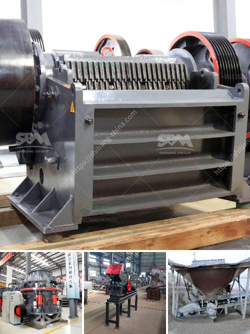

<h3>مطحنة الهامر في جوهانسبرغ</h3>
تعتبر مطحنة الهامر في جوهانسبرغ واحدة من أكثر المعالم الشهيرة في المدينة. تقع المطحنة في حي الفنون النشط والمزدهر ، وتشتهر بتقديم مجموعة متنوعة من الفعاليات والعروض الفنية المميزة. تأسست في عام 1980 ، وتعد المطحنة من أوائل الفضاءات الثقافية التي ظهرت في جوهانسبرغ.

تم تسمية المطحنة باسم مصنع الهامر الذي كان يستخدم سابقًا في عمليات التصنيع المحلية. وهكذا ، تم تحويل هذا المكان القديم الذي كان مهجورًا إلى واحدة من أكثر الأماكن تميزًا ونشاطًا في المدينة. يتميز التصميم المعماري للمبنى بالطابع الصناعي القديم ، الذي يعكس تاريخها الثقافي والاجتماعي.

تقدم مطحنة الهامر مجموعة واسعة من الفعاليات والمعارض الفنية ، بدءًا من المسرح والموسيقى والرقص ، وصولاً إلى العروض التفاعلية والمعارض الفنية الحديثة. يتم اختيار الفعاليات بعناية لضمان تقديم تجارب فنية غير تقليدية وملهمة للجمهور.

توفر المطحنة كذلك منصات للفنانين المحليين والعالميين لعرض أعمالهم الفنية والموسيقية والمسرحية. يتم تعزيز التعاون الثقافي والفني ، بين الفنانين والمهنيين الشباب وعشاق الفن.

تجربة زيارة مطحنة الهامر تعد أحدى التجارب الرائعة في جوهانسبرغ. يمكن للزوار استمتاع بمشاهدة العروض المسرحية المبتكرة أو الاستماع إلى الموسيقى المبتكرة على المسرح الرئيسي المرتفع. بالإضافة إلى ذلك ، يتم تقديم عروض فنية وعديدة في صالات متعددة الأغراض ، تستضيف معارض فنية جديدة ومثيرة باستمرار.

إن مطحنة الهامر في جوهانسبرغ تجسد حقًا روح المدينة النابضة بالحياة والثقافة الحديثة. تعمل كجسر بين الفن والمجتمع ، وتعزز التفاعل والتفاهم الثقافي بين الناس من خلفيات مختلفة. بالإضافة إلى ذلك ، تعطي الفرصة للفنانين المحليين للتعرض وتطوير مواهبهم ومهاراتهم.

في الختام ، فإن مطحنة الهامر في جوهانسبرغ تمثل مثالًا ملهمًا عن التركيز على الثقافة والفن في تطور المدينة. تعد هذه المكان متنوع ومليء بالحيوية ، ويشكل واجهة مثالية للابتكار والإبداع. إذا كنت تزور جوهانسبرغ ، يجب عليك أن تخطط لزيارة هذا الفضاء الثقافي الرائع لتجربة فريدة وممتعة.
<h3>Contact us</h3><ul><li><strong>Whatsapp:&nbsp;<a href="https://wa.me/8613661969651">+8613661969651</a></strong></li><li><a href="https://swt.shibang-china.com/?git&amp;zhl&amp;مطحنة الهامر في جوهانسبرغ"><strong>Online Service(chat now)</strong></a></li></ul><h3>Related</h3><ul><li><a href='تصميم مطحنة الهامر.md'>تصميم مطحنة الهامر</a></li><li><a href='معدات طحن صناعية وأسعار معدات الطحن.md'>معدات طحن صناعية وأسعار معدات الطحن</a></li><li><a href='كسارة الصخور 250 طن في الساعة.md'>كسارة الصخور 250 طن في الساعة</a></li><li><a href='سعر كسارة محمولة.md'>سعر كسارة محمولة</a></li><li><a href='عصابات كسارة الحجر في جامايكا.md'>عصابات كسارة الحجر في جامايكا</a></li></ul>