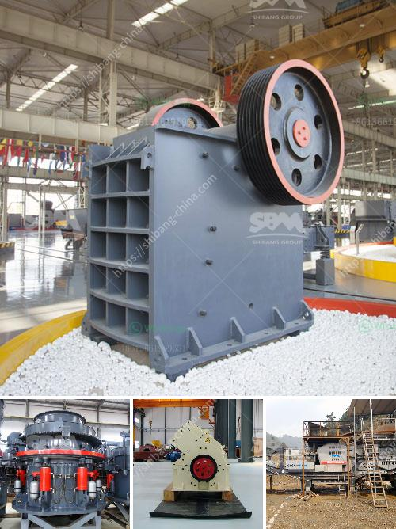

<h3>مطحنة الهامر للحبوب</h3>
تُعَدُّ مطاحن الهامر واحدة من الأدوات الأساسية في صناعة تحويل الحبوب إلى منتجات نهائية مثل الدقيق والعلف. تعمل مطاحن الهامر عن طريق استخدام قوة الهامر الميكانيكي المتكرر لتحطيم الحبوب إلى قطع صغيرة ومتجانسة. تستخدم هذه المطاحن عادةً في صناعة العلف للحيوانات أو تجهيز الحبوب لصناعة الأعلاف للطيور أو في مصانع تحويل الحبوب إلى دقيق.

تتألف مطاحن الهامر من هندسة متقدمة تتضمن محركًا كهربائيًا، ومجموعة من الهامر الموزعة على طول دوران أفقي دائري. يتم تشغيل الهامر بالطاقة الكهربائية، ويتم تحميل الحبوب في جزء المطحنة وتتعرض للضربات المتكررة من الهامر، مما يؤدي إلى تفتيتها وسحقها. يتم تصفية الحبوب المسحوقة بواسطة فتحات صغيرة في الطبقة الخارجية للمطحنة، وتمرر إلى خزان التجميع أو ما شابه ذلك.

تعتبر مطاحن الهامر فعالة لتجهيز الحبوب وتحويلها إلى منتجات نهائية لعدة أسباب. فبفضل تصميمها الفريد وقوتها التصادمية، يمكن لهذه المطاحن تحقيق تفتيت سريع وفعال للحبوب وتحويلها إلى مسحوق ناعم. وبالتالي، يمكن قليل المجهود من صنع الدقيق المرغوب به لصناعة الخبز والمعجنات والمنتجات الغذائية الأخرى.

توفر مطاحن الهامر أيضًا مرونة في عملية الطحن، حيث يمكن تعديل سرعة وطاقة الهامر لتحقيق نتائج مختلفة وتلبية احتياجات مختلفة في الإنتاج. يمكن أيضًا استخدام الهامر بأحجام وأوزان مختلفة لضمان سحق الحبوب بشكل متساوٍ ومتجانس.

علاوة على ذلك، تعد مطاحن الهامر سهلة الصيانة والتشغيل. بغض النظر عن حجم المطحنة، تتسم بالبساطة في التصميم وعدم الاعتماد على أجزاء معقدة. بالإضافة إلى ذلك، تتكون المطاحن من مواد متينة وقوية للتحمل والاستخدام الطويل.

لخص، تُعَد مطاحن الهامر للحبوب واحدة من الأدوات الأساسية في صناعة تحويل الحبوب إلى منتجات نهائية. تمتاز بتفتيت سريع وفعال للحبوب وتوفر مرونة في الإنتاج وسهولة الصيانة والتشغيل. تلعب هذه المطاحن دورًا حيويًا في تلبية احتياجات صناعة العلف والمواد الغذائية، وتساهم في تحسين وتطوير هذه الصناعات.
<h3>Contact us</h3><ul><li><strong>Whatsapp:&nbsp;<a href="https://wa.me/8613661969651">+8613661969651</a></strong></li><li><a href="https://swt.shibang-china.com/?git&amp;zhl&amp;مطحنة الهامر للحبوب"><strong>Online Service(chat now)</strong></a></li></ul><h3>Related</h3><ul><li><a href='آلة سحق مكعب الخرسانة.md'>آلة سحق مكعب الخرسانة</a></li><li><a href='أرض الجرانيت الأسود للبيع في تاميل نادو.md'>أرض الجرانيت الأسود للبيع في تاميل نادو</a></li><li><a href='كسارات مخروط هيدروليكية.md'>كسارات مخروط هيدروليكية</a></li><li><a href='خدمات آلة التكسير.md'>خدمات آلة التكسير</a></li><li><a href='إنتاج مصنع الإسمنت في الجزائر.md'>إنتاج مصنع الإسمنت في الجزائر</a></li></ul>