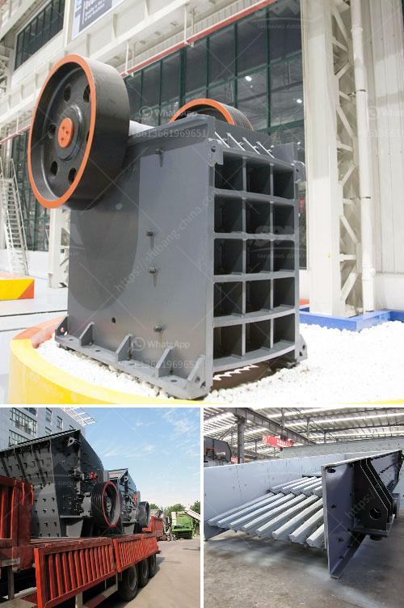

<h3>مطحنة الهامر من إيديبيسا</h3>
تعد مطحنة الهامر من إيديبيسا واحدة من أهم الأدوات المستخدمة في صناعة الطحن وتحطيم المواد الصلبة. تتمتع هذه المطاحن بتصميم وتقنية فريدة من نوعها، مما يجعلها مثالية للاستخدام في العديد من الصناعات المختلفة بما في ذلك صناعة الأغذية والمشروبات والمواد الكيميائية والمواد البلاستيكية وغيرها.

تتكون مطحنة الهامر من إيديبيسا من ثنايا كبيرة ذات شفرات حادة معلقة على ذراعات دوارة في غرفة الطحن. تعمل هذه الشفرات على تحطيم المواد التي يتم تغذيتها داخل المطحنة، سواء كانت جافة أو رطبة أو حتى لزجة. تدور الذراعات بسرعة عالية، وبفضل القوة العالية المتولدة، تتمكن من تحطيم المواد بشكل كامل وتفتيتها إلى حجم صغير.

تعد مطاحن الهامر من إيديبيسا مثالية لتحطيم المواد الخام وتقطيعها إلى قطع صغيرة بحجم معين، مما يسهل عملية معالجتها واستخدامها في الصناعات المختلفة. فعلى سبيل المثال، يمكن استخدام هذه المطاحن في صناعة الأعلاف الحيوانية، حيث تتمكن من تحطيم الحبوب والمكونات الأخرى إلى قطع صغيرة منتظمة الحجم. تستخدم أيضًا في صناعة المواد الكيميائية، حيث يتم تحطيم المكونات الكيميائية الصلبة المتينة قبل استخدامها في عمليات الإنتاج.

توفر مطاحن الهامر من إيديبيسا العديد من المزايا، بما في ذلك الكفاءة العالية في الأداء والتشغيل السلس والصيانة السهلة. يمكن ضبط حجم المخرجات بسهولة باستخدام شبكات مختلفة، مما يتيح للمستخدمين الحصول على الحجم المطلوب للمنتج النهائي. كما أنها آمنة في الاستخدام، وتتميز بالمتانة والمتانة العالية، مما يجعلها قادرة على التعامل مع المواد القاسية والصعبة.

باختصار، تعتبر مطاحن الهامر من إيديبيسا أدوات قوية وفعالة في عملية الطحن وتحطيم المواد. تجمع بين الدقة والكفاءة والمتانة، مما يجعلها الاختيار الأمثل للعديد من الصناعات المختلفة. إذا كنت تبحث عن مطحنة تلبي متطلباتك الخاصة في عملية الطحن، فإن مطاحن الهامر من إيديبيسا هي الخيار الأمثل لك.
<h3>Contact us</h3><ul><li><strong>Whatsapp:&nbsp;<a href="https://wa.me/8613661969651">+8613661969651</a></strong></li><li><a href="https://swt.shibang-china.com/?git&amp;zhl&amp;مطحنة الهامر من إيديبيسا"><strong>Online Service(chat now)</strong></a></li></ul><h3>Related</h3><ul><li><a href='مصنع الكرة لتكسير السليكات.md'>مصنع الكرة لتكسير السليكات</a></li><li><a href='سعر مصنع التكسير.md'>سعر مصنع التكسير</a></li><li><a href='سعر كسارة الفك في جنوب أفريقيا.md'>سعر كسارة الفك في جنوب أفريقيا</a></li><li><a href='آلة كسارة الرمل السيليكا المصنعة.md'>آلة كسارة الرمل السيليكا المصنعة</a></li><li><a href='مطحنة طحن رايموند في باكستان.md'>مطحنة طحن رايموند في باكستان</a></li></ul>