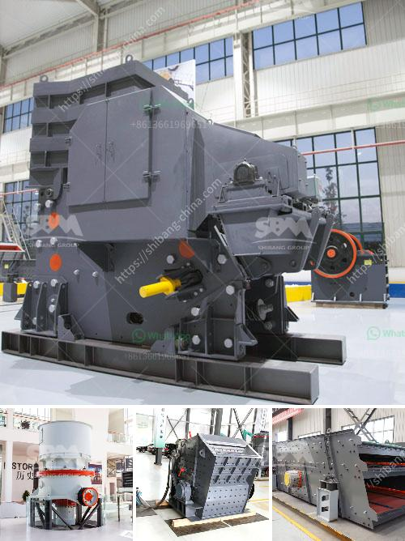

<h3>مطحنة تشانغفا للطحن</h3>
تعتبر مطحنة تشانغفا للطحن واحدة من أكبر وأقدم المطاحن في الصين. تأسست في عام 1952 ومقرها في مقاطعة هوبي. تشتهر المطحنة بتصنيع منتجات الدقيق عالية الجودة والمتنوعة.

تعتبر تشانغفا للطحن واحدة من رواد صناعة الطحين في الصين وتمتلك خبرة تزيد عن 60 عامًا في هذا المجال. تعتمد المطحنة على أحدث التقنيات والمعدات الحديثة لضمان جودة المنتجات. تحظى المطحنة بسمعة طيبة في السوق بفضل منتجاتها عالية الجودة وتقديمها بأسعار تنافسية.

تنتج مطحنة تشانغفا للطحن مجموعة متنوعة من منتجات الدقيق تشمل القمح الأبيض والقمح الكامل والشعير والذرة الصفراء والأرز والشوفان والشعيرية وغيرها. يتم استخدام هذه المنتجات في صناعات متعددة مثل الخبز والمخابز والبسكويت والكعك والمعكرونة والأطعمة المجمدة والسكريات.

تضم مطحنة تشانغفا للطحن فريقًا ذا خبرة ومهارة عالية في إدارة وتشغيل المطاحن. يتمتعون بمعرفة عميقة في عملية الطحن والجودة والسلامة الغذائية والتحكم في الجودة. تضمن المطحنة استيفاء جميع معايير السلامة الصحية والبيئية وفقًا للمعايير الوطنية والدولية.

تشتهر مطحنة تشانغفا للطحن بالتزامها بتحقيق رضا العملاء. تسعى المطحنة جاهدة لتلبية متطلبات العملاء وتوفير منتجات ذات جودة عالية وخدمات ممتازة. تعتمد المطحنة على الابتكار المستمر وتطوير التكنولوجيا لتلبية الطلب المتزايد على منتجات الدقيق ذات الجودة العالية.

في الختام، تعتبر مطحنة تشانغفا للطحن واحدة من أبرز المطاحن في الصين. تتميز بتقديم منتجات الدقيق عالية الجودة والمتنوعة، وتلتزم بتحقيق رضا العملاء وتلبية متطلباتهم. بفضل تاريخها الطويل وخبرتها الغنية، تحظى المطحنة بسمعة طيبة في السوق المحلية والعالمية.
<h3>Contact us</h3><ul><li><strong>Whatsapp:&nbsp;<a href="https://wa.me/8613661969651">+8613661969651</a></strong></li><li><a href="https://swt.shibang-china.com/?git&amp;zhl&amp;مطحنة تشانغفا للطحن"><strong>Online Service(chat now)</strong></a></li></ul><h3>Related</h3><ul><li><a href='تدفق معالجة البنتونيت.md'>تدفق معالجة البنتونيت</a></li><li><a href='أسعار معدات التكسير والفحص جنوب أفريقيا.md'>أسعار معدات التكسير والفحص جنوب أفريقيا</a></li><li><a href='مصنع إعادة تدوير الخرسانة للبيع.md'>مصنع إعادة تدوير الخرسانة للبيع</a></li><li><a href='الجيوكيمياء التطبيقية لمعالجة اللميكا.md'>الجيوكيمياء التطبيقية لمعالجة اللميكا</a></li><li><a href='أسعار مطاحن الكرة الاسمنت.md'>أسعار مطاحن الكرة الاسمنت</a></li></ul>