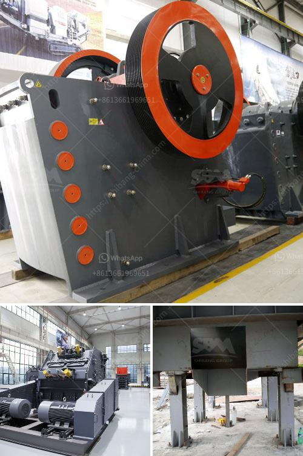

<h3>مطحنة تعدين</h3>
يُعد قطاع التعدين من أبرز القطاعات الاقتصادية التي تلعب دورًا حاسمًا في توفير الموارد الطبيعية والمعادن الهامة التي تلبي احتياجات الصناعة والبنية التحتية والاقتصاد العالمي بشكل عام. ومن بين المعدات الأساسية المستخدمة في عمليات التعدين تلك المعدات المتطورة المستخدمة في مطاحن التعدين.

تُعتبر مطاحن التعدين من أهم الوحدات التكنولوجية في صناعة التعدين، حيث تقوم بطحن الخامات المستخرجة من المناجم وتحويلها إلى جسيمات صغيرة قابلة للتصفية والترشيح. وتعتمد فعالية أي عملية تعدين بنجاح على جودة وكفاءة هذه المطاحن.

تتكون مطاحن التعدين من جزأين رئيسيين: دوران الطاحونة ونظام التشغيل. يعتبر نظام دوران الطاحونة المحرك الأساسي الذي يؤثر في عملية طحن وتكسير الخامات المعدنية. ويضمن الضغط والاحتكاك الصحيحين للخامات لتحقيق أعلى نسب التحطيم والتفتيت. بينما يضمن نظام التشغيل الجودة والكفاءة في تحميل الخامات وفرزها وتصفيتها للحصول على خام نهائي يتناسب مع احتياجات السوق.

جميع مكونات مطحنة التعدين تعمل بتناغم تام لضمان الحصول على أفضل نتيجة في عملية التعدين. ويصمم الخبراء مطاحن التعدين بدقة وجودة عالية لتلبية احتياجات الصناعة التعدينية المتطلبة.

تأتي مطاحن التعدين بأحجام وقدرات مختلفة، حيث يتم تحديدها بناءً على نوع المادة الخام والتركيب الكيميائي والحجم والكثافة المطلوبة للخام المنتج. كما يتم تصميمها بطريقة سهلة الصيانة لضمان تشغيل مستمر وعالي الكفاءة.

في الختام، تعد مطاحن التعدين من العوامل الأساسية والحاسمة في صناعة التعدين. فهي تلعب دورًا بارزًا في تحويل الخامات المعدنية إلى منتج قابل للاستخدام واقتصاديًا. وبفضل التطور التكنولوجي المستمر، يتم تحسين مطاحن التعدين باستمرار لتلبية احتياجات ومتطلبات صناعة التعدين الحديثة.
<h3>Contact us</h3><ul><li><strong>Whatsapp:&nbsp;<a href="https://wa.me/8613661969651">+8613661969651</a></strong></li><li><a href="https://swt.shibang-china.com/?git&amp;zhl&amp;مطحنة تعدين"><strong>Online Service(chat now)</strong></a></li></ul><h3>Related</h3><ul><li><a href='سعر كسارة الحصى في رانشي.md'>سعر كسارة الحصى في رانشي</a></li><li><a href='كسارة فك محمولة.md'>كسارة فك محمولة</a></li><li><a href='مطاحن الكرة للتعدين.md'>مطاحن الكرة للتعدين</a></li><li><a href='مطحنة طحن عمودية.md'>مطحنة طحن عمودية</a></li><li><a href='أنا أبحث عن كسارة في ماليزيا.md'>أنا أبحث عن كسارة في ماليزيا</a></li></ul>