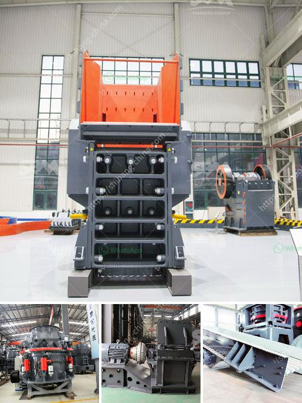

<h3>مطحنة حجر نيجيريا</h3>
تعتبر مطاحن الحجر في نيجيريا من أقدم وأهم المعالم الصناعية في البلاد. تاريخها يعود إلى عدة قرون، حيث كانت تستخدم لطحن الحبوب والغلال لإنتاج الدقيق والعجينة. وعلى مر العصور، تطورت هذه المطاحن لتصبح أكثر كفاءة وتلبي احتياجات السكان والمزارعين في المناطق القريبة.

كانت الطحنة الأولى في نيجيريا تعود إلى القرن السادس عشر، حيث تم استيرادها من أوروبا. ومنذ ذلك الحين، بدأ بناء مطاحن أخرى في مناطق مختلفة من البلاد. ومع مرور الزمن، أصبحت مطاحن الحجر أكثر انتشارًا في القرى والبلدات والمدن.

تعد مطاحن الحجر في نيجيريا من أهم المصادر الرئيسية لإنتاج الدقيق. تحتوي معظم هذه المطاحن على جهاز طحن يعمل بنظام الحجر المائي، حيث يتم استخدام حجرين لطحن الحبوب. يتم تدوير الحجرين على بعضهما البعض بفعل القوة المائية المستخدمة، وبذلك يتم تحويل الحبوب إلى دقيق.

مطاحن الحجر النيجيرية استخدمت لسنوات طويلة في تلبية احتياجات السكان المحليين. ومع ذلك، مع التقدم التكنولوجي وتطور الصناعة الغذائية، بدأ استخدام الطاحونة الكهربائية في البلاد في العقود الأخيرة. وبالتالي، بدأت مطاحن الحجر في نيجيريا في التراجع تدريجيًا وتكبدها خسائر اقتصادية.

على الرغم من ذلك، ما زالت بعض مطاحن الحجر في نيجيريا تعمل حتى اليوم. وتلعب دورًا هامًا في إنتاج الدقيق المحلي وتلبية احتياجات السكان في المناطق النائية والقروية. وتحتفظ هذه المطاحن بقيمة ثقافية وتاريخية كبيرة في البلاد.

بصرف النظر عن ذلك، فإن هناك جهود مستمرة لتعزيز صناعة الدقيق في نيجيريا وتحسين التكنولوجيا المستخدمة في عمليات الطحن. وتشمل هذه الجهود تطوير مطاحن حديثة وفعالة تستخدم طرق طحن مبتكرة وتكنولوجيا حديثة.

باختصار، تعتبر مطاحن الحجر في نيجيريا جزءًا أساسيًا من التراث الصناعي والثقافي للبلاد. تأسست قرونًا مضت، وتواجه اليوم تحديات من التكنولوجيا الحديثة، ومع ذلك فإنها ما زالت تلعب دورًا حيويًا في تلبية احتياجات السكان المحليين والمزارعين في نيجيريا.
<h3>Contact us</h3><ul><li><strong>Whatsapp:&nbsp;<a href="https://wa.me/8613661969651">+8613661969651</a></strong></li><li><a href="https://swt.shibang-china.com/?git&amp;zhl&amp;مطحنة حجر نيجيريا"><strong>Online Service(chat now)</strong></a></li></ul><h3>Related</h3><ul><li><a href='مصانع فحص الركام.md'>مصانع فحص الركام</a></li><li><a href='آلة طحن الكرات بتقنية ألمانية.md'>آلة طحن الكرات بتقنية ألمانية</a></li><li><a href='آلة مطحنة الأسطوانة في فرنسا.md'>آلة مطحنة الأسطوانة في فرنسا</a></li><li><a href='سعر آلة الكسارة في سريلانكا.md'>سعر آلة الكسارة في سريلانكا</a></li><li><a href='كسارات مسحوق التلك.md'>كسارات مسحوق التلك</a></li></ul>