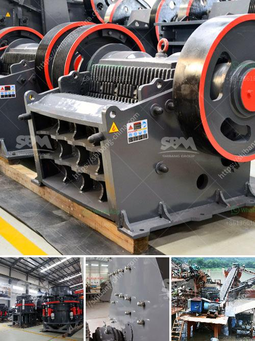

<h3>مطحنة رايموند العمودية</h3>
مطحنة رايموند العمودية أداة تستخدم في صناعة الطحن والتكسير. تعتبر مطحنة رايموند العمودية من أكثر المعدات استخداماً في صناعة تجهيز المعادن، والمواد الكيميائية، وصناعة مواد البناء، والطحن الكاولين، والصهر الزجاجي.

تتميز مطحنة رايموند العمودية بتصميمها المثالي وهيكلها القوي. تم تصميمها لتلبية سوق الطحن عالي الجودة والطلب المتزايد على نسب الرقة بالإضافة إلى الاهتمام بحماية البيئة وتوفير مصادر الطاقة. يعمل نظام التحكم التلقائي في المطحنة على ضمان القوة العالية والحرارة المنخفضة، ويمكن أن يعمل بسلاسة لفترة طويلة دون توقف.

تشتمل المطحنة العمودية على العديد من الأجزاء المهمة، مثل الجهاز المغذي المركزي، والجهاز المحلق بالكابل، والجهاز الناقل، والفحص الأوتوماتيكي للشاشة، ونظام التشحيم الأوتوماتيكي. تعتمد عملية الطحن على تغذية المواد الخام عبر الجهاز المغذي المركزي إلى الوحدة الطحنية حيث يتم طحن المواد بواسطة الأسطوانة والحلقة المحلقة. يتم التحكم في حجم الجسيمات وفقًا للحاجة باستخدام الشاشة التي تغربل الجسيمات الكبيرة.

مزايا مطحنة رايموند العمودية واضحة. فهي توفر كفاءة عالية في عملية الطحن وتضمن جودة عالية للمنتج النهائي. بالإضافة إلى ذلك، فإنها تتميز بسهولة التشغيل والصيانة والتنظيف. يعتبر تصميم الهيكل الرأسي للمطحنة ميزة فريدة لها، حيث يتيح ذلك تركيبها بشكل مريح في المساحات الضيقة. كما تعتبر المطحنة رايموند العمودية موثوقة وتوفر أداءً استثنائيًا لسنوات عديدة.

باختصار، تُعد مطحنة رايموند العمودية أداة هامة في صناعة الطحن والتكسير. فهي توفر كفاءة عالية، وجودة ممتازة للمنتج، وتصميم قوي وموثوق. تُعد مطحنة رايموند العمودية حلاً مثاليًا للشركات الصناعية التي تبحث عن أداء متميز وموثوقية في عملية الطحن.
<h3>Contact us</h3><ul><li><strong>Whatsapp:&nbsp;<a href="https://wa.me/8613661969651">+8613661969651</a></strong></li><li><a href="https://swt.shibang-china.com/?git&amp;zhl&amp;مطحنة رايموند العمودية"><strong>Online Service(chat now)</strong></a></li></ul><h3>Related</h3><ul><li><a href='سعر آلة الكسارة في سريلانكا.md'>سعر آلة الكسارة في سريلانكا</a></li><li><a href='مصانع محمولة للبيع في جنوب أفريقيا.md'>مصانع محمولة للبيع في جنوب أفريقيا</a></li><li><a href='تكلفة مجفف الرمال في ولاية كيرالا.md'>تكلفة مجفف الرمال في ولاية كيرالا</a></li><li><a href='مصانع المعالجة في الصين للحجر الجيري.md'>مصانع المعالجة في الصين للحجر الجيري</a></li><li><a href='معدات مستخدمة في تعدين الفحم.md'>معدات مستخدمة في تعدين الفحم</a></li></ul>