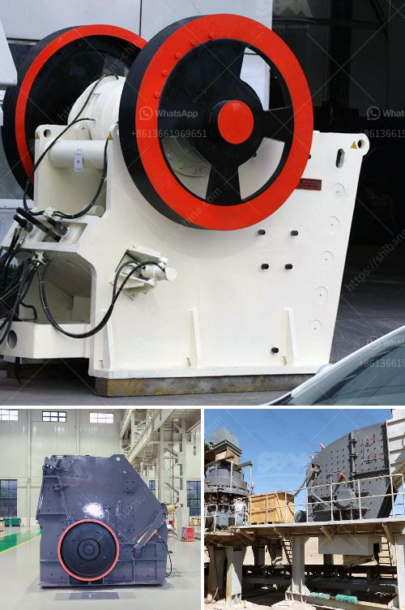

<h3>مطحنة رايموند بخمس أسطوانات لوحدة الطحن</h3>
تُعتبر مطحنة رايموند بخمس أسطوانات وحدة طحن فعالة يتم استخدامها في عمليات تكسير المواد الخام وتحويلها إلى مسحوق ناعم يمكن استخدامه في صناعات متنوعة. تتميز هذه المطحنة بأداء فائق وجودة عالية، مما يجعلها اختيارًا مناسبًا للشركات والمنشآت التي تحتاج إلى طحن الأعشاب والمعادن والمواد الصلبة الأخرى.

تعمل مطحنة رايموند بخمس أسطوانات بنظام ضغط الهواء، وتتكون من خمس أسطوانات تعمل على طحن المواد الخام بواسطة الضغط والاحتكاك المستمر. تضمن هذه التكنولوجيا المتقدمة معالجة سريعة وكفاءة عالية للمواد، مما يعني زيادة في الإنتاجية وتوفيرًا في الوقت والطاقة.

تتميز مطحنة رايموند بخمس أسطوانات بالعديد من الفوائد. أولاً، توفر هذه المطحنة قدرة على طحن مجموعة واسعة من المواد بغض النظر عن صلابتها. فهي تستطيع طحن المواد الناعمة والمتوسطة والصلبة بكفاءة عالية. كما تتيح هذه المطحنة إمكانية التحكم في حجم الجسيمات المطحونة، وبالتالي تلبية متطلبات الإنتاج المحددة.

بالإضافة إلى ذلك، تُعدُ مطحنة رايموند بخمس أسطوانات قابلة للتكيف وسهلة الاستخدام. يتم التحكم في عملية الطحن بسهولة من خلال ضبط الضغط وسرعة الأسطوانات وزمن الطحن وغيرها من العوامل التي تؤثر على أداء المطحنة. بالإضافة إلى ذلك، يمكن توصيل المطحنة بأنواع مختلفة من المنظومات الأخرى في خطوط إنتاج المواد الخام لزيادة كفاءة العمليات.

تمثل مطاحن رايموند بخمس أسطوانات حلاً مثاليًا للشركات التي تحتاج إلى طحن كميات كبيرة من المواد الخام. فهي توفر أداءً متفوقًا وجودة عالية وكفاءة كبيرة في العمليات. تُعتبر مطاحن رايموند باختلافها ذات الأسطوانات الخمسة خيارًا مثاليًا للمناجم والمصانع التي تعمل في صناعات مثل البناء والتعدين والكيميائية وغيرها.
<h3>Contact us</h3><ul><li><strong>Whatsapp:&nbsp;<a href="https://wa.me/8613661969651">+8613661969651</a></strong></li><li><a href="https://swt.shibang-china.com/?git&amp;zhl&amp;مطحنة رايموند بخمس أسطوانات لوحدة الطحن"><strong>Online Service(chat now)</strong></a></li></ul><h3>Related</h3><ul><li><a href='كسارة الحجر المحمولة.md'>كسارة الحجر المحمولة</a></li><li><a href='مصنع طحن الحجر.md'>مصنع طحن الحجر</a></li><li><a href='مصانع الكسارات للبيع في جنوب أفريقيا.md'>مصانع الكسارات للبيع في جنوب أفريقيا</a></li><li><a href='عملية تعدين الذهب.md'>عملية تعدين الذهب</a></li><li><a href='عمليات مصنع كسارة الصخور.md'>عمليات مصنع كسارة الصخور</a></li></ul>