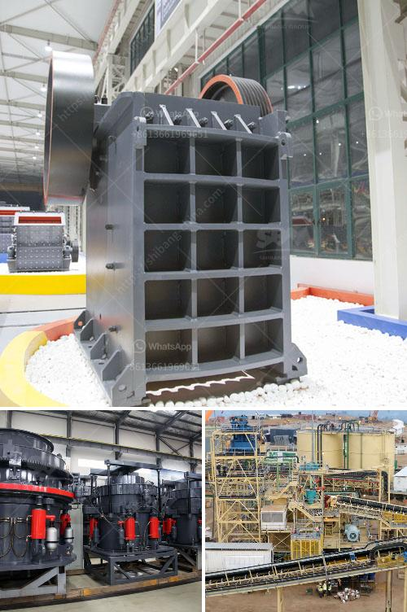

<h3>مطحنة رايموند في بورور</h3>
تعد مطحنة رايموند في بورور واحدة من المعالم الرئيسية في المدينة. تأسست هذه المطحنة في أوائل القرن التاسع عشر وأصبحت مرجعًا هامًا في صناعة الطحن.

تشتهر مطحنة رايموند بتصميمها الفريد والفعال، حيث تستخدم نظام الطحن الهوائي بالكامل. يقع المبنى الرئيسي للمطحنة على ضفاف نهر بورور، مما يوفر لها إمدادات مستدامة من المياه. يعمل النهر على توليد الطاقة اللازمة لتشغيل الآلات في المطحنة.

تعتبر مطحنة رايموند من المعالم التاريخية المهمة في المنطقة. تم تحويل المطحنة في السنوات الأخيرة إلى متحف، حيث يتم عرض قطع التاريخية والأدوات التي استخدمت في عملية الطحن. يقوم المتحف أيضًا بتوضيح العملية التي تخضع لها الحبوب خلال الطحن.

يُعتبر المتحف جذابًا للسياح والمهتمين بتاريخ الصناعة. يحظى الزوار بفرصة لاكتشاف كيفية عمل المطحنة وكيف يتم إنتاج الطحين. كما يتعلم الزوار أيضًا عن الأدوات التاريخية التي تم استخدامها في العملية.

توفر رحلة إلى مطحنة رايموند تجربة فريدة للاستمتاع بجمال الطبيعة المحيطة ولاستكشاف تاريخ هذه المنطقة. إلى جانب ذلك، يعد النشاط المثالي لأولئك الذين يرغبون في فهم صناعة الطحين وتطورها على مر العصور.

بصفة عامة، فإن مطحنة رايموند في بورور تعد معلمًا هامًا يجب زيارته لكل السياح والمهتمين بالتاريخ الصناعي. تشجع رحلة إلى هذه المطحنة الزوار على اكتشاف وتعلم المزيد عن صناعة الثقافة والتقاليد القديمة.
<h3>Contact us</h3><ul><li><strong>Whatsapp:&nbsp;<a href="https://wa.me/8613661969651">+8613661969651</a></strong></li><li><a href="https://swt.shibang-china.com/?git&amp;zhl&amp;مطحنة رايموند في بورور"><strong>Online Service(chat now)</strong></a></li></ul><h3>Related</h3><ul><li><a href='كسارة معدنية للإيجار.md'>كسارة معدنية للإيجار</a></li><li><a href='كسارة الحجر المحمولة اللوحة المزدوجة.md'>كسارة الحجر المحمولة اللوحة المزدوجة</a></li><li><a href='تاجر شاشة اهتزاز في الفلبين.md'>تاجر شاشة اهتزاز في الفلبين</a></li><li><a href='هل هناك طاحونة فائقة الدقة عمودية للأسطوانة.md'>هل هناك طاحونة فائقة الدقة عمودية للأسطوانة</a></li><li><a href='سعر آلة طحن المطحنة.md'>سعر آلة طحن المطحنة</a></li></ul>