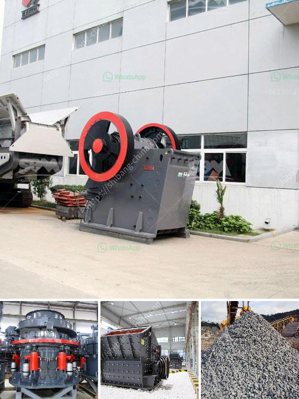

<h3>مطحنة رايموند في ماليزيا</h3>
تعتبر مطحنة رايموند واحدة من أبرز المطاحن الصناعية في ماليزيا والتي تستخدم تقنية متطورة للطحن. تواجدت في السوق لأكثر من عقدين من الزمن وحققت سمعة ممتازة في صناعة الطحن.

تتميز مطحنة رايموند بتصميمها الفريد والذي يعتمد على التكنولوجيا المتطورة لضمان الأداء الفائق والخدمة الموثوقة. تهدف هذه المطحنة إلى طحن المواد الخام بشكل أفضل وتجهيزها للاستخدام في صناعة الأسمنت والمعادن اللافلزية والمواد الكيميائية.

من بين المزايا الرئيسية التي تميز مطحنة رايموند ، يمكننا الإشارة إلى فعالية الطحن العالية والأداء الثابت. تستخدم هذه المطاحن تقنية الدوائر المغلقة لإعادة طحن المواد عدة مرات حتى تحصل على حبيبات صغيرة وموحدة الحجم. تساهم هذه العملية في زيادة كفاءة العملية الإنتاجية وتقليل فقدان المواد وتحسين جودة الإنتاج.

بالإضافة إلى ذلك ، توفر مطحنة رايموند نظام تحكم دقيق لضبط حجم الجسيمات المطحونة وسرعة الإنتاج. يمكن للعملاء ضبط إعدادات الطحن بسهولة وفقًا لاحتياجاتهم الخاصة. يحقق تنظيم الطحن الدقيق اختيارًا مثاليًا للجودة المطلوبة ومعايير الأداء المطلوبة للمنتج النهائي.

تعتبر تقنية التشغيل البسيطة والصيانة المريحة أيضًا من جوانب المطحنة الرائعة. يتم توفيرها بواسطة الأعطال الذاتية والنظام الذي يمكنه التنبؤ بالمشاكل المحتملة وإبلاغ المشغلين بخطوات الصيانة الواجب اتخاذها للحفاظ على جودة الأداء وتجنب الأعطال.

بفضل جميع هذه الميزات الرائعة، يعد استخدام مطحنة رايموند في صناعة الطحن في ماليزيا خيارًا فعالًا واقتصاديًا. تساعد تكنولوجيا المطحنة على زيادة إنتاجية المصانع وتحسين جودة المنتجات، مما يسهم في تعزيز تنافسية الشركات الماليزية في السوق العالمية.

باختصار، تعد مطحنة رايموند في ماليزيا واحدة من أكثر المطاحن التكنولوجية تقدمًا والتي تساهم في تطوير صناعة الطحن في البلاد. تعمل هذه المطاحن على تحقيق الكفاءة والدقة والأداء العالي في عمليات الطحن، مما يؤدي إلى تحسين الإنتاجية وزيادة جودة المنتجات في ماليزيا.
<h3>Contact us</h3><ul><li><strong>Whatsapp:&nbsp;<a href="https://wa.me/8613661969651">+8613661969651</a></strong></li><li><a href="https://swt.shibang-china.com/?git&amp;zhl&amp;مطحنة رايموند في ماليزيا"><strong>Online Service(chat now)</strong></a></li></ul><h3>Related</h3><ul><li><a href='مصنع كسارة الحجر التلقائي.md'>مصنع كسارة الحجر التلقائي</a></li><li><a href='موردين لفات الناقل في جنوب أفريقيا.md'>موردين لفات الناقل في جنوب أفريقيا</a></li><li><a href='مصنع معالجة التنغستن في الهند.md'>مصنع معالجة التنغستن في الهند</a></li><li><a href='رسم بياني لعملية غسيل الرمال.md'>رسم بياني لعملية غسيل الرمال</a></li><li><a href='آلة كسارة البنتونيت.md'>آلة كسارة البنتونيت</a></li></ul>