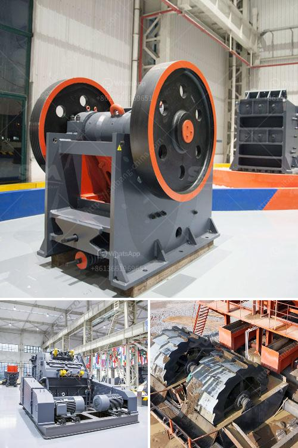

<h3>مطحنة رايموند للبيع مستعملة</h3>
تُعتبر مطحنة رايموند مطحنة هوائية تعمل بالضغط العالي وتستخدم في صناعة الطحن. وقد تم تصميمها وتطويرها لأول مرة في الولايات المتحدة الأمريكية في العقد الخامس عشر من القرن الماضي، ومنذ ذلك الحين أصبحت هذه المطاحن شائعة في جميع أنحاء العالم.

إذا كنت تفكر في شراء مطحنة رايموند مستعملة، فإليك بعض المعلومات التي يجب عليك مراعاتها. قبل كل شيء، يجب أن تتحقق من حالة المطحنة وأن تتأكد من أنها في حالة جيدة وتعمل بكفاءة. يُفضل أن تحصل على تقرير فني عن المطحنة القديمة قبل شرائها، حيث يمكن لخبير أن يقيم حالتها ويقدم لك التوصيات اللازمة.

عند تفحص المطحنة، استفسر عن سنة تصنيعها وعن التعديلات أو الصيانة التي تمت عليها. قد يؤثر التعديلات الكثيرة على عمر المطحنة وعلى جودتها. كما يُفضل أن تتحقق أيضًا من حالة الضمان ومدته.

عند شراء مطحنة رايموند مستعملة، عليك الانتباه إلى الأمور التالية:

1- التحقق من حالة الضواغط والمروحة والسليندرات والمرشحات. قم بإجراء اللازم لضمان سلامة التشغيل المطلوبة.

2- التحقق من حالة الشبكات والأسلاك والفلاتر. قد تحتاج إلى استبدال بعض الأجزاء إذا كانت تالفة.

3- التحقق من حالة الأجزاء الدوارة مثل العتاد والمحرك. تأكد من أنها تعمل بسلاسة وليس بها أي تلف.

بالإضافة إلى ذلك، يجب أن تتأكد من أن المطحنة تلبي متطلبات الإنتاج الخاصة بك. تحتوي مطاحن رايموند على مجموعة متنوعة من الأحجام والقدرات، لذا تأكد من أن الطاقة الإنتاجية والقدرة تلبي احتياجاتك التشغيلية.

أخيرًا، عند البحث عن مطحنة رايموند مستعملة بسعر مناسب، تأكد من أنك تشتري من مصدر موثوق. قد يكون من المفضل شراءها من تاجر موثوق أو من شركة صناعة ذات سمعة جيدة.
<h3>Contact us</h3><ul><li><strong>Whatsapp:&nbsp;<a href="https://wa.me/8613661969651">+8613661969651</a></strong></li><li><a href="https://swt.shibang-china.com/?git&amp;zhl&amp;مطحنة رايموند للبيع مستعملة"><strong>Online Service(chat now)</strong></a></li></ul><h3>Related</h3><ul><li><a href='تكلفة عند استخدام كسارة الحجر.md'>تكلفة عند استخدام كسارة الحجر</a></li><li><a href='عملية تعدين الكوارتز في ولاية أندرا براديش.md'>عملية تعدين الكوارتز في ولاية أندرا براديش</a></li><li><a href='مصانع مطاحن الأسمنت.md'>مصانع مطاحن الأسمنت</a></li><li><a href='جهاز استشعار المعادن لسير الناقل.md'>جهاز استشعار المعادن لسير الناقل</a></li><li><a href='مصنع كسارة مستعمل في الإمارات.md'>مصنع كسارة مستعمل في الإمارات</a></li></ul>