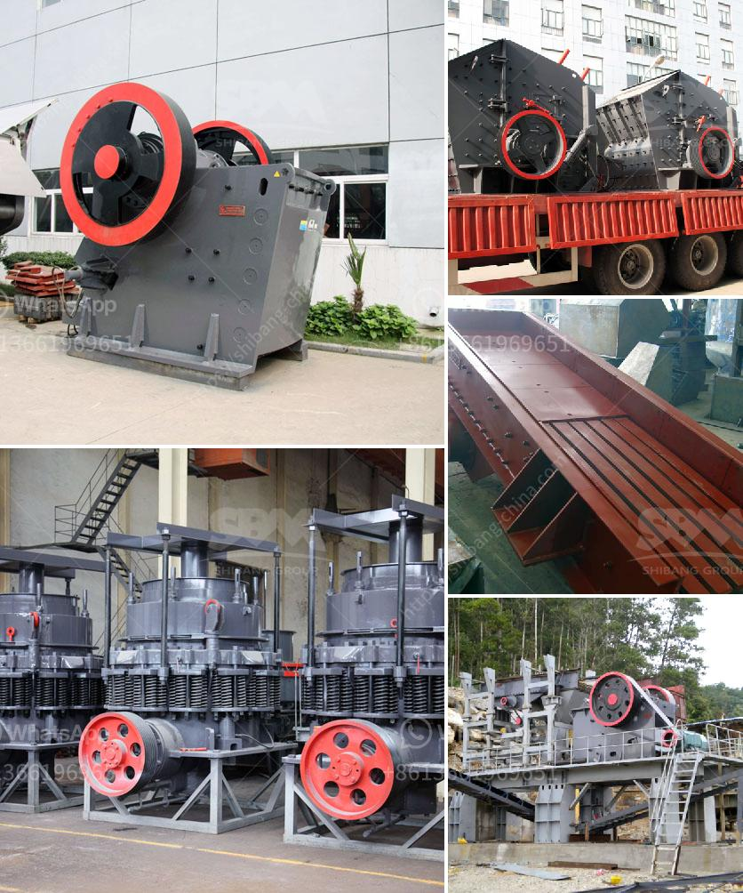

<h3>مطحنة رايموند للطحن الدقيق جدا</h3>
تعد مطحنة رايموند للطحن الدقيق جدًا واحدة من أكثر المطاحن شهرة في صناعة الطحن. تم تصميمها وتطويرها بواسطة شركة رايموند المعروفة بخبرتها العالية في تصنيع المطاحن.

تتميز مطحنة رايموند بأدائها الممتاز وقدراتها الهائلة في تكسير المواد الصلبة والصخور والمعادن إلى قطع صغيرة جدًا. تستخدم هذه المطاحن في العديد من الصناعات مثل صناعة البناء والتعدين ومعالجة المعادن وصناعة الكيماويات.

تعمل مطاحن رايموند بنظام الطحن المغلق، حيث يتم نقل المادة الخام عبر الأنابيب المغلقة إلى الجهاز الرئيسي للطحن. تتألف المطاحن من عدة أجزاء رئيسية مثل الدوران المركزي، والتجهيز المتقدم للتدوير والتصفية، والتجهيز للتعديل.

أحد أهم مزايا مطحنة رايموند هو تصميمها الهندسي المتقدم، حيث تضمن توزيعًا متساويًا لقوة الطحن في جميع النقاط. يسمح هذا التصميم بتحقيق أفضل كفاءة للطحن وتحسين جودة المنتج النهائي.

بالإضافة إلى ذلك، تتميز مطاحن رايموند بعمرها الافتراضي الطويل وصيانتها السهلة. تم تطبيق مواد جديدة وتقنيات متطورة في تصنيع هذه المطاحن لتجنب التآكل والتلف المبكر. علاوة على ذلك، تحتوي المطاحن على أجهزة تحكم إلكترونية حديثة تساعد في زيادة كفاءة الإنتاج وتوفير الطاقة.

تعتبر مطاحن رايموند أحدث التقنيات في مجال الطحن الدقيق جدًا. يعد الاستثمار في هذه المطاحن خيارًا حكيمًا للشركات التي تهدف لتحسين جودة المنتج وزيادة إنتاجيتها. تتمتع مطاحن رايموند بسمعة ممتازة في السوق وتحظى بثقة العديد من العملاء الذين يعتبرونها الخيار المثالي للحصول على نتائج ممتازة وفعالية عالية في عمليات الطحن.
<h3>Contact us</h3><ul><li><strong>Whatsapp:&nbsp;<a href="https://wa.me/8613661969651">+8613661969651</a></strong></li><li><a href="https://swt.shibang-china.com/?git&amp;zhl&amp;مطحنة رايموند للطحن الدقيق جدا"><strong>Online Service(chat now)</strong></a></li></ul><h3>Related</h3><ul><li><a href='آلة صغيرة لصنع المسحوق.md'>آلة صغيرة لصنع المسحوق</a></li><li><a href='عملية التئام الذاتي للحجر الجيري.md'>عملية التئام الذاتي للحجر الجيري</a></li><li><a href='مصنع كسارة الدولوميت في ناجبور.md'>مصنع كسارة الدولوميت في ناجبور</a></li><li><a href='مصنع كرة متنقل من ألمانيا.md'>مصنع كرة متنقل من ألمانيا</a></li><li><a href='مصنع خام الكروم الكامل.md'>مصنع خام الكروم الكامل</a></li></ul>