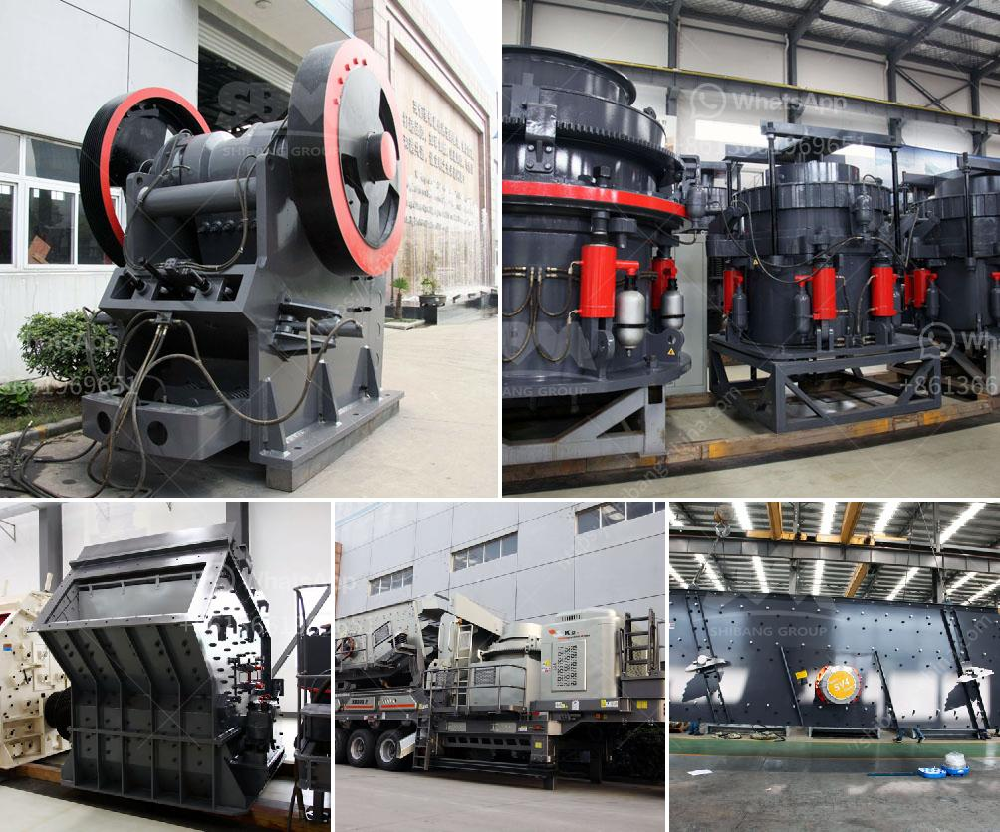

<h3>مطحنة رايموند مستخدمة في إندونيسيا</h3>
تعد مطحنة رايموند واحدة من أهم الآلات المستخدمة في صناعة الطحن في إندونيسيا. تم تصميم هذه المطحنة بشكل متقدم وفقًا لأحدث التقنيات والتطورات في عملية الطحن.

تمتاز مطحنة رايموند بعدة ميزات تجعلها الخيار الأمثل لصناعة الطحن في إندونيسيا. أولاً وقبل كل شيء، فهي قوية ومتينة مما يجعلها قادرة على تحمل الضغط الكبير الذي تتعرض له خلال عملية الطحن. كما أنها مصنوعة من مواد عالية الجودة، مما يجعلها مقاومة للتآكل وطويلة العمر.

ثانياً، تتميز مطحنة رايموند بكفاءتها العالية في عملية الطحن. فهي تستخدم تقنية الدوران السريع لتحقيق أعلى معدلات الطحن وأدق خامات الطحن بأقصى قدر من الكفاءة. بفضل هذه التقنية، تعمل المطحنة بكفاءة عالية وتحقق نتائج ممتازة في طحن المواد المختلفة.

ثالثًا، تتميز مطحنة رايموند بتصميمها الذكي والمبتكر. يتم تصميمها بشكل يسهل التحكم فيها واستخدامها. بفضل واجهتها البسيطة والسهلة، يمكن للمشغلين التعامل معها بكل سهولة ودقة.

وأخيرًا، تعتبر مطحنة رايموند ذات تكلفة منخفضة واقتصادية. توفر هذه المطحنة إنتاجية عالية بتكاليف منخفضة، مما يجعلها اختيارًا مثاليًا للشركات التي تبحث عن حلول اقتصادية لعملية الطحن.

تستخدم مطاحن رايموند على نطاق واسع في صناعة الأسمنت والتعدين والكيماويات وصناعة الغذاء وغيرها في إندونيسيا. يعود ذلك إلى فعالية وكفاءة هذه الآلة، فضلاً عن مرونتها في التعامل مع مجموعة متنوعة من المواد.

في النهاية، يمكن القول إن مطحنة رايموند تعتبر أداة أساسية في صناعة الطحن في إندونيسيا. بفضل تصميمها المتقدم وكفاءتها العالية وتكلفتها المنخفضة، تعد هذه المطحنة خيارًا مثاليًا للشركات التي ترغب في زيادة إنتاجيتها وتحسين جودة منتجاتها.
<h3>Contact us</h3><ul><li><strong>Whatsapp:&nbsp;<a href="https://wa.me/8613661969651">+8613661969651</a></strong></li><li><a href="https://swt.shibang-china.com/?git&amp;zhl&amp;مطحنة رايموند مستخدمة في إندونيسيا"><strong>Online Service(chat now)</strong></a></li></ul><h3>Related</h3><ul><li><a href='آلة سحق الحجر المحمولة.md'>آلة سحق الحجر المحمولة</a></li><li><a href='كسارة محمولة من Propel.md'>كسارة محمولة من Propel</a></li><li><a href='مصنع غسيل الرمل للبيع.md'>مصنع غسيل الرمل للبيع</a></li><li><a href='مصنع إنتاج مسحوق الجبس في أوروبا.md'>مصنع إنتاج مسحوق الجبس في أوروبا</a></li><li><a href='كيفية تصميم كسارة الحجر.md'>كيفية تصميم كسارة الحجر</a></li></ul>