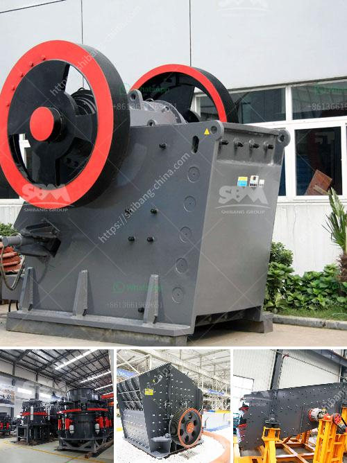

<h3>مطحنة رطبة في الصين</h3>
تُعد مطحنة الأواني الرطبة ظاهرةً شائعةً في الثقافة الصينية، حيث تُستخدم في طهي الأغذية وإعداد العصائر والصلصات والأطباق الأخرى. تعتبر الصين مكانًا مثاليًا لاكتشاف هذه الأجهزة المدهشة والفعالة.

تعتمد الفلسفة الرئيسية وراء استخدام المطحنة الرطبة على أهمية حفظ القيمة الغذائية والمعدنية للأطعمة والمشروبات التي يتم إعدادها. تعمل المطحنة عن طريق دمج الحبوب أو الفاكهة أو الخضروات مع الماء لخلق مزيج سلس ويسهل هضمه. تعد هذه التقنية متميزة عن طرق الطهي التقليدية الأخرى التي تتطلب استخدام الزيوت أو الدهون لإعطاء الطعام نكهة لذيذة.

المطحنة الرطبة تتميز بسرعتها الفائقة وقوتها العالية. فهي تعمل بواسطة المحرك الكهربائي القوي الذي يدور بشكل مستمر، مما يجعل عملية الطحن سهلة وسريعة. تتوفر هذه الأداة بأحجام وأشكال مختلفة لتناسب احتياجات المستخدمين المختلفة.

تتميز المطحنة الرطبة بعدة مزايا أخرى أيضًا. فهي تحافظ على النكهة والعناصر الغذائية الهامة في الطعام، بفضل تجنبها لارتفاع درجة حرارة العملية وتأثيرات الأكسدة المرتبطة بها. بالإضافة إلى ذلك، فإن استخدام الماء خلال عملية الطحن يعزز تجانس الخليط ويضفي طعمًا رائعًا على الطعام النهائي.

من المثير للاهتمام أن المطحنة الرطبة تُستخدم في شرق وجنوب شرق آسيا منذ آلاف السنين. تمتزج الثقافة الفريدة للمنطقة بجماليات هذه الاداة التقليدية لخلق تجربة طهي فريدة وذات طابع تقليدي. على سبيل المثال، في الصين، تُستخدم المطحنة الرطبة في تحضير الأطباق المحبوبة مثل الشوربات النقانق، وتوفر آنيتها العمق الكافي لتحضير هذه الأواني الكبيرة.

إذا كنت ترغب في استكشاف الثقافة الصينية وزيارة المطحنة الرطبة، فبإمكانك أن تجد هذه الأداة في محلات الأدوات المنزلية التقليدية في الصين، وفي بعض المتاجر العالمية التي تتخصص في منتجات وأدوات طهي الآسيوية.

في النهاية، تعد المطحنة الرطبة من المعروفات في ثقافة الطهي الصينية والآسيوية، وتوفر حلاً فعالًا وسهلًا لتحضير العديد من الأطعمة والمشروبات اللذيذة. سواء كنت طاهيًا محترفًا أو هاويًا مبتدئًا، ستكون المطحنة الرطبة إضافة قيمة لأدوات المطبخ الخاصة بك وتمكّنك من استكشاف طبخ صيني تقليدي شهي.
<h3>Contact us</h3><ul><li><strong>Whatsapp:&nbsp;<a href="https://wa.me/8613661969651">+8613661969651</a></strong></li><li><a href="https://swt.shibang-china.com/?git&amp;zhl&amp;مطحنة رطبة في الصين"><strong>Online Service(chat now)</strong></a></li></ul><h3>Related</h3><ul><li><a href='آلة صنع مسحوق الدولوميت لخط الإنتاج.md'>آلة صنع مسحوق الدولوميت لخط الإنتاج</a></li><li><a href='شاشة اهتزاز عالية التردد.md'>شاشة اهتزاز عالية التردد</a></li><li><a href='كسارات الحجر الجيري المحمولة الصغيرة.md'>كسارات الحجر الجيري المحمولة الصغيرة</a></li><li><a href='صنع مسحوق الكالسيوم.md'>صنع مسحوق الكالسيوم</a></li><li><a href='مطحنة الكرة للجبس.md'>مطحنة الكرة للجبس</a></li></ul>