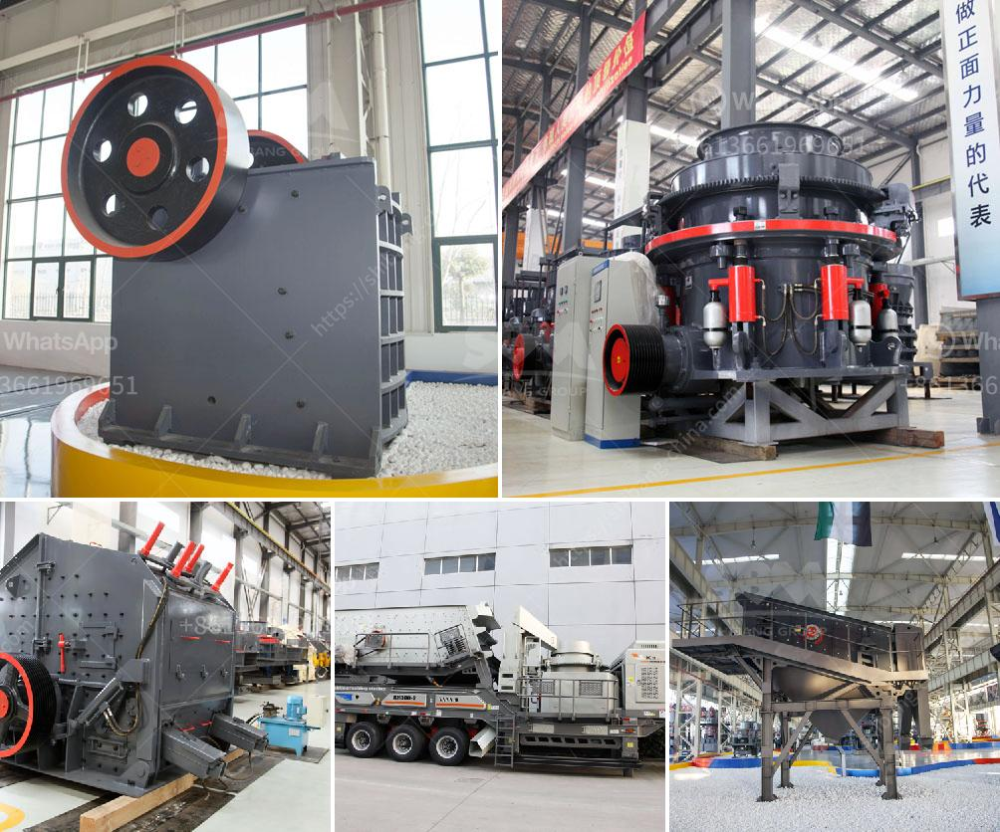

<h3>مطحنة رمل مستعملة في هولندا</h3>
تعتبر المطاحن الرملية واحدة من أبرز العلامات التجارية الأيقونية في هولندا. فهي تعكس تاريخًا طويلًا من الابتكار التكنولوجي والقدرة على الاستفادة من قوة الرياح. تُعتبر مطاحن الرمل مثالًا لنجاح صناعة الرياح الهولندية في توليد الطاقة منذ سنوات عديدة.

تعد المطاحن الرملية في هولندا آلات هندسية قديمة يتم استخدامها لطحن الحبوب وتحويلها إلى دقيق. وتعود جذور هذه المطاحن إلى القرن الثالث عشر، وقد تم استخدامها لأكثر من 700 سنة لتلبية احتياجات المجتمع المحلي.

في البداية، كانت تشيد المطاحن الرملية في المناطق الساحلية وعلى الأراضي الرطبة من هولندا، حيث تكثر الرياح. ومن خلال تصميمها المميز، كانت هذه المطاحن قادرة على امتصاص قوة الرياح وتحويلها إلى طاقة قادرة على تشغيل الآلات الميكانيكية الداخلية للطحن.

تتكون المطاحن الرملية عادةً من هيكل خشبي عالي ومدور، وبه أجزاء دوارة تعمل بفعل حركة الرياح. وأعلى الهيكل يتوج بجناحين أو أكثر يمكنهما الدوران تلقائيًا باتجاه الرياح. تتميز المطاحن الرملية بسقف مخروطي يرتفع فوق الهيكل ويسمح بتوجيه قادرة الرياح نحو الجناحين.

تعد المطاحن الرملية ظاهرة بصرية مذهلة في المناظر الطبيعية الهولندية. وبفضل مظهرها التقليدي وجهود الصيانة المستمرة، فقد تم الحفاظ على العديد من هذه المعالم الثقافية الهامة على مر السنين.

على الرغم من أن استخدام المطاحن الرملية قد تراجع مع تطور التقنيات الحديثة، إلا أنها مازالت شاهدة على تاريخ وتقاليد الشعب الهولندي. وتُعتبر اليوم مطاحن الرمل المستعملة في هولندا نصف نشطة كمعالم سياحية تاريخية، حيث يمكن للزوار القادمين من جميع أنحاء العالم التعرف على كيفية عمل هذه المطاحن واكتشاف روعة الهندسة المحلية.

بصفة عامة، تُعد المطاحن الرملية لا تُزال تعتبر رمزًا للهولندا التقليدية وتعكس حب واعتزاز الشعب الهولندي بتاريخهم الغني وتقاليدهم. فهي تذكرنا بتراث هذا البلد في الابتكار والاستعانة بالموارد الطبيعية المتاحة لتلبية احتياجاتهم وتطورهم الاقتصادي.
<h3>Contact us</h3><ul><li><strong>Whatsapp:&nbsp;<a href="https://wa.me/8613661969651">+8613661969651</a></strong></li><li><a href="https://swt.shibang-china.com/?git&amp;zhl&amp;مطحنة رمل مستعملة في هولندا"><strong>Online Service(chat now)</strong></a></li></ul><h3>Related</h3><ul><li><a href='مصنع آلات مطحنة الكرة.md'>مصنع آلات مطحنة الكرة</a></li><li><a href='كسارة الحجر وأسعارها.md'>كسارة الحجر وأسعارها</a></li><li><a href='سعر مطحنة الكرات.md'>سعر مطحنة الكرات</a></li><li><a href='آلات تكسير الحصى.md'>آلات تكسير الحصى</a></li><li><a href='مصنع معالجة التنغستن في الهند.md'>مصنع معالجة التنغستن في الهند</a></li></ul>