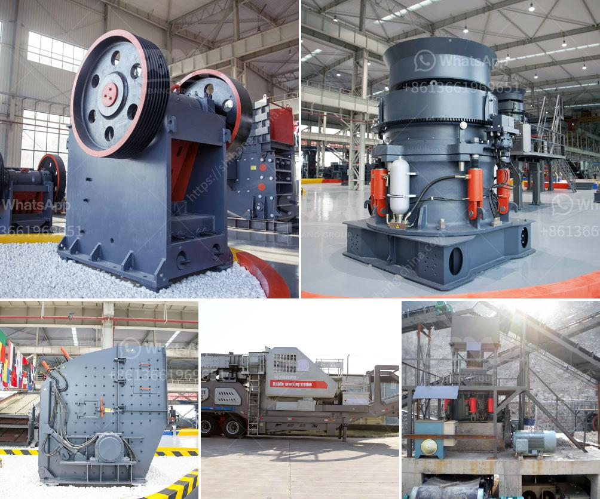

<h3>مطحنة ريموند 4 أسطوانات</h3>
تُعد مطحنة ريموند بأربع أسطوانات من أبرز وأفضل المطاحن التي تُستخدم في عملية طحن المواد الصلبة المختلفة. تتميز هذه المطحنة بأسطواناتها الحديدية القوية التي تؤدي إلى تفتيت المواد بشكل فعال وسريع. 

تتألف مطحنة ريموند من أربع أسطوانات عمودية تدور حول محورها الرئيسي. يتم تنصيب المواد الصلبة في الطاحونة من خلال المدخل الموجود في الأعلى وتُفتك بها الأسطوانات المتحركة. تتم طحن المواد عن طريق الاحتكاك المستمر بين الأسطوانات والمواد الصلبة.

تتميز مطحنة ريموند بقدرتها على طحن مجموعة متنوعة من المواد الصلبة مثل المعادن والفحم والحجر الجيري والفلسبار والكوارتز والمواد الكيميائية والمواد الحرارية والكاولين والأسمنت والفوسفات والمزيد. يعتبر ذلك من الأمور المهمة التي تُعتبر عنصراً أساسياً عند اختيار المطحنة المناسبة.

تضمن مطحنة ريموند الكفاءة والحصول على نتائج جيدة في عملية الطحن. يتم تحقيق ذلك بفضل التكنولوجيا المبتكرة المستخدمة في المطحنة ، حيث تتميز بنظام تهوية محسَّن يساعد في تقليل انبعاثات الغبار وزيادة استخدام الهواء الخارجي في الطحن. بالإضافة إلى ذلك ، تعمل مطحنة ريموند على نظام دوران جديد يحسن من كفاءة طحن المواد ويقلل من استهلاك الطاقة.

بالنظر إلى الأداء المتميز والنتائج الجيدة التي تقدمها مطحنة ريموند ، فإنها تستخدم على نطاق واسع في صناعات متنوعة مثل صناعة التعدين والبناء والمواد الكيميائية والتجميل والكريات الصناعية والمزيد. بفضل القدرة العالية والكفاءة الرائعة التي تتميز بها ، تعد مطحنة ريموند حلاً ممتازًا لعمليات الطحن الصناعية المتطلبة.

في الختام ، فإن مطحنة ريموند بأربع أسطوانات تمثل خيارًا ممتازًا لعمليات الطحن الصناعية. تتميز بأداء متميز ونتائج جيدة في عملية الطحن ، مما يجعلها مطحنة فعالة وفعالة في استخدام الطاقة. إذا كنت بحاجة إلى طحن المواد الصلبة ، فإن مطحنة ريموند بأربع أسطوانات هي الخيار المثالي.
<h3>Contact us</h3><ul><li><strong>Whatsapp:&nbsp;<a href="https://wa.me/8613661969651">+8613661969651</a></strong></li><li><a href="https://swt.shibang-china.com/?git&amp;zhl&amp;مطحنة ريموند 4 أسطوانات"><strong>Online Service(chat now)</strong></a></li></ul><h3>Related</h3><ul><li><a href='كسارة الفك في تايلاند.md'>كسارة الفك في تايلاند</a></li><li><a href='قائمة أسعار كسارة الجرانيت.md'>قائمة أسعار كسارة الجرانيت</a></li><li><a href='آلة مسحوق الدولوميت.md'>آلة مسحوق الدولوميت</a></li><li><a href='استخدام كسارة الفك المتنقلة.md'>استخدام كسارة الفك المتنقلة</a></li><li><a href='كسارات الحجر الرئيسية.md'>كسارات الحجر الرئيسية</a></li></ul>