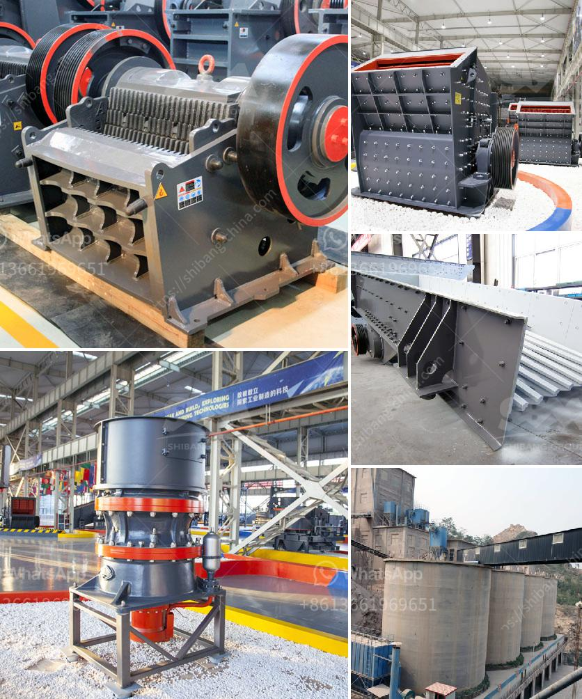

<h3>مطحنة ريموند الحجر الجيري</h3>
تُعد مطحنة ريموند الحجر الجيري من أكثر المطاحن استخداماً في صناعة التعدين ومعالجة المواد الخام. فهي معدات مهمة تستخدم في طحن وتكسير الحجر الجيري بنسبة تقدر بين 200-400 كلمة. تمتاز هذه المطحنة بقدرتها على معالجة الحجر الجيري بكفاءة عالية مع الحفاظ على جودة ونقاء الناتج النهائي.

تتميز مطحنة ريموند بتصميمها الفريد الذي يساعد على زيادة كفاءة الطحن. فهي تحتوي على محور رئيسي متدوّر يدعم القرص بمرونة، ويتحكم به وحدة التحكم، مما يساعد في تحقيق الطحن المتوازن والفعال. بالإضافة إلى ذلك، تتميز المطحنة بذكاءها الاصطناعي وقابليتها للتحكم عن بُعد، مما يوفّر مزيدًا من السهولة والدقة في التشغيل.

يتم استخدام مطحنة ريموند الحجر الجيري في عمليات تصنيع ومعالجة المواد الكيميائية والمعادن والبناء والمواد الكاشطة والزجاج والجبس وغيرها. توفر هذه المطحنة أحجامًا وإعدادات مختلفة للطحن، وبالتالي تلبي متطلبات الإنتاج المختلفة. وبفضل تصميمها الدائري والرأسي، يمكن أن تعمل المطحنة على استخدام أقل قدر من الطاقة ولكنها تحقق نفس النتائج.

تعتبر مطحنة ريموند الحجر الجيري خيارًا مثاليًا لكل منتج يبحث عن طريقة فعالة واقتصادية لطحن الحجر الجيري. فإلى جانب كفاءتها العالية، فإنها تتميز أيضًا بمرونتها في التعامل مع المواد، وسهولة استبدال الأجزاء الأساسية للحفاظ على الأداء المثلى.

لا يُمكن إنكار أن مطحنة ريموند الحجر الجيري هي حل مستدام واقتصادي للطحن المستمر طويل الأمد. بفضل تقنيتها المتطورة وإمكانيتها لمعالجة الحجر الجيري بكفاءة عالية، فإنها تساهم في زيادة الإنتاجية وتحسين جودة المنتج النهائي للصناعات المختلفة. إذا كنت بصدد البحث عن مطحنة تلبي احتياجات عملك، فإن مطحنة ريموند الحجر الجيري هي الخيار المناسب.
<h3>Contact us</h3><ul><li><strong>Whatsapp:&nbsp;<a href="https://wa.me/8613661969651">+8613661969651</a></strong></li><li><a href="https://swt.shibang-china.com/?git&amp;zhl&amp;مطحنة ريموند الحجر الجيري"><strong>Online Service(chat now)</strong></a></li></ul><h3>Related</h3><ul><li><a href='مطحنة هامر للأسمنت.md'>مطحنة هامر للأسمنت</a></li><li><a href='مصنع الأسمنت من الصهر 100 طن.md'>مصنع الأسمنت من الصهر 100 طن</a></li><li><a href='مصنعو الكرات في بنغالور.md'>مصنعو الكرات في بنغالور</a></li><li><a href='مصنع سحق حجر كامل بسعة 300 طن.md'>مصنع سحق حجر كامل بسعة 300 طن</a></li><li><a href='استيراد كسارة الفك الصين في باكستان.md'>استيراد كسارة الفك الصين في باكستان</a></li></ul>