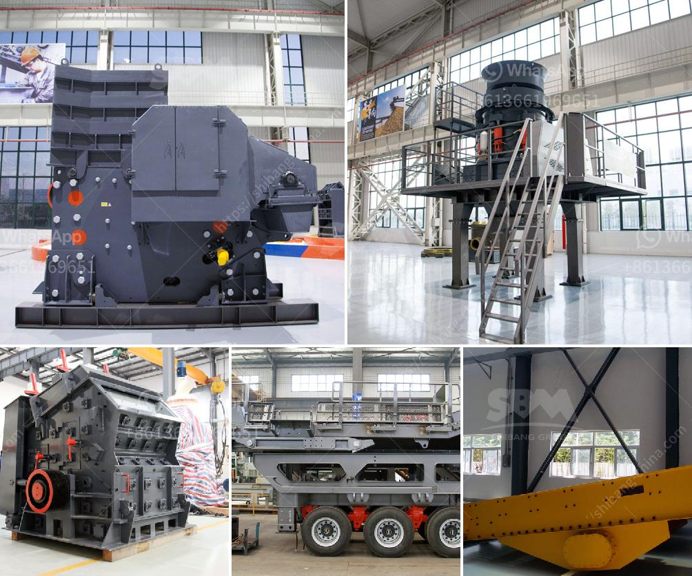

<h3>مطحنة ريموند في باكستان</h3>
تعتبر مطحنة ريموند واحدة من أهم المطاحن الصناعية في باكستان. تأسست هذه المطحنة في عام 1925 وتعد أحد الركائز الأساسية لصناعة الطحين في البلاد. تقع المطحنة في مدينة كراتشي، وتغطي مساحة واسعة تزيد عن 20 فدانا.

تمتلك مطحنة ريموند أحدث التقنيات والمعدات في صناعة الطحين. تستخدم المطحنة أحدث أنظمة المعالجة والتجهيز لضمان جودة عالية للمنتج النهائي. يتم تجهيز الحبوب في مطحنة ريموند باستخدام آلات متطورة تقوم بتنقية الحبوب وإزالة الشوائب قبل طحنها.

تضم المطحنة أيضًا مستودعات كبيرة لتخزين الحبوب، وتتمتع بنظام متقدم لإدارة المخزون يضمن توفر الحبوب بشكل مستمر. يتم تخزين الحبوب في الظروف المناسبة للحفاظ على جودتها وعدم تلفها.

يعمل في مطحنة ريموند فريق من المهندسين والفنيين المهرة والمدربين تدريباً عالياً. يعمل هؤلاء المتخصصين على مراقبة عملية الطحن وضمان أعلى مستويات الجودة والنظافة. تتمتع المطحنة بنظام صارم لمراقبة الجودة يتضمن اختبارات دقيقة تتم خلال كل مرحلة من مراحل الإنتاج.

تلتزم مطحنة ريموند أيضًا بالمسؤولية الاجتماعية والبيئية. تعمل المطحنة على تقليل تأثيرها على البيئة من خلال التحكم في نفاياتها والحفاظ على النظافة العامة. تتبع المطحنة أيضًا معايير صارمة فيما يتعلق بصحة وسلامة العاملين وجودة المنتج النهائي.

تعتبر مطحنة ريموند رمزًا للكفاءة والاحترافية في صناعة الطحين في باكستان. تزود المطحنة العديد من المناطق والمدن في البلاد بالطحين عالي الجودة المستخدم في تصنيع الخبز والمنتجات الأخرى. يعتبر منتجها مرغوبًا من قبل العديد من الشركات والأفراد في البلاد.

باختصار، تعتبر مطحنة ريموند في باكستان من أكبر وأهم المطاحن الصناعية في البلاد، حيث تتمتع بالتقنيات المتقدمة والعاملين المدربين وتلتزم بأعلى معايير الجودة والنظافة، وتقدم منتجات عالية الجودة للعديد من الشركات والأفراد في البلاد.
<h3>Contact us</h3><ul><li><strong>Whatsapp:&nbsp;<a href="https://wa.me/8613661969651">+8613661969651</a></strong></li><li><a href="https://swt.shibang-china.com/?git&amp;zhl&amp;مطحنة ريموند في باكستان"><strong>Online Service(chat now)</strong></a></li></ul><h3>Related</h3><ul><li><a href='إنتاج الركام.md'>إنتاج الركام</a></li><li><a href='آلة معالجة الذهب في الصين.md'>آلة معالجة الذهب في الصين</a></li><li><a href='تكلفة مصنع كسارة الحجر الجيري.md'>تكلفة مصنع كسارة الحجر الجيري</a></li><li><a href='معدات تعدين الذهب الطبيعي في الصين.md'>معدات تعدين الذهب الطبيعي في الصين</a></li><li><a href='استفسار حول كسارة الصدم.md'>استفسار حول كسارة الصدم</a></li></ul>