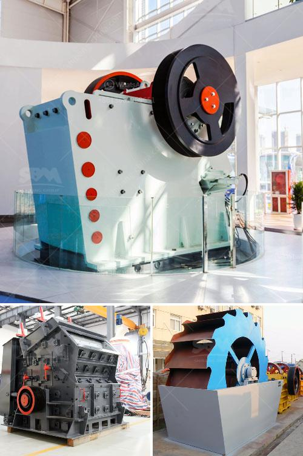

<h3>مطحنة ريموند في تشيناي</h3>
تقع مطحنة ريموند في مدينة تشيناي في ولاية تاميل نادو بالهند. تُعتبر هذه المطحنة أحد أهم المعالم التاريخية والصناعية في المدينة، حيث تعود تاريخ بنائها إلى القرن التاسع عشر.

تأسست مطحنة ريموند في عام 1889 على يد السيد جي الراماسوامي نايكر، وكانت في بادئ الأمر تسمى مطحنة فالثيرافر. بعد عدة سنوات، أُعيد تسميتها إلى مطحنة ريموند نسبةً للإنجازات الكبيرة التي حققتها في مجال معالجة النسيج والنسيج الصوفي.

تتميز مطحنة ريموند بتصميمها الفريد والمعماري الجميل، حيث تعتبر نموذجًا للهندسة المعمارية البريطانية الكلاسيكية. يتألف المبنى من مختلف الأجزاء التي تم نقلها من بريطانيا عبر البحر، وتضم العديد من النوافذ العريضة والأعمدة المزخرفة والمجسمات الحجرية التي تزينها.

تُعتبر مطحنة ريموند من أقدم المطاحن في المدينة، حيث قامت بدور مهم في تطور صناعة النسيج هناك. وكانت تعمل على إنتاج المنسوجات الراقية والصوفية بجودة عالية، وقد اكتسبت شهرة واسعة بفضل جودة منتجاتها.

لكن مع تطور التكنولوجيا وانتشار المطاحن الحديثة، توقفت مطحنة ريموند عن العمل في عام 1940. ومع ذلك، تم الحفاظ على المبنى التاريخي وتحويله إلى متحف للنسيج حيث يعرض العديد من المعروضات المتعلقة بالصناعة النسيجية التقليدية في المدينة.

يعتبر زيارة مطحنة ريموند تجربة فريدة للاستمتاع بالتراث الصناعي لتشيناي. يوفر المتحف العديد من الفرص التعليمية لفهم تاريخ النسيج في المنطقة، وأهمية هذه الصناعة في الحياة اليومية للناس.

بالإضافة إلى ذلك، يعمل المتحف على تعزيز الوعي بأهمية الحفاظ على التراث الثقافي والصناعي. يتمتع الزوار بفرصة لاكتشاف تفرد الصناعة النسيجية التقليدية التي تعتبر اليوم واحدة من العوامل الرئيسية في الاقتصاد المحلي.

باختصار، مطحنة ريموند في تشيناي هي تحفة معمارية تاريخية تستحق الزيارة. ينصح المسافرون والمهتمون بالتراث الثقافي بالاستمتاع بزيارة هذا المتحف الفريد للنسيج والمشاركة في استكشاف التاريخ والتراث الصناعي للمنطقة.
<h3>Contact us</h3><ul><li><strong>Whatsapp:&nbsp;<a href="https://wa.me/8613661969651">+8613661969651</a></strong></li><li><a href="https://swt.shibang-china.com/?git&amp;zhl&amp;مطحنة ريموند في تشيناي"><strong>Online Service(chat now)</strong></a></li></ul><h3>Related</h3><ul><li><a href='مطاحن الأسطوانة العليا للبيع.md'>مطاحن الأسطوانة العليا للبيع</a></li><li><a href='كيفية إنشاء شركة محجر.md'>كيفية إنشاء شركة محجر</a></li><li><a href='سعر كسارة المختبر المستخدمة.md'>سعر كسارة المختبر المستخدمة</a></li><li><a href='كسارات مخروط للإيجار في جنوب أفريقيا.md'>كسارات مخروط للإيجار في جنوب أفريقيا</a></li><li><a href='كسارات الحجر المستعملة للبيع في ألمانيا.md'>كسارات الحجر المستعملة للبيع في ألمانيا</a></li></ul>