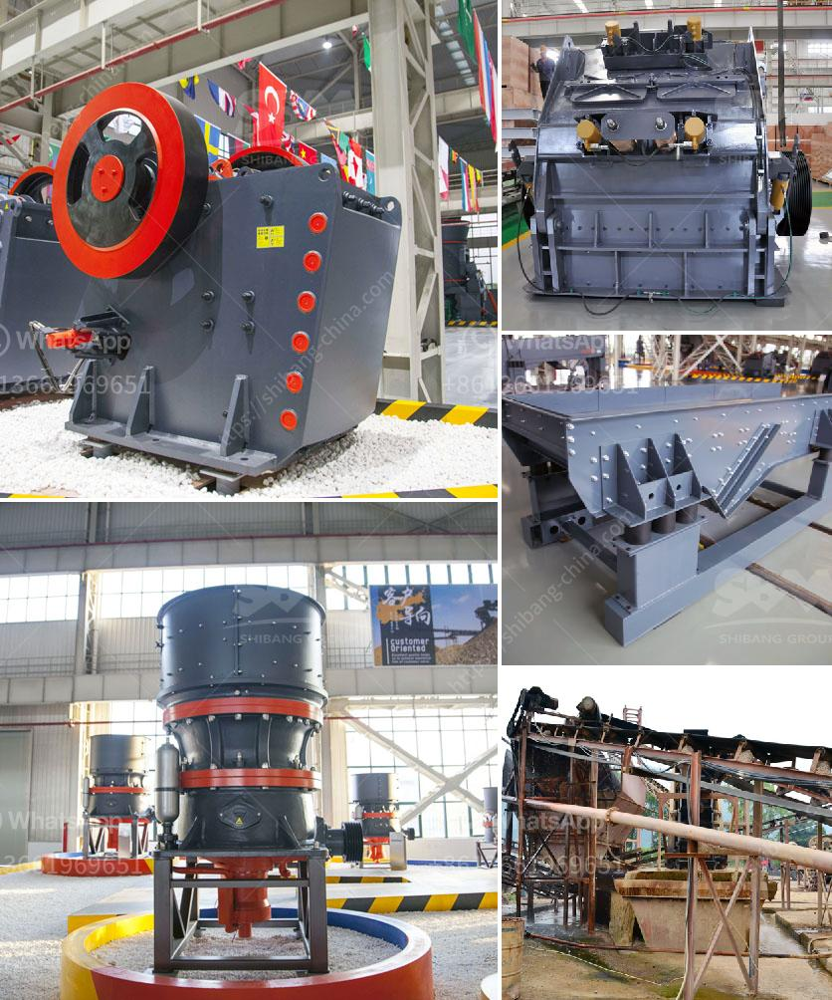

<h3>مطحنة ريموند للبنتونيت</h3>
تُعتبر مطحنة ريموند للبنتونيت من أهم المطاحن المستخدمة في صناعة البنتونيت. تستخدم هذه المطحنة لطحن البنتونيت إلى مسحوق ناعم يمكن استخدامه في العديد من التطبيقات المختلفة. تعتبر البنتونيت مادة خام معدنية تتكون أساسًا من طين الفولاذة، وتحتوي على عدة عناصر مهمة مثل الألومنيوم والسيليكون والماغنيسيوم والحديد. 

تتميز مطحنة ريموند للبنتونيت بعدة مزايا تجعلها الخيار المثالي لصناعة البنتونيت. أحد هذه المزايا هو الكفاءة العالية للمطحنة، حيث يتم تقديم طحن سريع وفعال يعمل على تحويل البنتونيت إلى مسحوق ناعم في وقت قصير. كما يتميز هذا النوع من المطاحن بوجود نظام تحكم دقيق يضمن الحصول على دقة عالية في حجم الجسيمات المقاسة. لذلك، يمكن استخدام مسحوق البنتونيت المنتج لتلبية متطلبات التطبيق المحددة.

تتوفر مطاحن ريموند للبنتونيت في طرز مختلفة تتراوح بين القدرة والمواصفات. تعتمد القدرة على معدل الإنتاج المطلوب وحجم البنتونيت المراد طحنه. بالإضافة إلى ذلك، تأتي هذه المطاحن مع تصميم متين وقوي يعزز متانة المعدات ويمنع الصدأ والتآكل. 

يمكن استخدام مسحوق البنتونيت في العديد من الصناعات المختلفة. في صناعة الورق، يتم استخدامه كمادة ملء لتحسين خصائص الورق وتحسين القوة والمرونة. أيضًا، يستخدم في صناعة الترابط السوائل، حيث يستخدم كمادة تغليف للترابط السوائل بفضل قدرته على امتصاص الماء. وعلاوة على ذلك، يمكن استخدامه أيضًا في صناعة الألوان والدهانات ومستحضرات التجميل وصناعة المواد اللاصقة.

في الختام، تُعتبر مطحنة ريموند للبنتونيت أداة هامة تستخدم في صناعة البنتونيت. تتميز بقدرتها على طحن البنتونيت بكفاءة ودقة عالية، مما يجعلها الخيار المثالي للحصول على مسحوق ناعم ملائم للاستخدام في مجموعة متنوعة من التطبيقات الصناعية.
<h3>Contact us</h3><ul><li><strong>Whatsapp:&nbsp;<a href="https://wa.me/8613661969651">+8613661969651</a></strong></li><li><a href="https://swt.shibang-china.com/?git&amp;zhl&amp;مطحنة ريموند للبنتونيت"><strong>Online Service(chat now)</strong></a></li></ul><h3>Related</h3><ul><li><a href='كم عدد شركات تصنيع كسارات الفك في الهند.md'>كم عدد شركات تصنيع كسارات الفك في الهند</a></li><li><a href='مصنع كرة الاسمنت المواد والطاقة.md'>مصنع كرة الاسمنت المواد والطاقة</a></li><li><a href='كسارة الصدم المحمولة في إثيوبيا.md'>كسارة الصدم المحمولة في إثيوبيا</a></li><li><a href='سعة كسارة الحجر.md'>سعة كسارة الحجر</a></li><li><a href='مطاحن الكرة للحجر الجيري في ماليزيا.md'>مطاحن الكرة للحجر الجيري في ماليزيا</a></li></ul>