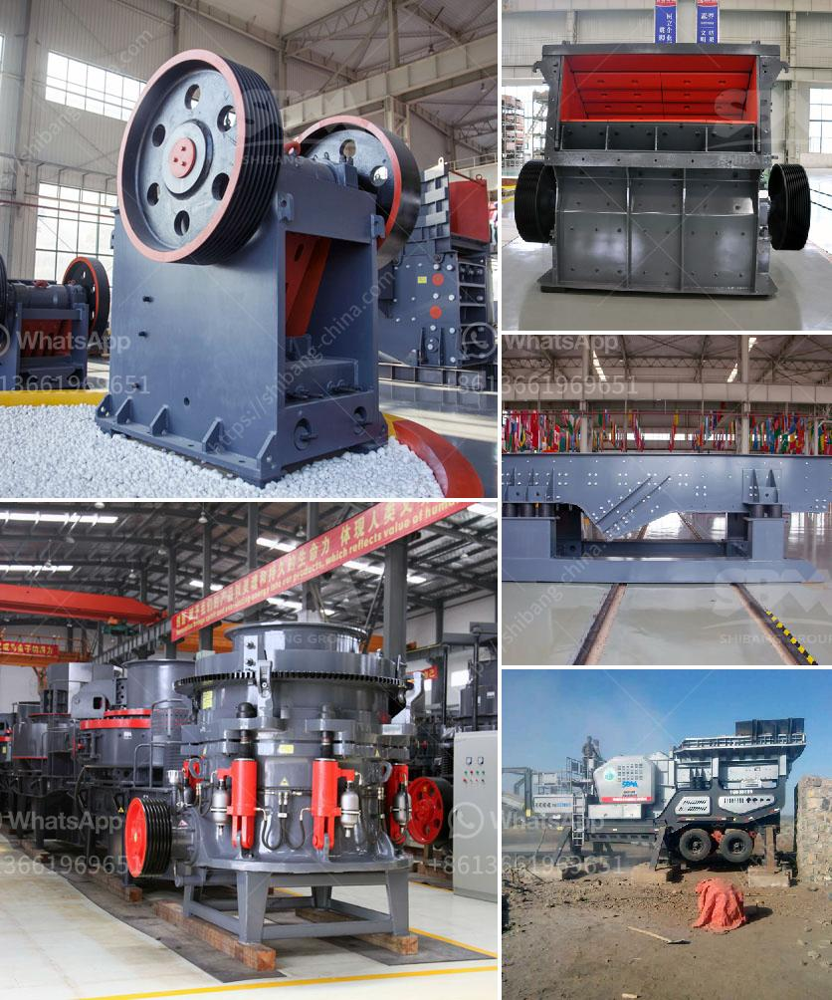

<h3>مطحنة ريموند للرخام</h3>
تعتبر مطحنة ريموند للرخام واحدة من أفضل المعامل المتخصصة في طحن وتجهيز الرخام في العالم. تأسست في عام 1920 في الولايات المتحدة الأمريكية، ومنذ ذلك الحين حصدت سمعة عالمية بفضل جودة منتجاتها وخدماتها الاحترافية.

تتميز مطحنة ريموند بتقنية حديثة ومتطورة لطحن الرخام، مما يجعلها قادرة على تحويل قطع الرخام إلى أحجام وأشكال مختلفة حسب رغبة العملاء. تعمل المطحنة بنظام قوة المحرك والمراوح، مما يساعدها على طحن الرخام بسرعة وكفاءة عالية، مع الحفاظ على جودة المنتج النهائي.

تعتبر المطحنة ريموند خيارًا مثاليًا للعملاء الذين يبحثون عن رخام ذو جودة عالية واستخدامات متعددة. فالرخام المطحون يمكن استخدامه في صناعة البلاط، والأرضيات، والجدران، والطاولات، والمنحوتات، والأعمدة، والنصب التذكارية، والعديد من التطبيقات الأخرى.

بفضل فريق الخبراء المحترفين والمهرة الموجودين في مطحنة ريموند، يتم ضمان توفير منتج نهائي مثالي يتوافق مع الاحتياجات والمواصفات الخاصة بكل عميل. حيث يتم اتباع إجراءات صارمة في عملية الفحص والتحقق من جودة المنتج، بدءًا من اختيار القطع المناسبة من الرخام، ومرورًا بالعملية الدقيقة للطحن والتجهيز، وحتى وضع اللمسات الأخيرة للمنتج قبل تسليمه للعميل.

بفضل سمعتها ومكانتها الريادية في صناعة المعادن والحجر، وصلت منتجات مطحنة ريموند للرخام إلى العديد من الأسواق العالمية، وذلك بعد أن حققت ثقة العملاء من خلال جودة منتجاتها واحترافيتها في توفير الخدمات.

باختصار، مطحنة ريموند للرخام هي الاختيار الأمثل للعملاء الراغبين في الحصول على رخام عالي الجودة ومصقول بإتقان. فهي تقدم تجربة فريدة ومتميزة في تحويل قطع الرخام إلى منتجات ذات شكل وجودة استثنائية، مما يجعلها شركة رائدة في مجالها.
<h3>Contact us</h3><ul><li><strong>Whatsapp:&nbsp;<a href="https://wa.me/8613661969651">+8613661969651</a></strong></li><li><a href="https://swt.shibang-china.com/?git&amp;zhl&amp;مطحنة ريموند للرخام"><strong>Online Service(chat now)</strong></a></li></ul><h3>Related</h3><ul><li><a href='كسارات محمولة في السعودية.md'>كسارات محمولة في السعودية</a></li><li><a href='أسعار مطاحن الكرة في جنوب أفريقيا.md'>أسعار مطاحن الكرة في جنوب أفريقيا</a></li><li><a href='تكلفة مطحنة مسحوق صغيرة.md'>تكلفة مطحنة مسحوق صغيرة</a></li><li><a href='آلة كسارة الفحم 5 طن في الساعة.md'>آلة كسارة الفحم 5 طن في الساعة</a></li><li><a href='مصنعي مطحنة عمودية.md'>مصنعي مطحنة عمودية</a></li></ul>