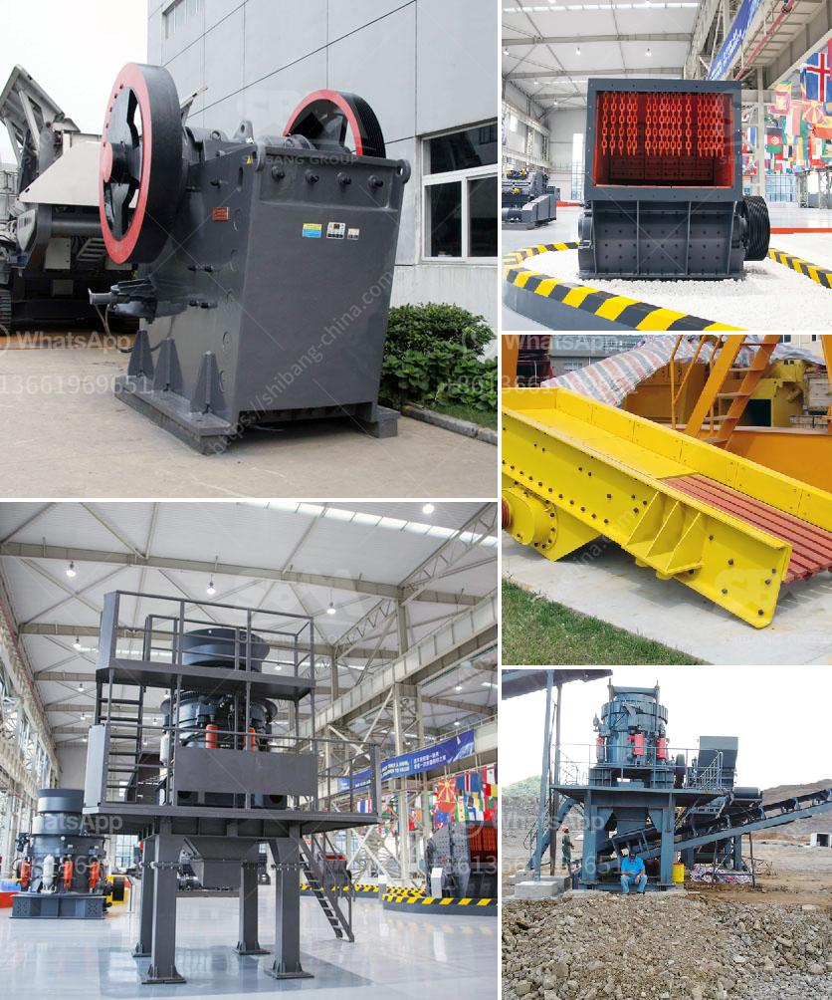

<h3>مطحنة ريموند لمعالجة البازلت الجاف</h3>
تُعد مطحنة ريموند من أكثر المعدات شيوعًا وفعّالية لمعالجة البازلت الجاف. يُعتبر البازلت من الصخور البركانية القوية والصلبة، والتي تستخدم في العديد من التطبيقات الإنشائية مثل الأساسات والفرش الرملية والخرسانة. يمكن أن تتطلب معالجة البازلت الجاف سلسلة من العمليات لتحقيق المواصفات المطلوبة، وتكون المطاحن الريموند هي الخيار الأمثل لهذا الغرض.

تعتبر مطاحن ريموند مطاحن هوائية ذات محور عمودي تستخدم في سحق وطحن المواد الصلبة. تتكون المطاحن من عدة أجزاء رئيسية بما في ذلك الكسارة الفكية، والمصعد، وماكينة التغذية الاهتزازية، وصوامع التخزين، والمطحنة الرئيسية، ونظام التحكم الكهربائي. تأخذ المطاحن الريموند عينات من البازلت الجاف وتقوم بتكسيرها وطحنها إلى جسيمات صغيرة حجمها يتراوح بين 20 و 25 ملم.

تتميز مطاحن ريموند بعدة مزايا. لا يُلزم استخدام الماء في عملية الطحن، مما يعد ميزة كبيرة عند معالجة البازلت الجاف. بفضل تصميمها المتقدم والمبتكر، تساعد المطاحن الريموند في تقليل استهلاك الطاقة والحفاظ على البازلت ذو الحجم المطلوب. بالإضافة إلى ذلك، تعمل المطاحن بكفاءة عالية وتنتج مسحوقًا دقيقًا ومتجانسًا، مما يضمن الحصول على نتائج مثلى في العمليات الإنشائية.

تستخدم المطاحن الريموند أيضًا في عمليات التصنيف، حيث يتم فصل البازلت الجاف عن الجسيمات الأخرى غير المرغوب فيها. تُعد هذه المطاحن مثالية للمصانع والأفران التجريبية، حيث يتعين معالجة كميات صغيرة من البازلت الجاف.

في الختام، تعتبر مطاحن ريموند هي الخيار الأمثل لمعالجة البازلت الجاف بسبب كفاءتها العالية وتقنياتها المتقدمة وسهولة صيانتها. إن استخدامها يسهم في تحقيق أفضل النتائج في العمليات الإنشائية وفي الحفاظ على جودة ومتانة المنتجات النهائية المصنوعة من البازلت.
<h3>Contact us</h3><ul><li><strong>Whatsapp:&nbsp;<a href="https://wa.me/8613661969651">+8613661969651</a></strong></li><li><a href="https://swt.shibang-china.com/?git&amp;zhl&amp;مطحنة ريموند لمعالجة البازلت الجاف"><strong>Online Service(chat now)</strong></a></li></ul><h3>Related</h3><ul><li><a href='مصنعين لشاشات الاهتزاز في جنوب أفريقيا.md'>مصنعين لشاشات الاهتزاز في جنوب أفريقيا</a></li><li><a href='بائع معدات الطحن.md'>بائع معدات الطحن</a></li><li><a href='آلة طحن الطين الصيني.md'>آلة طحن الطين الصيني</a></li><li><a href='مكونات مطحنة الأسطوانة.md'>مكونات مطحنة الأسطوانة</a></li><li><a href='كسارة مخروط في أمريكا.md'>كسارة مخروط في أمريكا</a></li></ul>