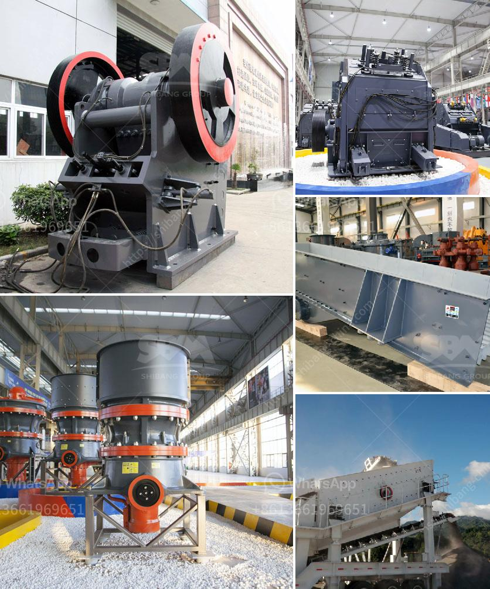

<h3>مطحنة صخرة الرخام</h3>
تعتبر مطحنة صخرة الرخام من أهم المعدات المستخدمة في صناعة الرخام والحجر الطبيعي. تُستخدم هذه المطاحن لطحن وتجهيز الرخام وتحويله إلى شكل نهائي مثل البلاط والألواح والقطع الأخرى المستخدمة في البناء والديكور.

تشتمل مطاحن صخرة الرخام على عدة أجزاء رئيسية، بما في ذلك المحرك المستخدم لتشغيلها وجهاز التحكم والنظام الهيدروليكي الذي يساهم في توجيه الحركة والقوة اللازمة للطحن. تعمل تلك المطاحن عادة بالطاقة الكهربائية أو بمحركات أخرى تعمل بالديزل أو غيره.

يبدأ العمل في مطحنة صخرة الرخام بتحميل الصخور في جزء معين من الماكينة وتمريرها خلال ناقل تحميل لتوجيهها إلى المنصة العلوية حيث يتم تحويلها إلى كتل كبيرة تسمى البلوكات. بعد ذلك، تتم تشغيل النظام الهيدروليكي وتحريك الصخور من خلال الأسطوانات الهيدروليكية إلى مكان الطحن.

يتم وضع الرخام في طاحونة الرخام حيث يتم طحنه بشكل دائري، وذلك باستخدام قرص من الحديد وبه نقوش خاصة تعمل على طحن الرخام بشكل فعال ودقيق. يتم تحكم في سرعة القرص لضمان تأثير الطحن المطلوب دون إتلاف الرخام.

بعد عملية الطحن، يتم إزالة الرخام من المطحنة وتوجيهه إلى الأجهزة الأخرى للتشطيب. وتتضمن هذه الأجهزة آلات قطع وتلميع وتنعيم السطح للحصول على شكل نهائي مثالي للاستخدام.

تُعتبر مطاحن صخرة الرخام أداة حيوية في صناعة الرخام. فهي تمكن من تقليل التكاليف والوقت المستغرق في عملية الإنتاج وتحسين جودة الرخام النهائية. بفضل تلك المطاحن ، أصبحت صناعة الرخام تتمتع بعملية إنتاجية وفعالة أكثر من ذي قبل وتستطيع تلبية متطلبات السوق بشكل مثالي.

باختصار، فإن مطحنة صخرة الرخام تعتبر أداة لا غنى عنها في صناعة الرخام وتساهم في تحسين جودة الإنتاج وتوفير الوقت والمجهود.
<h3>Contact us</h3><ul><li><strong>Whatsapp:&nbsp;<a href="https://wa.me/8613661969651">+8613661969651</a></strong></li><li><a href="https://swt.shibang-china.com/?git&amp;zhl&amp;مطحنة صخرة الرخام"><strong>Online Service(chat now)</strong></a></li></ul><h3>Related</h3><ul><li><a href='مصنع DMS للماس المستعمل للبيع في كيمبرلي.md'>مصنع DMS للماس المستعمل للبيع في كيمبرلي</a></li><li><a href='مورد كسارة النحاس.md'>مورد كسارة النحاس</a></li><li><a href='معدات سحق الصناعات الثقيلة في ماليزيا.md'>معدات سحق الصناعات الثقيلة في ماليزيا</a></li><li><a href='آلة معالجة الجبس بسعة طن واحد.md'>آلة معالجة الجبس بسعة طن واحد</a></li><li><a href='آلة مطحنة الأسطوانة في فرنسا.md'>آلة مطحنة الأسطوانة في فرنسا</a></li></ul>