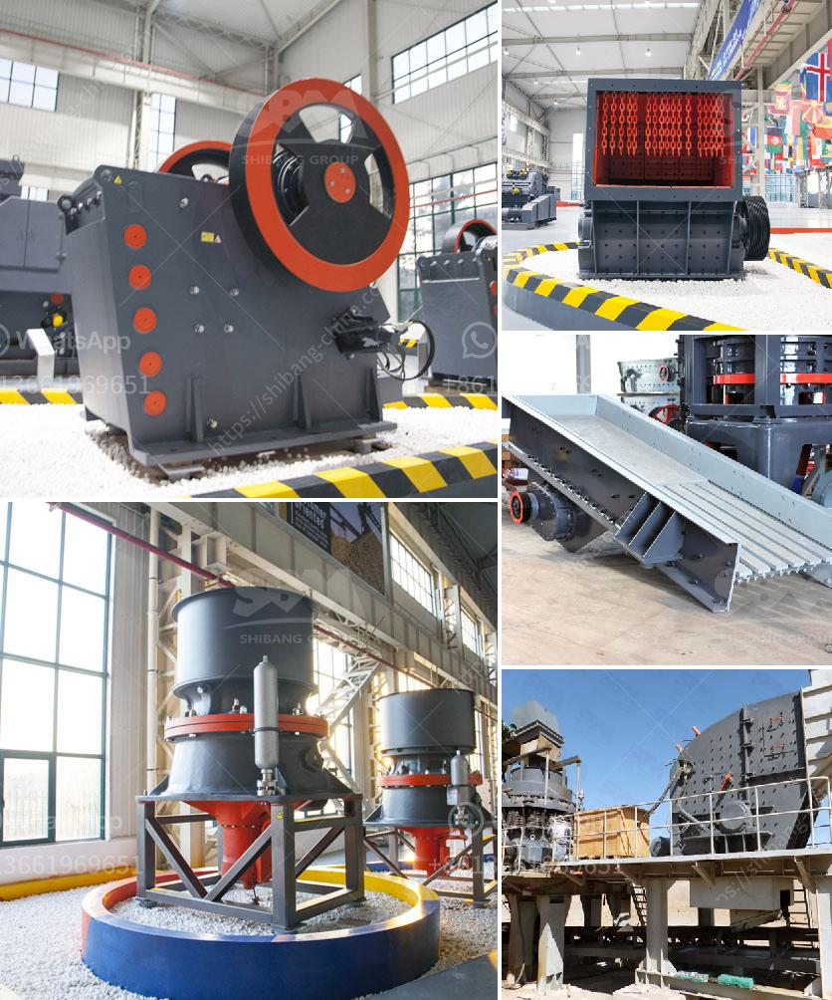

<h3>مطحنة صغيرة للمعادن</h3>
تعتبر مطاحن المعادن الصغيرة أدوات مهمة في صناعة وتجهيز المعادن. قد تتنوع المعادن التي يتم طحنها في هذه المطاحن من الألومنيوم والنحاس إلى الفولاذ المقاوم للصدأ والزنك والحديد. تستخدم هذه المطاحن في عمليات التصنيع الصناعي والتشكيل وتلميع الأجزاء المعدنية للحصول على الشكل والأداء المثالي.

تتميز المطاحن الصغيرة للمعادن بعدة ميزات. أولاً، فإن حجمها الصغير يعني أنها مثالية للاستخدام في المناطق التي تحتوي على مساحة محدودة، مما يسهل تثبيتها في ورش العمل الصغيرة. بالإضافة إلى ذلك، فإن الحجم الصغير يسهل عمليات النقل والتنقل ، مما يتيح للمستخدمين نقلها بسهولة بين مواقع العمل المختلفة.

ثانيًا، فإن المطاحن الصغيرة للمعادن تتميز بقوة دوران عالية وكفاءة عملية متفوقة. يمتلك هذا النوع من المطاحن محركات قوية تتيح لها تحقيق سرعات دوران عالية، مما يسهل عملية طحن المعادن وتشكيلها بسهولة وفي وقت قصير. تحتوي العديد من هذه المطاحن على أنظمة تبريد مدمجة تساعد في منع ارتفاع درجات الحرارة أثناء الاستخدام المتكرر، مما يعزز عمر الأداة ويحافظ على جودة النتائج.

ثالثًا، تتميز المطاحن الصغيرة بالدقة والمرونة. يتوفر في هذه الأدوات مجموعة متنوعة من الأقواس والحوامل والأجهزة الملحقة المختلفة التي تسمح للمستخدمين بضبط المطحنة وفقًا لاحتياجاتهم. يمكن استخدام هذه الأدوات لتكوين مجموعة واسعة من الشكليات والأحجام والتشطيبات، وبالتالي تعزيز المرونة في عمليات التصنيع والتشكيل.

في الختام، تعد المطاحن الصغيرة للمعادن أدوات مهمة في عمليات تشكيل المعادن وتلميعها. مع القدرة على عمليات دقيقة وسريعة وتوفير المرونة في التشكيل، تساهم هذه المطاحن في تحسين كفاءة العمل والجودة النهائية للمنتجات المعدنية. إذا كنت تعمل في صناعة المعادن أو مجالات ذات صلة، فإن استثمارك في مطحنة صغيرة للمعادن قد يكون خطوة ذكية لتحقيق التقدم في أعمالك وتحسين إنتاجيتك.
<h3>Contact us</h3><ul><li><strong>Whatsapp:&nbsp;<a href="https://wa.me/8613661969651">+8613661969651</a></strong></li><li><a href="https://swt.shibang-china.com/?git&amp;zhl&amp;مطحنة صغيرة للمعادن"><strong>Online Service(chat now)</strong></a></li></ul><h3>Related</h3><ul><li><a href='مطحنة للحجر الجيري في إيطاليا.md'>مطحنة للحجر الجيري في إيطاليا</a></li><li><a href='نوع مطحنة طاحونة عمودية في ماليزيا.md'>نوع مطحنة طاحونة عمودية في ماليزيا</a></li><li><a href='كسارة أولية للدولوميت.md'>كسارة أولية للدولوميت</a></li><li><a href='شركات مصنعي مطاحن الأسطوانات في الهند.md'>شركات مصنعي مطاحن الأسطوانات في الهند</a></li><li><a href='كيفية غسل الرمل للبناء.md'>كيفية غسل الرمل للبناء</a></li></ul>