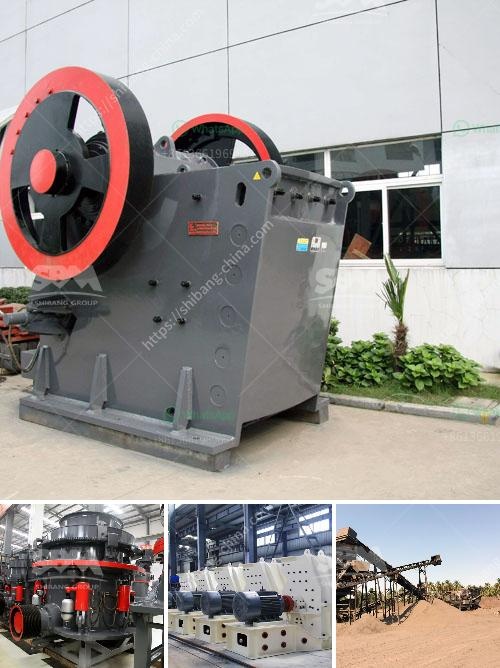

<h3>مطحنة صغيرة</h3>
تُعد المطاحن الصغيرة من أهم الأدوات التي يعتمد عليها الناس في العديد من الأماكن لطحن الحبوب والبذور والتوابل. فقد تعدت هذه المطاحن الصغيرة عقبة المساحة الضيقة وأصبحت الحل الأمثل للكثير من الناس الذين يبحثون عن تحقيق الطحن بطريقة سهلة وفعالة في المنزل.

تتميز المطاحن الصغيرة بالعديد من المزايا. أولاً وقبل كل شيء ، فهي محمولة وسهلة الاستخدام. يمكن للأفراد أخذها معهم في رحلاتهم القصيرة لضمان الحصول على طحين طازج ونقي في أي وقت يشاءون. تعتبر هذه المطاحن الصغيرة خفيفة الوزن ومصنوعة من مواد عالية الجودة مثل الفولاذ المقاوم للصدأ ، مما يجعلها متينة وطويلة الأمد.

ثانياً ، تُعد المطاحن الصغيرة فعالة من حيث استهلاك الطاقة والمساحة. فبفضل حجمها الصغير ، يمكن وضعها في أي مكان في المطبخ بدون أن تأخذ مساحة كبيرة. بالإضافة إلى ذلك ، فإنها تعمل بكفاءة عالية وتوفر الوقت والجهد. سهولة تفكيكها وتركيبها وتنظيفها تجعلها مثالية للاستخدام اليومي.

ثالثًا وأهم شيء ، فإن المطاحن الصغيرة تضفي جودة فائقة على الطحين والتوابل المطحونة. حيث أن الحبوب يمكن طحنها على الفور ، تضمن هذه المطاحن الحصول على طحين طازج ومشوب بالعناصر الغذائية. بالإضافة إلى ذلك ، يمكن ضبط درجة الطحن حسب الاحتياجات الشخصية ، مما يعزز الإمكانات والتنوع في المطبخ.

في الختام ، تعد المطاحن الصغيرة حلاً مثاليًا للأفراد الذين يهتمون بجودة الطحين والتوابل ويرغبون في الحصول على نتيجة ممتازة ومضمونة. علاوة على ذلك ، فهي محمولة وسهلة الاستخدام وتعمل بكفاءة عالية. يمكن أن تكون هذه المطاحن مساعدة قيمة في المطبخ وتوفر الوقت والجهد. إذا كنت تبحث عن طحين طازج وجودة عالية ، فإن المطاحن الصغيرة هي الاختيار الأمثل لك.
<h3>Contact us</h3><ul><li><strong>Whatsapp:&nbsp;<a href="https://wa.me/8613661969651">+8613661969651</a></strong></li><li><a href="https://swt.shibang-china.com/?git&amp;zhl&amp;مطحنة صغيرة"><strong>Online Service(chat now)</strong></a></li></ul><h3>Related</h3><ul><li><a href='آلة صنع الكرةست.md'>آلة صنع الكرةست</a></li><li><a href='خط إنتاج الكوارتز.md'>خط إنتاج الكوارتز</a></li><li><a href='مطحنة الأسطوانة في نيجيريا.md'>مطحنة الأسطوانة في نيجيريا</a></li><li><a href='إعداد مصفاة الكروم.md'>إعداد مصفاة الكروم</a></li><li><a href='صورة خط إنتاج الكلنكر الاسمنتي.md'>صورة خط إنتاج الكلنكر الاسمنتي</a></li></ul>