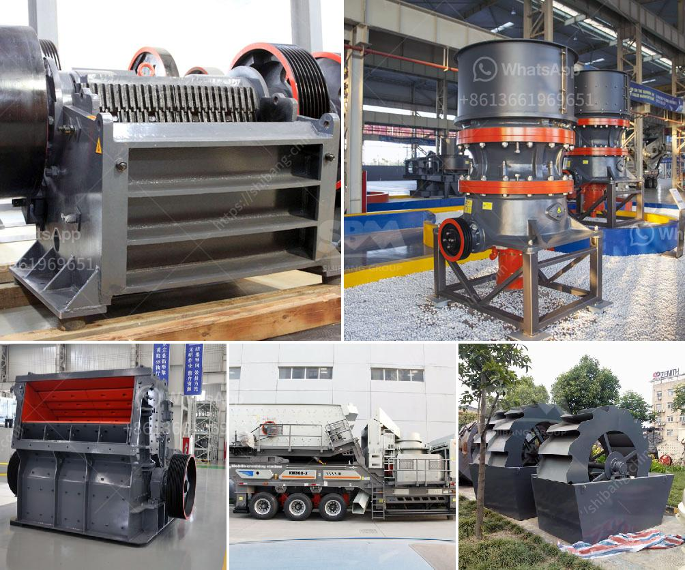

<h3>مطحنة صناعية</h3>
تحظى مطاحن الحبوب الصناعية بدور هام وحيوي في قطاع الزراعة والغذاء. فهي تعتبر واحدة من الصناعات الرئيسية التي تعالج وتهيئ الحبوب الخام لإنتاج الطحين والحبوب الأخرى. تعتبر المطاحن الصناعية أكبر الوحدات التحويلية للحبوب في العالم، حيث تتميز بقدرتها على معالجة كميات كبيرة من الحبوب بسرعة فائقة وبكفاءة عالية.

تتكون المطاحن الصناعية من عدة أجزاء أساسية، بما في ذلك المصعد الكبير لنقل الحبوب من المخازن إلى المطحنة، آلة التنظيف لفصل الشوائب والشوائب العضوية من الحبوب، وآلة الطحن لطحن الحبوب إلى دقيق. وتعتمد عملية الطحن على طرق متقدمة تشمل الطحن بالعجينة والطحن بالأسطوانات. تتمتع المطاحن الصناعية بمختلف القدرات ويتم تحديد قدرتها بناءً على القدرة العملية لكل مطحنة.

تُستخدم المطاحن الصناعية لإنتاج مجموعة متنوعة من المنتجات الحبوب المطحونة، مثل الطحين، والسميد، والشعيرية، وغيرها. وتختلف أنواع المنتجات وفقًا للحبوب المستخدمة. فمثلاً، يستخدم الأرز لإنتاج الرز المصفى والرز المقشور، في حين يستخدم القمح لإنتاج الطحين بأنواعه المختلفة.

إن وجود المطاحن الصناعية يوفر فرص العمل ويسهم في تعزيز الاقتصاد المحلي. حيث تتطلب عملية تشغيل المطحنة مجموعة متنوعة من المهارات الفنية والتقنية، وبالتالي يكون لديها القدرة على توظيف أعداد كبيرة من الأشخاص.

وفي الختام، فإن المطاحن الصناعية تلعب دورًا حيويًا في تحويل الحبوب الخام إلى منتجات غذائية قيمة. إنها تساهم في تلبية الطلب المتزايد على المنتجات الحبوب المطحونة وتحسين أمن الغذاء وتوفير المنتجات بأسعار معقولة. وبفضل تقنياتها المتطورة، ينبغي أن تستمر المطاحن الصناعية في تلبية الطلب المتزايد والتحديات التي تواجهها صناعة الغذاء.
<h3>Contact us</h3><ul><li><strong>Whatsapp:&nbsp;<a href="https://wa.me/8613661969651">+8613661969651</a></strong></li><li><a href="https://swt.shibang-china.com/?git&amp;zhl&amp;مطحنة صناعية"><strong>Online Service(chat now)</strong></a></li></ul><h3>Related</h3><ul><li><a href='مصنع النحاس للبيع.md'>مصنع النحاس للبيع</a></li><li><a href='كسارات الفك المستخدمة في الفلبين.md'>كسارات الفك المستخدمة في الفلبين</a></li><li><a href='سعر مطحنة الكرات بمقدار 25 طن في الساعة.md'>سعر مطحنة الكرات بمقدار 25 طن في الساعة</a></li><li><a href='صناعة تكسير ومعالجة الرخام على نطاق صغير.md'>صناعة تكسير ومعالجة الرخام على نطاق صغير</a></li><li><a href='آلات مستخدمة في مصنع الفحم المسحوق.md'>آلات مستخدمة في مصنع الفحم المسحوق</a></li></ul>