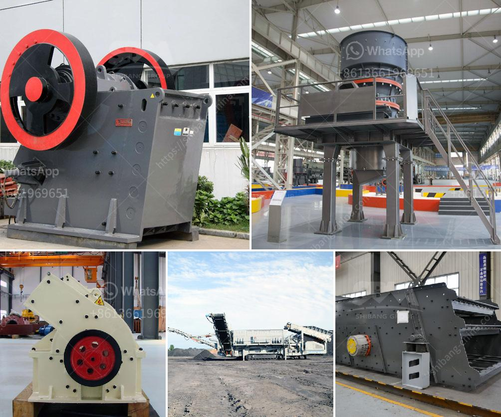

<h3>مطحنة طحن ألمانية</h3>
تحظى المطاحن الألمانية بسمعة عالمية لجودتها العالية وأدائها المتميز في طحن الحبوب. ومن بين المطاحن الألمانية الشهيرة، تتميز مطحنة طحن ألمانية بعدة جوانب تجعلها تبرز في سوق المطاحن.

أولاً، تتميز المطاحن الألمانية بتصميمها الدقيق والمتقن. فقد تم ابتكارها بعناية فائقة لتلبي احتياجات المستخدمين وضمان أداء ممتاز وفعالية في العمل. تستخدم تقنيات ومكونات متطورة تعزز جودة الطحن وتعمل على ضمان الحصول على نتائج متسقة في كل مرة.

ثانياً، تتميز المطاحن الألمانية بتوفرها في مجموعة متنوعة من الأحجام والقدرات. تتوفر مطاحن صغيرة للاستخدام المنزلي ومطاحن كبيرة للاستخدام التجاري. وتتميز كل مطحنة بتصميم فريد يلبي احتياجات المستخدم ويضمن طحناً سلساً وفعالاً للحبوب.

ثالثاً، تعتبر المطاحن الألمانية من أكثر المطاحن دقة في عملية الطحن. فهي مزودة بنظام طحن متقدم يسمح بتعديل درجة الطحن بدقة عالية. وبفضل هذه الدقة، يمكن للمستخدمين تحقيق أفضل نتائج الطحن حسب احتياجاتهم الخاصة، من الحبوب الكاملة إلى نعطافة الطحين الدقيق.

رابعاً، توفر المطاحن الألمانية أداءً قوياً ومستداماً. فهي مصنوعة من مواد عالية الجودة تضمن متانة المطحنة طويلة الأمد وقدرتها على التحمل في الاستخدام اليومي. كما تتميز بسهولة الاستخدام والصيانة، مما يجعلها خياراً مثالياً للمستخدمين الذين يبحثون عن مطحنة تدوم لفترة طويلة وتعمل بكفاءة.

في النهاية، تعد المطاحن الألمانية خياراً مثالياً لأولئك الذين يهتمون بجودة الطحن والأداء العالي. تتمتع بتصميم دقيق وقدرات متنوعة وأداء قوي ومستدام، بالإضافة إلى سهولة الاستخدام والصيانة. فإن استثمارك في مطحنة طحن ألمانية سيكون قراراً موفقاً يضمن لك الحصول على طحن متميز للحبوب بطريقة سهلة وفعالة.
<h3>Contact us</h3><ul><li><strong>Whatsapp:&nbsp;<a href="https://wa.me/8613661969651">+8613661969651</a></strong></li><li><a href="https://swt.shibang-china.com/?git&amp;zhl&amp;مطحنة طحن ألمانية"><strong>Online Service(chat now)</strong></a></li></ul><h3>Related</h3><ul><li><a href='معدات معالجة الكروم لباكستان.md'>معدات معالجة الكروم لباكستان</a></li><li><a href='قائمة شركات التعدين على الحجر الجيري في الصين.md'>قائمة شركات التعدين على الحجر الجيري في الصين</a></li><li><a href='آلة صنع الطوب من الطين.md'>آلة صنع الطوب من الطين</a></li><li><a href='مصانع مطاحن الأسمنت.md'>مصانع مطاحن الأسمنت</a></li><li><a href='كسارة متنقلة في اليابان.md'>كسارة متنقلة في اليابان</a></li></ul>