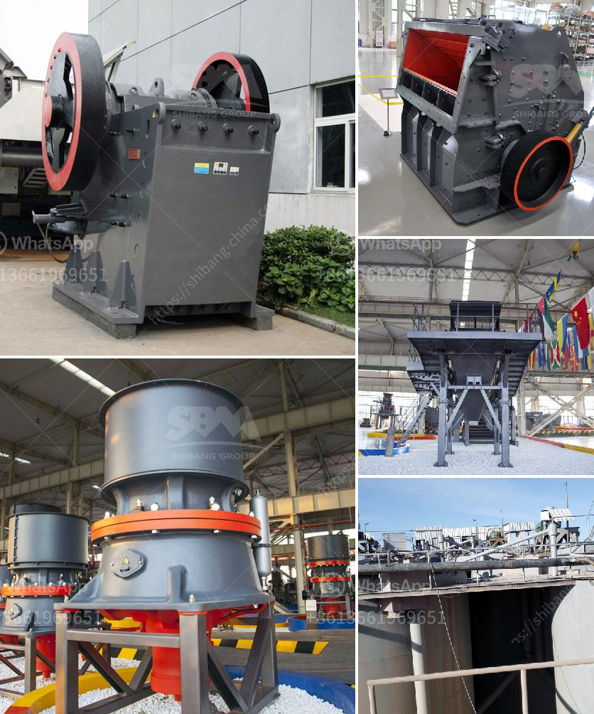

<h3>مطحنة طحن الحجر الصناعي</h3>
تعتبر مطحنة طحن الحجر الصناعي أحد الأدوات الهامة لصناعة الحجر الصناعي. تستخدم هذه المطاحن لطحن الحجر الصناعي بشكل فعال ودقيق للحصول على الحجم والشكل المطلوب.

تتألف مطاحن طحن الحجر الصناعي من جسم معدني صلب يحتوي على أسطوانة دوارة مزودة بألواح معدنية أو سداسية، ويتم تثبيتها على الأسطوانة. تتم دوران الأسطوانة بسرعة عالية لفرض ضغط على الحجر الصناعي وطحنه.

تحتوي مطاحن طحن الحجر الصناعي على أجزاء عديدة مهمة تضمن أداء فعال ودقة في الطحن. تتضمن هذه الأجزاء المغناطيسات والحساسات والمحركات والعتاد والمخازن ووحدات التحكم. تعتمد كفاءة المطحنة على أداء هذه الأجزاء بشكل جيد.

تبدأ عملية طحن الحجر الصناعي بإدخال الحجر في فوهة الطحن. يتم نقل الحجر عبر السيور الناقلة إلى الجسم الرئيسي للمطحنة. يتم طحن الحجر بواسطة مداسات مصممة خصيصًا لهذا الغرض على أسطوانة الطحن. يتم تحويل الحجم الكبير للحجر إلى أجزاء أصغر ويتم تفريغها من خلال شبكة تصفية.

توفر مطاحن طحن الحجر الصناعي عدة فوائد. أولاً وقبل كل شيء، فإنها تسمح بتحسين جودة الحجر الصناعي. تحقق المطاحن دقة عالية في الطحن، مما يؤدي إلى استنساخ تام للأشكال والأحجام المطلوبة للحجر الصناعي. كما أنها تعزز كفاءة العملية الخاصة بإنتاج الحجر الصناعي وتقلل من عبء العمل اليدوي المطلوب.

بالإضافة إلى ذلك، فإن مطاحن طحن الحجر الصناعي تساهم في زيادة إنتاجية الصناعة وتوفير الوقت والجهد. ومن المهم أيضًا أن يتم صيانة وتنظيف المطاحن بانتظام لضمان عملها الفعال والسلس.

في الختام، تعد مطاحن طحن الحجر الصناعي أداة أساسية في صناعة الحجر الصناعي. تساهم هذه المطاحن في تحسين جودة الحجر الصناعي، زيادة الإنتاجية، وتوفير الجهد والوقت. يجب الاهتمام بصيانة وتنظيف المطاحن بانتظام لضمان عملها الفعال والمستدام.
<h3>Contact us</h3><ul><li><strong>Whatsapp:&nbsp;<a href="https://wa.me/8613661969651">+8613661969651</a></strong></li><li><a href="https://swt.shibang-china.com/?git&amp;zhl&amp;مطحنة طحن الحجر الصناعي"><strong>Online Service(chat now)</strong></a></li></ul><h3>Related</h3><ul><li><a href='مصنع تكسير الحجر في نيجيريا.md'>مصنع تكسير الحجر في نيجيريا</a></li><li><a href='موردين تكسير الكوارتز في أوروبا.md'>موردين تكسير الكوارتز في أوروبا</a></li><li><a href='كسارة الفك والشاشة بتنسيق PDF.md'>كسارة الفك والشاشة بتنسيق PDF</a></li><li><a href='مصنع كسارة الصخور بسعة 150 طن.md'>مصنع كسارة الصخور بسعة 150 طن</a></li><li><a href='سعر مطاحن الكرة.md'>سعر مطاحن الكرة</a></li></ul>