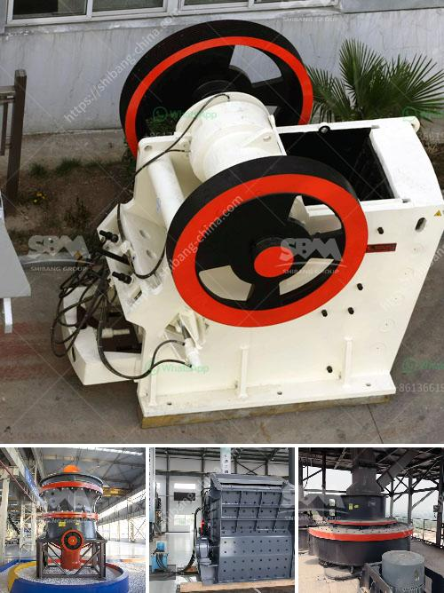

<h3>مطحنة طحن الحجر من ألمانيا</h3>
تعتبر مطاحن طحن الحجر من ألمانيا من أهم الآلات التي تستخدم في صناعة الأغذية. تتميز هذه المطاحن بالقدرة على طحن الحبوب والأعشاب بطريقة فعالة وسريعة. تبنت عدة دول حول العالم هذه التكنولوجيا الرائدة للحصول على منتجات عالية الجودة.

تمتاز مطاحن طحن الحجر من ألمانيا بوجود حجر كبير وثقيل يتحرك بسرعة على حبوب المواد الغذائية المطحونة، مسحقًا إياها بفعالية. يتميز هذا النظام بقدرته على الحفاظ على الألياف والعناصر الغذائية الهامة في المنتج النهائي. كما أنه يقلل من الحرارة الناتجة عن الاحتكاك، مما يساعد على الحفاظ على كل المغذيات الطبيعية في المواد الغذائية.

قد يتساءل البعض عن الفرق بين مطاحن طحن الحجر والمطاحن العادية؟ حسنًا، الفرق الرئيسي يكمن في عملية الطحن ذاتها. في المطاحن العادية، يتم استخدام شفرات حادة لقطع المواد الغذائية إلى قطع دقيقة، مما قد يؤدي إلى فقدان العناصر الغذائية الهامة والاحتكاك الزائد والحرارة الناتجة عن العملية.

أما في حالة المطاحن التقليدية التي تستخدم حجرًا للطحن، فإن الفائدة تكمن في قدرتها على الحفاظ على البيئة التي تعمل فيها المطحنة. فالحجر قوي ويدوم لفترة طويلة، مما يجعل هذا النوع من المطاحن يعد خيارًا صديقًا للبيئة واقتصاديًا.

تُستخدم مطاحن طحن الحجر من ألمانيا في مجالات عديدة. ومن ضمن التطبيقات الشائعة لهذه المعدات، طحن الحبوب لإنتاج الطحين والأغذية المختلفة. كما يتم استخدامها في طحن البهارات والأعشاب لإنتاج التوابل الطازجة.

بشكل عام، يمثل استخدام مطاحن طحن الحجر من ألمانيا خطوة هامة نحو إنتاج الأغذية الطبيعية ذات الجودة العالية والمحافظة على العناصر الغذائية القيمة. تعتبر هذه المطاحن محطة طحن مهمة في سلسلة إنتاج الأغذية، حيث تساعد في تعزيز صحة الإنسان عن طريق الحفاظ على المغذيات وتقديم منتجات ذات جودة عالية وقيمة غذائية مميزة.

باختصار، تعد مطاحن طحن الحجر من ألمانيا هي الخيار الأمثل للشركات والمصانع التي تحرص على إنتاج الأغذية الطبيعية ذات الجودة العالية. تأتي هذه المطاحن بالعديد من المزايا مثل الاحتفاظ بالعناصر الغذائية والجودة المتميزة في المنتج النهائي.
<h3>Contact us</h3><ul><li><strong>Whatsapp:&nbsp;<a href="https://wa.me/8613661969651">+8613661969651</a></strong></li><li><a href="https://swt.shibang-china.com/?git&amp;zhl&amp;مطحنة طحن الحجر من ألمانيا"><strong>Online Service(chat now)</strong></a></li></ul><h3>Related</h3><ul><li><a href='قائمة أسعار كسارات الفك.md'>قائمة أسعار كسارات الفك</a></li><li><a href='مصنع تكسير خام البوكسيت.md'>مصنع تكسير خام البوكسيت</a></li><li><a href='مطحنة رايموند للبيع مستعملة.md'>مطحنة رايموند للبيع مستعملة</a></li><li><a href='طاحونة طحن الكالسيوم.md'>طاحونة طحن الكالسيوم</a></li><li><a href='علامات مصنع كسارة المحجر مطحنة الكرة.md'>علامات مصنع كسارة المحجر مطحنة الكرة</a></li></ul>