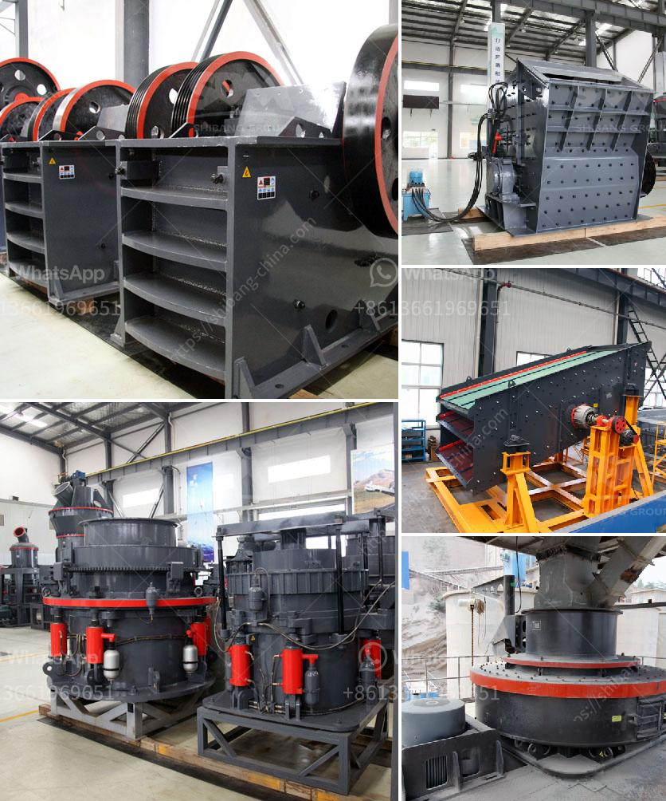

<h3>مطحنة طحن الذرة في جنوب أفريقيا</h3>
تعتبر طحن الذرة من العمليات الأساسية في صناعة الأغذية، حيث يتم تحويل الحبوب الجافة إلى مسحوق دقيق للاستخدام في صنع الخبز والمعجنات والعديد من المنتجات الغذائية الأخرى. تعد جنوب أفريقيا واحدة من أهم الدول المنتجة للذرة في العالم، وبالتالي، فإن مطاحن طحن الذرة في هذا البلد تعد عنصرًا حاسمًا في تلبية احتياجات السوق المحلية والإقليمية.

تعمل مطحنة طحن الذرة في جنوب أفريقيا عن طريق تحويل حبوب الذرة الجافة إلى مسحوق دقيق من خلال مجموعة من المعدات والآلات المتخصصة. يتم استخدام الحبوب الجافة في إنتاج الدقيق الأبيض والأصفر والأزرق، والتي تعتبر أنواعًا شائعة في السوق المحلية.

تتكون المطاحن الحديثة من عدة مراحل، بدءًا من مرحلة تنظيف الحبوب وإزالة الشوائب والأوساخ، ثم مرحلة تجفيف الحبوب حتى يتم ضمان نسبة رطوبة مناسبة. بعد ذلك، تستخدم المطاحن أجهزة طحن متطورة لتقطيع وطحن الحبوب إلى حجم جسيمات صغيرة جدًا. يتم تنظيم حجم الذرة المطحونة حسب الطلب النهائي واحتياجات السوق.

بعد مرحلة الطحن، يتم غربلة الدقيق المطحون لإزالة الشوائب والأجسام الغريبة الأخرى التي قد تكون موجودة. ثم يتم تعبئة الدقيق في حاويات خاصة مع الالتزام بمعايير الجودة والنظافة. يتم استخدام هذا الدقيق في صنع مجموعة متنوعة من المنتجات الغذائية، مثل الخبز والمعجنات والكعك والبسكويت والكريمة الفانيليا وغيرها.

إضافةً إلى تأمين احتياجات السوق المحلية، تلعب مطاحن طحن الذرة في جنوب أفريقيا دورًا هامًا في تصدير المنتجات الغذائية إلى دول أخرى في الإقليم. فهي توفر أفضل جودة للذرة المطحونة بتقنيات متطورة ومعايير جودة صارمة.

تعد مطاحن طحن الذرة في جنوب أفريقيا بمثابة محور لصناعة الأغذية المحلية. فهي تلبي احتياجات السوق المحلية والإقليمية، وتوفر فرص عمل للعديد من العمال، وتعزز الاقتصاد المحلي. بالإضافة إلى ذلك، فإن المطاحن تعمل على تعظيم قيمة الذرة كمادة خام محلية، وبالتالي تساهم في تحسين الأمن الغذائي في البلاد.

باختصار، مطاحن طحن الذرة في جنوب أفريقيا تعد جزءًا حيويًا من سلسلة إنتاج الأغذية في البلاد. توفر هذه المطاحن الدقيق المطحون عالي الجودة للاستهلاك المحلي والتصدير، مع تحسين القيمة المضافة للذرة المحلية والتشجيع على النمو الاقتصادي في القطاع الزراعي.
<h3>Contact us</h3><ul><li><strong>Whatsapp:&nbsp;<a href="https://wa.me/8613661969651">+8613661969651</a></strong></li><li><a href="https://swt.shibang-china.com/?git&amp;zhl&amp;مطحنة طحن الذرة في جنوب أفريقيا"><strong>Online Service(chat now)</strong></a></li></ul><h3>Related</h3><ul><li><a href='آلة تعدين الذهب.md'>آلة تعدين الذهب</a></li><li><a href='تكلفة آلة الكسارة.md'>تكلفة آلة الكسارة</a></li><li><a href='مصنع سحق وطحن.md'>مصنع سحق وطحن</a></li><li><a href='كسارة الفك هي.md'>كسارة الفك هي</a></li><li><a href='سعر آلة طحن الرخام في الهند.md'>سعر آلة طحن الرخام في الهند</a></li></ul>