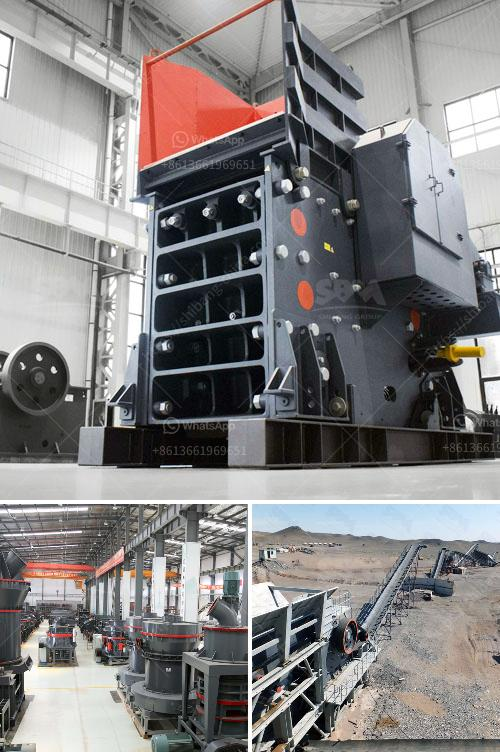

<h3>مطحنة طحن السخام في الهند</h3>
تعتبر الهند واحدة من أكبر الدول المنتجة للسخام في العالم. يعود ذلك إلى العديد من العوامل مثل التنمية الصناعية الكبيرة في البلاد والزيادة المستمرة في النشاط الزراعي. لتلبية الطلب المتزايد على سلعة السخام، تمتلك الهند العديد من مطاحن السخام المتخصصة في عملية طحن السخام وإعداده للاستخدام في الصناعات المختلفة.

تعد مطحنة طحن السخام في الهند مكونًا أساسيًا في سلسلة التوريد للمنتجات التي تحتوي على السخام، مثل الأدوية الصناعية والدهانات والألوان والأصباغ والأسمدة والمبيدات الحشرية والمستحضرات الصحية. تهدف عملية طحن السخام إلى تحويل السخام الخام إلى مسحوق ناعم قادر على الاندماج بسهولة في المنتجات النهائية. وتشمل معدات مطحنة طحن السخام مجموعة من الأجهزة مثل الكسارات والمطاحن والغرابيل والمجففات ومعدات التحميل والتفريغ.

تتبع مطاحن طحن السخام في الهند إجراءات دقيقة لضمان الجودة والسلامة. يتم فحص المنتجات بدقة للتحقق من مطابقتها للمعايير الوطنية والدولية. تستخدم الهند التكنولوجيا الحديثة في عملية طحن السخام، مما يضمن حصول المنتج على خواصه الميكانيكية المطلوبة وقدرته على تطبيقاته المختلفة.

ومن المهم أن نذكر أن طحن السخام قد يكون ضارًا للصحة، حيث يتطاير الغبار الناجم عن عملية الطحن ويتراوح حجمه بين 2.5 و 10 ميكرومتر، مما يجعله صغيرًا بما يكفي للوصول إلى الجهاز التنفسي والتسبب في مشاكل صحية مثل أمراض الرئة والربو. عليه، فإن مطاحن طحن السخام يجب أن تتبع إرشادات واجراءات السلامة المهنية، مثل استخدام أجهزة الحماية الشخصية وتطبيق نظم التهوية المناسبة لتقليل التعرض للغبار.

في الختام، تعد مطاحن طحن السخام في الهند جزءًا حيويًا من قطاع الصناعات المتعلقة بالسخام. تلعب هذه المطاحن دورًا مهمًا في تحويل السخام الخام إلى منتج ذو قيمة مضافة عالية وجودة ممتازة. ومع مراعاة السلامة والجودة في عملية الإنتاج، يمكن للمطاحن تلبية الطلب المتزايد على السخام وتلبية احتياجات الصناعات المختلفة المعتمدة على هذه السلعة.
<h3>Contact us</h3><ul><li><strong>Whatsapp:&nbsp;<a href="https://wa.me/8613661969651">+8613661969651</a></strong></li><li><a href="https://swt.shibang-china.com/?git&amp;zhl&amp;مطحنة طحن السخام في الهند"><strong>Online Service(chat now)</strong></a></li></ul><h3>Related</h3><ul><li><a href='خطة عمل لتعدين الحجر واستغلاله.md'>خطة عمل لتعدين الحجر واستغلاله</a></li><li><a href='سعر كسارة الحجر pe 600 900.md'>سعر كسارة الحجر pe 600 900</a></li><li><a href='تكلفة المعدات المستخدمة في تعدين خام الرصاص.md'>تكلفة المعدات المستخدمة في تعدين خام الرصاص</a></li><li><a href='كسارة صخور محمولة صغيرة.md'>كسارة صخور محمولة صغيرة</a></li><li><a href='كسارة الحجر للجرار.md'>كسارة الحجر للجرار</a></li></ul>