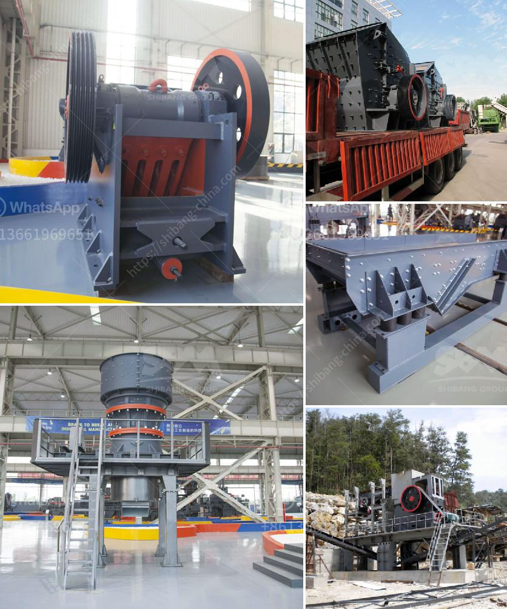

<h3>مطحنة طحن الطين الصيني</h3>
تعد مطحنة طحن الطين الصيني واحدة من أقدم وأكثر الآلات استخدامًا في صناعة الجبس والسيراميك والكيماويات. تستخدم هذه المطحنة لطحن الطين إلى حجم يناسب استخدامه في العديد من العمليات الصناعية الأخرى.

تتكون مطحنة الطين الصينية من طاحونة تدور بسرعة عالية وتحتوي على مطرقة صلبة. يتم وضع الطين داخل المطاحن وتفتته بواسطة الطاقة الدورانية للمطحنة والمطرقة. يتم استخدام التيار الهوائي لتفتيت الطين إلى حجم جزيئي مناسب قبل خروجه من المطحنة. وبهذه الطريقة ، يتم تطحين الطين بشكل فعال لإعطاء منتج نهائي عالي الجودة ومتسق.

تتميز مطحنة طحن الطين الصيني بالعديد من المزايا. أحدها هو التصميم المدمج الذي يسمح بسهولة التركيب والصيانة. يمكن وضع هذه المطاحن في مساحات ضيقة ولا تحتاج إلى مساحة كبيرة للعمل. بالإضافة إلى ذلك ، يمكن تكوين المطاحن الصينية بأحجام مختلفة وفقًا لاحتياجات العميل. بالتالي ، تكون مثالية للاستخدام في مجموعة متنوعة من الصناعات.

يتميز الطين الصيني بخواصه الفريدة والمتنوعة. يتم استخدامه في صناعة الطوب والبلوك والأواني الفخارية والسيراميك والجص. ولتحقيق هذه الاستخدامات المختلفة ، يجب طحن الطين الصيني بشكل صحيح للحصول على حجم جزيئي يواكب متطلبات هذه الصناعات.

بالنظر إلى ذلك ، تعد مطاحن طحن الطين الصينية الخيار الأمثل لتلبية احتياجات العديد من الصناعات. فهي تتميز بالكفاءة والاقتصاد والتحمل العالي. كما أنها سهلة الاستخدام وتتطلب صيانة بسيطة.

باختصار ، فإن مطحنة طحن الطين الصينية تعد أداة أساسية في صناعة الجبس والسيراميك والكيماويات. يمكن أن تساهم في تحسين جودة المنتجات النهائية وتقديم المرونة في العملية الصناعية. كما تتمتع هذه المطاحن بمزايا عديدة تجعلها خيارًا مثاليًا للعديد من الصناعات المختلفة.
<h3>Contact us</h3><ul><li><strong>Whatsapp:&nbsp;<a href="https://wa.me/8613661969651">+8613661969651</a></strong></li><li><a href="https://swt.shibang-china.com/?git&amp;zhl&amp;مطحنة طحن الطين الصيني"><strong>Online Service(chat now)</strong></a></li></ul><h3>Related</h3><ul><li><a href='كسارة محمولة في ماليزيا.md'>كسارة محمولة في ماليزيا</a></li><li><a href='تجار كسارات الحجر الكوارتز.md'>تجار كسارات الحجر الكوارتز</a></li><li><a href='عملية تنشيط الكالسيوم.md'>عملية تنشيط الكالسيوم</a></li><li><a href='كسارة صخور لخام الكروم أو الكروميت.md'>كسارة صخور لخام الكروم أو الكروميت</a></li><li><a href='نموذج 2D لمطحنة الكرة.md'>نموذج 2D لمطحنة الكرة</a></li></ul>