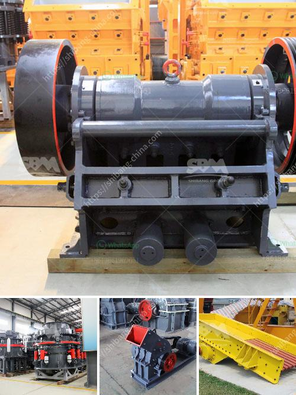

<h3>مطحنة طحن الفحم في الصين</h3>
تعد الصين من الدول الرائدة في صناعة الفحم على مستوى العالم، وتستخدم مجموعة متنوعة من الآلات والمعدات لطحن وتحضير الفحم. ومن أهم تلك الآلات تأتي مطحنة طحن الفحم التي تعد العمود الفقري لعمليات تحضير الفحم.

تستخدم مطاحن طحن الفحم في الصين لتقوم بطحن الفحم إلى حبيبات ناعمة، وذلك بهدف زيادة كفاءة احتراق الوقود وتحسين أداء الأفران والمعدات الأخرى التي تعمل بالفحم. وتتميز هذه المطاحن بقدرتها على تحقيق درجات دقة عالية في الطحن، حيث يتم ضبط حجم الحبيبات وتوزيعها بدقة وفقًا لاحتياجات المستخدم.

تعتمد مطاحن طحن الفحم في الصين على مبدأ الطحن بالأثر، حيث يتم إدخال الفحم داخل الجهاز وتتم معالجته بواسطة الضغط والاحتكاك لتحقيق عملية الطحن. وتختلف تصاميم هذه المطاحن حسب المتطلبات والاحتياجات، حيث تتضمن أنواعًا مختلفة مثل مطاحن الكرة ومطاحن المطرقة ومطاحن التأرجح وغيرها.

تتميز مطاحن طحن الفحم في الصين بقدرتها العالية على الطحن المستدام والفعال للفحم، وذلك بفضل تقنيات الصيانة المتطورة الخاصة بها. وتعتبر هذه المطاحن أحدث التقنيات في مجال طحن الفحم، وهي تستخدم في العديد من الصناعات مثل صناعة الطاقة والأسمدة والأسمدة البيولوجية والأسمدة العضوية وصناعة الزجاج والجير.

ومن الجدير بالذكر أن صناعة الفحم تعد من الصناعات الهامة في الصين، حيث تعتمد العديد من الصناعات الكبرى في البلاد على الفحم لتشغيل معداتها وأفرانها الحرارية. وبفضل تطور صناعة طحن الفحم في الصين، تم تحسين كفاءة استخدام الفحم وتقليل تلوث الهواء المرتبط به.

وفي الختام، تعد مطاحن طحن الفحم في الصين جزءًا أساسيًا من صناعة الفحم في البلاد، حيث تتمتع بتقنيات متطورة وتصاميم مبتكرة تساهم في زيادة كفاءة استخدام الفحم وتحسين أداء العديد من الصناعات التي تعتمد عليه. وتكمن أهمية هذه المطاحن في الدور الذي تلعبه في تحويل الفحم إلى وقود فعال وصديق للبيئة.
<h3>Contact us</h3><ul><li><strong>Whatsapp:&nbsp;<a href="https://wa.me/8613661969651">+8613661969651</a></strong></li><li><a href="https://swt.shibang-china.com/?git&amp;zhl&amp;مطحنة طحن الفحم في الصين"><strong>Online Service(chat now)</strong></a></li></ul><h3>Related</h3><ul><li><a href='الأحجار الكريمة الموجودة في نيجيريا.md'>الأحجار الكريمة الموجودة في نيجيريا</a></li><li><a href='قمع التفريغ لمطحنة الكرة.md'>قمع التفريغ لمطحنة الكرة</a></li><li><a href='تصميم آلة كسارة الحجر مخطط تدفق التجميع.md'>تصميم آلة كسارة الحجر مخطط تدفق التجميع</a></li><li><a href='مخططات تدفق لتصنيع الحديد الزهر.md'>مخططات تدفق لتصنيع الحديد الزهر</a></li><li><a href='كسارة للبيع بسعر دبي.md'>كسارة للبيع بسعر دبي</a></li></ul>