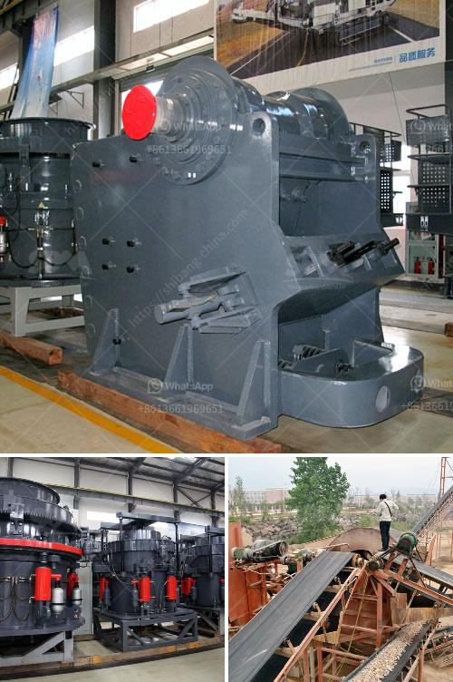

<h3>مطحنة طحن الكرة في الهند</h3>
تعتبر مطحنة طحن الكرة واحدة من أهم المعدات المستخدمة في صناعة الاسمنت في الهند. تستخدم هذه المطاحن لطحن المواد الخام والأسمنت النهائي، وتعتمد على آلية طحن الكرة الدوارة للتخلص من الحبيبات الكبيرة وجعلها أصغر حجمًا.

تتكون مطاحن الكرة من أسطوانة أفقية كبيرة الحجم مجهزة بأعواض داخلية متحركة تحتوي على كرات فولاذية. عندما تدخل المواد الخام إلى المطحنة، يتم طحنها بواسطة الحركة الدورانية للكرات الفولاذية والأعواض الداخلية، مما ينتج عنه مسحوق الأسمنت النهائي.

تستخدم مطاحن الكرة في العديد من مصانع الاسمنت في الهند بنجاح. فهي توفر كفاءة عالية في الطحن وتكسير المواد الخام، وتتميز بقدرتها على طحن مجموعة واسعة من المواد الخام بكفاءة عالية. توفر هذه المطاحن أيضًا توزيعًا مثاليًا لحجم الجسيمات ومساحة سطح كبيرة للاندماج الكيميائي.

كما أن مطاحن الكرة طحن الكلنكر ، وهو المكون الرئيسي للأسمنت ، لتكوين الأسمنت النهائي. فالكلنكر عبارة عن مادة خام تم تسخينها وتفجيرها لتحقيق خواص الاسمنت المطلوبة. بعد طحن الكلنكر في مطحنة الكرة ، يتم إضافة بعض المواد المعدلة للخلطة النهائية لإنتاج أنواع مختلفة من الأسمنت.

توفر مطاحن الكرة الهندية مزايا عديدة لصناعة الاسمنت. فهي توفر تقنيات طحن حديثة ، مما يقلل من استهلاك الطاقة ويحسن كفاءة الطحن. بالإضافة إلى ذلك ، فإنها تساهم في توفير الدقة والثبات في العملية الإنتاجية. كما أنها تعمل على تحسين جودة المنتج النهائي وزيادة إنتاجية المصنع.

بالإضافة إلى ذلك ، تُعَدُّ الهند أحد أبرز المنتجين والمستهلكين للأسمنت في العالم. بفضل الطلب المتزايد على الأسمنت في الهند ، تم تطوير مطاحن الكرة المتطورة لتلبية احتياجات الصناعة. ولاسيما أن الهند تعتمد بشكل كبير على البنية التحتية والإسكان وقطاع البناء لتحقيق التنمية الاقتصادية.

باختصار ، تُعَدُّ مطاحن الكرة في الهند أحد العوامل الرئيسية في تطوير صناعة الاسمنت المزدهرة في البلاد. بفضل تكنولوجيا الطحن المتقدمة والكفاءة العالية ، تمثل مطاحن الكرة حلاً مثاليًا لطحن المواد الخام والكلنكر وتحقيق الأداء المطلوب لإنتاج الأسمنت بجودة عالية.
<h3>Contact us</h3><ul><li><strong>Whatsapp:&nbsp;<a href="https://wa.me/8613661969651">+8613661969651</a></strong></li><li><a href="https://swt.shibang-china.com/?git&amp;zhl&amp;مطحنة طحن الكرة في الهند"><strong>Online Service(chat now)</strong></a></li></ul><h3>Related</h3><ul><li><a href='مطحنة قضيب الكرة الحجر الجيري.md'>مطحنة قضيب الكرة الحجر الجيري</a></li><li><a href='بيع كسارة مخروط قديمة.md'>بيع كسارة مخروط قديمة</a></li><li><a href='سعر كسارة الفك في نيجيريا.md'>سعر كسارة الفك في نيجيريا</a></li><li><a href='تعليم مطحنة الكرة.md'>تعليم مطحنة الكرة</a></li><li><a href='كسارة محمولة كليمان.md'>كسارة محمولة كليمان.</a></li></ul>