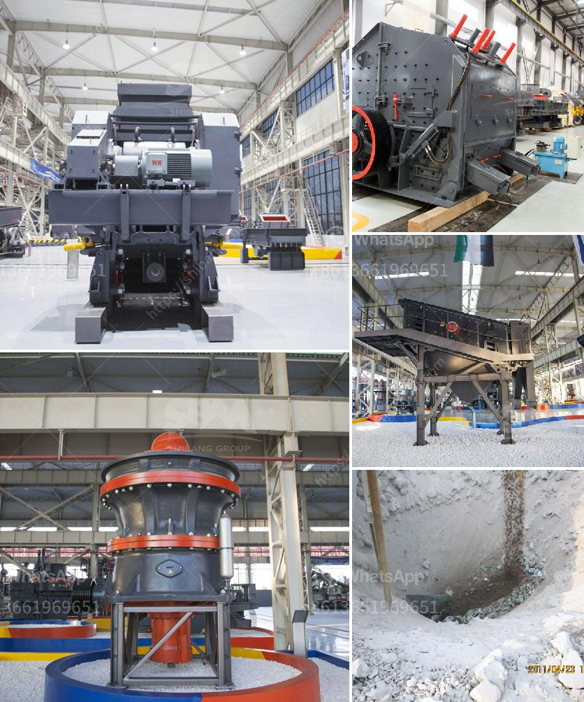

<h3>مطحنة طحن الكرةستخدم لطحن الكرات</h3>
تعد مطحنة طحن الكرة واحدة من أهم الأدوات المستخدمة في صناعة الطحن. تُستخدم المطاحن الكروية في عملية طحن الخامات والمواد الصلبة الأخرى، حيث يتم طحن المواد بواسطة كرات معدنية تدور داخل المطحنة. تعد هذه المطاحن فعالة جداً في طحن المواد الصلبة، سواءً كانت جافة أو رطبة.

تتألف المطاحن الكروية من جسم أسطواني مع غطاء يحمل فتحة لإدخال وإخراج المواد. يوجد داخل المطحنة مجموعة من الكرات المعدنية المصنوعة من الفولاذ أو الخزف، وتكون مثقلة بوزنها لتخلق تأثير اصطدام عالي عند الدوران.

تعمل عملية الطحن في المطاحن الكروية على النحو التالي: يتم إدخال المواد داخل المطحنة من خلال الفتحة الموجودة في الغطاء، ثم تتم دوران الكرات مع المواد داخل المطحنة. تتعرض المواد للطحن بفعل اصطدام الكرات بالمواد وبعضها البعض، مما يؤدي إلى تكسير المواد وتحويلها إلى حجم أصغر وأجزاء أدق.

تعتبر المطاحن الكروية مفيدة في صناعات عديدة مثل صناعة الأسمنت والسيراميك والتعدين والبناء والصناعات الكيميائية. تستخدم هذه المطاحن لطحن المواد الصلبة المختلفة، مثل الخامات الصلبة والخشنة، وتستخدم أيضًا في عملية الطحن الرطبة للمواد التي تحتاج إلى طحن بالماء أو السوائل الأخرى.

هناك عدة عوامل تؤثر في كفاءة المطحنة الكروية ونتائج عملية الطحن، مثل حجم الكرات المستخدمة والسرعة وزمن الطحن ونسبة المواد الصلبة المضافة للمطحنة. بالإضافة إلى ذلك، يجب مراقبة درجة التآكل للكرات وتحديدها بانتظام للحفاظ على أداء المطاحن الكروية.

في الختام، تعد مطحنة طحن الكرة أداة هامة لطحن المواد الصلبة وتحويلها إلى أحجام أصغر وأدق. تستخدم في صناعة الأسمنت والسيراميك والتعدين والكيمياء وتوفر طريقة فعالة لتحقيق عملية الطحن بسرعة وبكفاءة عالية. من خلال مراقبة عوامل الطحن المختلفة، يمكن تحسين أداء المطاحن الكروية وتحقيق نتائج مرضية لعملية الطحن.
<h3>Contact us</h3><ul><li><strong>Whatsapp:&nbsp;<a href="https://wa.me/8613661969651">+8613661969651</a></strong></li><li><a href="https://swt.shibang-china.com/?git&amp;zhl&amp;مطحنة طحن الكرةستخدم لطحن الكرات"><strong>Online Service(chat now)</strong></a></li></ul><h3>Related</h3><ul><li><a href='مطحنة رمل مستعملة في هولندا.md'>مطحنة رمل مستعملة في هولندا</a></li><li><a href='عملية تصنيع لوحات الجبس.md'>عملية تصنيع لوحات الجبس</a></li><li><a href='معدات تعدين النحاس.md'>معدات تعدين النحاس</a></li><li><a href='كسارة متنقلة بسعة 100 طن في الساعة.md'>كسارة متنقلة بسعة 100 طن في الساعة</a></li><li><a href='كسارات الحجر في كاليفورنيا.md'>كسارات الحجر في كاليفورنيا</a></li></ul>