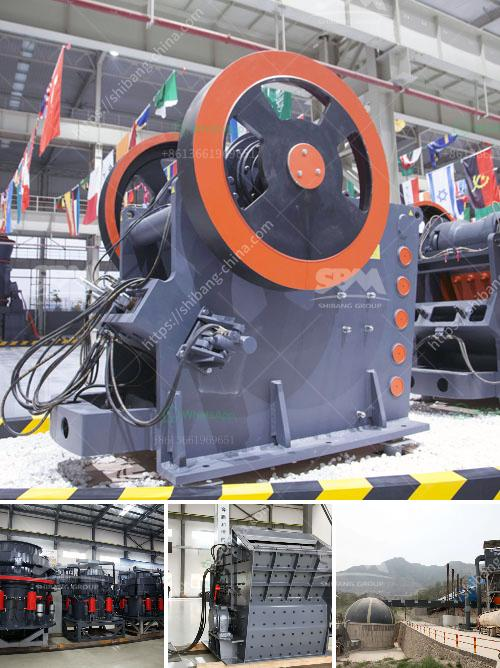

<h3>مطحنة طحن دقيقة للبيع</h3>
تعتبر مطحنة طحن الدقيق من الأدوات الأساسية في صناعة الغذاء ومعالجة البذور والحبوب. وفي السنوات الأخيرة، ازداد الاهتمام بشراء واستخدام المطاحن الصناعية لأغراض المنزل. لذلك، إذا كنت تفكر في شراء مطحنة طحن الدقيقة للاستخدام المنزلي، فقد تكون المادة التالية مفيدة لك.

أحد أهم العناصر التي يجب أن تنتبه إليها عند شراء مطحنة طحن الدقيق هو السعة. فهذا يحدد كمية الدقيق التي يمكن طحنها دفعة واحدة. إذا كنت تخطط لاستخدام المطحنة للاستخدام المنزلي العادي، فإن سعة 200-400 جرام ستكون كافية بشكل عام. ولكن إذا كنت تخطط لاستخدام المطحنة لأغراض تجارية صغيرة، فقد تحتاج إلى مطحنة بسعة تصل إلى 1 كيلوغرام أو أكثر.

بالإضافة إلى السعة، يجب أيضًا النظر في قوة المحرك. إذا كنت تخطط لطحن الحبوب الصلبة مثل الذرة أو القمح، فسوف تحتاج إلى مطحنة طحن مزودة بمحرك قوي يستطيع التعامل مع تلك الحبوب الصلبة. قوة المحرك المناسبة للاستخدام المنزلي تتراوح بين 500 و 1500 واط. إذا كنت ترغب في الاستفادة من تلك المطحنة لأغراض تجارية أو الطحن المستمر، فيجب أن يكون المحرك أكثر قوة.

لا تنسَ أن تبحث عن مطحنة طحن الدقيقة التي تأتي مع إعدادات قابلة للتعديل للحصول على نسب طحن مختلفة. هذا يعطيك أقصى قدر من المرونة في استخدام المطحنة في إعداد مختلفة مثل الدقيق الفاخر أو الخشن. قابلية التعديل للحصول على نسب طحن مختلفة ستؤثر على نوعية الدقيق الناتج وتحقيق النتائج المرجوة.

بالإضافة إلى الأشياء المذكورة أعلاه، ينبغي أن تنتبه أيضا إلى المواد المستخدمة في صناعة المطحنة. تأكد من أنها مصنوعة من مواد عالية الجودة تكفي لتحمل الاستخدام المكثف على مدار الوقت.

أخيرًا، لا تنسَ أن تبحث عن مطحنة طحن الدقيقة التي تأتي مع ضمان جيد. هذا يضمن أنك ستحصل على منتج ذي جودة عالية وفعالية في عمله. قم بقراءة تقييمات المشترين السابقين قبل شراء المطحنة للتأكد من أدائها وموثوقيتها.

باختلاف الأغراض والاحتياجات، ستكون هناك العديد من المطاحن الصناعية المتاحة في السوق. قد يكون هناك تشويش في الاختيار، ولكن باتباع النصائح المذكورة أعلاه، يمكنك الآن اختيار مطحنة طحن الدقيقة المناسبة لاستخدامك المنزلي بسهولة.
<h3>Contact us</h3><ul><li><strong>Whatsapp:&nbsp;<a href="https://wa.me/8613661969651">+8613661969651</a></strong></li><li><a href="https://swt.shibang-china.com/?git&amp;zhl&amp;مطحنة طحن دقيقة للبيع"><strong>Online Service(chat now)</strong></a></li></ul><h3>Related</h3><ul><li><a href='كيف يعمل مطحنة الهامر.md'>كيف يعمل مطحنة الهامر</a></li><li><a href='آلات غسيل الفحم.md'>آلات غسيل الفحم</a></li><li><a href='مطحنة الكرة في معدات مصنع الألومنيوم.md'>مطحنة الكرة في معدات مصنع الألومنيوم</a></li><li><a href='آلة كسارة الحجر 250 400.md'>آلة كسارة الحجر 250 400</a></li><li><a href='تحسين مصنع التكسير.md'>تحسين مصنع التكسير</a></li></ul>