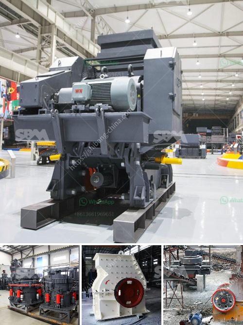

<h3>مطحنة طحن رايموند في باكستان</h3>
تعتبر مطحنة طحن رايموند في باكستان واحدة من أبرز المطاحن في المنطقة، حيث تتميز بالدقة والكفاءة في عملية الطحن وتحويل المواد الخام إلى مساحيق ناعمة. تم تأسيس هذه المطحنة في عام 1920 ، ومنذ ذلك الحين أصبحت رائدة في صناعة الطحن في العالم.

تعتمد مطحنة رايموند على تقنية متقدمة لطحن العديد من المواد الخام المختلفة ، مثل الفحم والباريت والدولوميت والكاولين والجبس والبوكسيت وغيرها. تستخدم هذه المطحنة نظامًا تحت الماء للتحكم في درجة حرارة الطحن وضغط الهواء ، مما يجعلها قادرة على تحقيق أعلى مستويات الدقة والكفاءة في عملية الطحن.

تتميز مطاحن رايموند بميزاتها الفريدة التي تجعلها الخيار الأمثل للعديد من الصناعات. تتميز بتصميم مضغوط يوفر مساحة ويجعلها مناسبة للاستخدام في مساحات صغيرة. تتميز أيضًا بأداء قوي وعمر طويل ، مما يجعلها خيارًا مستدامًا واقتصاديًا في المدى الطويل.

تستخدم مطاحن رايموند في عدة صناعات ، بما في ذلك البناء والبتروكيماويات والصناعات الكيماوية والطاقة والتعدين وغيرها. تعتبر هذه المطاحن حلاً مثاليًا لطحن المواد الخام في تلك الصناعات وتحويلها إلى منتجات نهائية ذات جودة عالية.

تستخدم مطاحن رايموند في مناطق مختلفة من باكستان ، حيث تساهم في تطوير الصناعات المحلية وتعزيز الاقتصاد. بالإضافة إلى ذلك ، فإن هذه المطاحن يعتمد عليها العديد من المصانع والمنشآت لتلبية احتياجاتهم من المساحيق الناعمة لعمليات إنتاجهم.

باختصار ، مطحنة طحن رايموند في باكستان هي واحدة من أبرز المطاحن في البلاد ، حيث تعتمد على تكنولوجيا متقدمة وتتميز بأداء قوي وكفاءة عالية. تعد هذه المطحنة حلاً مثاليًا للعديد من الصناعات المحلية وتسهم في تطوير الاقتصاد المحلي. تمثل هذه المطاحن رمزًا للتطور التكنولوجي وسببًا للفخر لباكستان.
<h3>Contact us</h3><ul><li><strong>Whatsapp:&nbsp;<a href="https://wa.me/8613661969651">+8613661969651</a></strong></li><li><a href="https://swt.shibang-china.com/?git&amp;zhl&amp;مطحنة طحن رايموند في باكستان"><strong>Online Service(chat now)</strong></a></li></ul><h3>Related</h3><ul><li><a href='مصنع غسيل الكروم الطبيعي.md'>مصنع غسيل الكروم الطبيعي</a></li><li><a href='معدات سحق الصناعات الثقيلة في ماليزيا.md'>معدات سحق الصناعات الثقيلة في ماليزيا</a></li><li><a href='آلة صنع المسحوق في جنوب أفريقيا.md'>آلة صنع المسحوق في جنوب أفريقيا</a></li><li><a href='كسارات الفك الصناعية.md'>كسارات الفك الصناعية</a></li><li><a href='شركات آلات مصانع الحجر في سالم تاميل نادو.md'>شركات آلات مصانع الحجر في سالم تاميل نادو</a></li></ul>