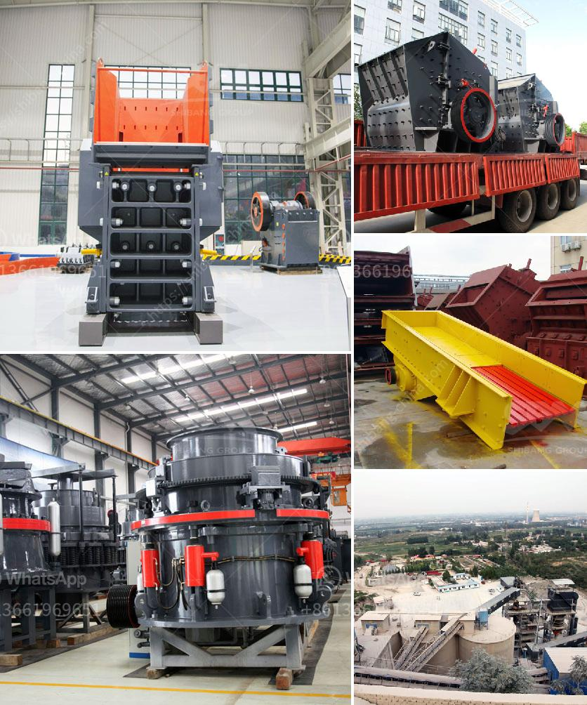

<h3>مطحنة طحن ريموند في أوروبا</h3>
تُعتبر مطاحن طحن ريموند واحدة من أبرز المعدات الصناعية في صناعة الطحن، وتعتبر شركة ريموند المصنعة لها من أكبر الشركات في مجالها في أوروبا. تعتبر هذه المطاحن الكهربائية من أعلى جودة وفعالية في عملية طحن العديد من المواد، بدءًا من المعادن وانتهاءً بالحبوب والمواد الكيميائية.

من الميزات الرئيسية التي تميز مطاحن ريموند في أوروبا هي قدرتها على تنفيذ عمليات الطحن بسرعة فائقة وكفاءة عالية، مما يوفر الوقت والجهد. تعتمد هذه المطاحن على نظام قوة المحرك والشفرات الدوارة التي تقوم بطحن المادة الموضوعة فيها.

يتم توزيع هذه المطاحن في العديد من البلدان الأوروبية، لتلبية الطلب المتزايد لصناعة الطحن. تستخدم هذه المطاحن في العديد من الصناعات مثل تصنيع الإسمنت والزجاج والأسمدة والأعلاف والدهانات وغيرها الكثير. إن قدرتها على تحويل المواد الخام إلى مسحوق دقيق يجعلها أداة ضرورية لعملية الإنتاج.

بالإضافة إلى ذلك، تتميز مطاحن ريموند بأنها آمنة وموثوقة في الاستخدام، حيث تتوافر فيها تقنيات حديثة للتحكم والحماية من الحوادث والأعطال الكهربائية. كما تساهم التصاميم المتقدمة لهذه المطاحن في تقليل الاهتزازات والضوضاء، مما يجعلها صديقة للبيئة ومناسبة للاستخدام في الصناعات الحساسة.

من المهم أن نذكر أن مطاحن ريموند ليست فقط مشهورة بأدائها وجودتها في أوروبا، بل أيضًا في جميع أنحاء العالم. فهي تعتبر منتجًا عالي الطلب في العديد من البلدان الأخرى، وتحظى بسمعة طيبة في صناعة الطحن.

باختصار، يعد استخدام مطاحن ريموند في أوروبا من أهم الخطوات المتخصصة في صناعة الطحن. فهي تقدم الجودة العالية والكفاءة في عمليات الطحن، مع الأخذ في الاعتبار السلامة والموثوقية. تعتبر هذه المطاحن حلاً رائعًا للصناعات المختلفة التي تعتمد على عملية الطحن لإنتاج منتجاتها.
<h3>Contact us</h3><ul><li><strong>Whatsapp:&nbsp;<a href="https://wa.me/8613661969651">+8613661969651</a></strong></li><li><a href="https://swt.shibang-china.com/?git&amp;zhl&amp;مطحنة طحن ريموند في أوروبا"><strong>Online Service(chat now)</strong></a></li></ul><h3>Related</h3><ul><li><a href='سعر كسارة الأسطوانة.md'>سعر كسارة الأسطوانة</a></li><li><a href='سعر آلة طحن المطحنة.md'>سعر آلة طحن المطحنة</a></li><li><a href='كسارة الفك sp 60x100.md'>كسارة الفك sp 60x100</a></li><li><a href='مصنع المعادن سحق خام البوكسيت.md'>مصنع المعادن سحق خام البوكسيت</a></li><li><a href='تكلفة ماكينات كسارة المحاجر.md'>تكلفة ماكينات كسارة المحاجر</a></li></ul>