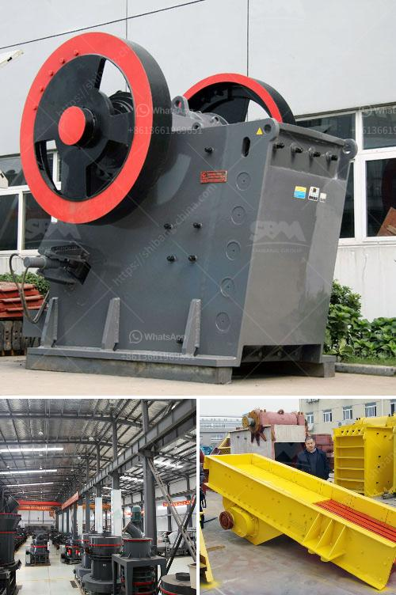

<h3>مطحنة طحن عمودية مستعملة بسعة 100 طن في الساعة</h3>
تعد مطحنة طحن الحبوب العمودية بسعة 100 طن في الساعة واحدة من أكثر المعدات استخدامًا في صناعة الأغذية. تعمل هذه المطاحن على طحن الحبوب الزراعية لإنتاج الدقيق المستخدم في صناعة الخبز والشعيرية والحلويات وغيرها. تم تطوير هذا النوع من المطاحن العمودية لتحسين كفاءة وإنتاجية عملية الطحن.

إحدى أهم ميزات مطحنة الطحن العمودية هي قدرتها على طحن الحبوب بفعالية وسرعة. تستخدم هذه المطاحن الأسطوانية العمودية إما بكرات أو مطارق عالقة على دوارة. تؤدي الحركة الأفقية لهذه العناصر إلى طحن الحبوب وتحويلها إلى مسحوق ناعم. تعمل هذه المطاحن بطرق مختلفة، بعضها يعتمد على طريقة الضغط والطرق الأخرى تستخدم قوة الاحتكاك بين العناصر لتحقيق عملية الطحن.

واحدة من أهم الخصائص التي يجب أن تتوفر في مطحنة الطحن العمودية هي القدرة على التحكم الدقيق في حجم الحبوب التي تخرج من الطاحونة. يتم ضبط هذا العامل بواسطة التحكم في مسافة الفتحة بين الأسطوانات. تستخدم المطاحن العمودية أيضًا نظم تصنيف لفصل الجسيمات المختلفة وتحقيق منتجات نهائية ذات جودة عالية.

بالإضافة إلى ذلك، توفر مطاحن الطحن العمودية استخدامًا فعالًا للطاقة. تتميز هذه المطاحن بتصميمها الكفؤ الذي يسمح بإدارة الحبوب على نحو فعال وتحقيق أعلى كفاءة ممكنة في عملية الطحن. بالتالي، فإن تكلفة الإنتاج تنخفض ويمكن تحقيق مزيد من الأرباح للمزارعين أو المصانع.

من الجدير بالذكر أيضًا أن مطاحن الطحن العمودية المستعملة بسعة 100 طن في الساعة تعتبر صديقة للبيئة. يتم تركيب نظم إزالة الغبار والتلوث للمساهمة في الحد من انبعاثات الجسيمات الضارة في الجو. تهدف هذه التركيبات إلى تحقيق أعلى مستويات النظافة وتوفير بيئة أمنة وصحية للعاملين في الصناعة والمجتمع المحيط.

في النهاية، تعد مطحنة الطحن العمودية بسعة 100 طن في الساعة إضافة قوية لصناعة الأغذية. بفضل استخدام تقنيات حديثة وقدرة استيعابية كبيرة، فإن هذه المطاحن تساهم في إنتاج منتجات غذائية ذات جودة عالية وتلبية احتياجات المستهلكين بشكل أفضل. كما تعتبر هذه المطاحن صديقة للبيئة بفضل تنظيم التلوث والحماية البيئية التي توفرها.
<h3>Contact us</h3><ul><li><strong>Whatsapp:&nbsp;<a href="https://wa.me/8613661969651">+8613661969651</a></strong></li><li><a href="https://swt.shibang-china.com/?git&amp;zhl&amp;مطحنة طحن عمودية مستعملة بسعة 100 طن في الساعة"><strong>Online Service(chat now)</strong></a></li></ul><h3>Related</h3><ul><li><a href='مطحنة ريموند ميكرو بلفرايزر.md'>مطحنة ريموند ميكرو بلفرايزر</a></li><li><a href='سيور ناقلة معدنية في الألواح.md'>سيور ناقلة معدنية في الألواح</a></li><li><a href='كسارة حجر بجرار.md'>كسارة حجر بجرار</a></li><li><a href='كسارة الكرة النحاس آلة كسارة النحاس.md'>كسارة الكرة النحاس آلة كسارة النحاس</a></li><li><a href='آلة كسارة لصنع الرمل من الحجر.md'>آلة كسارة لصنع الرمل من الحجر</a></li></ul>