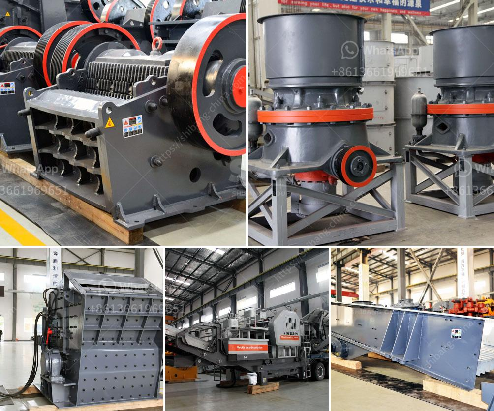

<h3>مطحنة طحن عمودية</h3>
تعتبر مطحنة الطحن العمودية واحدة من أهم الأدوات المستخدمة في صناعة الطحن الصناعي. تعتمد هذه المطاحن على نظام عمل متطور يعمل عن طريق ثني الحبوب الموضوعة بين طبقتين من الأسطوانات المعدنية العمودية، لتحويلها إلى مساحيق ناعمة تستخدم في العديد من الصناعات.

يعود تاريخ استخدام المطاحن العمودية إلى قرون مضت، حيث كانت تستخدم في طحن الحبوب والحبوب الأخرى. ومع تطور التكنولوجيا، أصبحت تستخدم أيضًا في طحن المعادن والمواد الكيميائية والمواد الغذائية والأسمدة والألوان والبلاستيك وغيرها. تتميز هذه المطاحن بالقدرة على طحن المواد الخام إلى مسحوق رقيق جداً، مما يجعلها مناسبة للاستخدام في العديد من الصناعات.

المطاحن العمودية تشتمل على بعض الأجزاء الرئيسية مثل الأسطوانة، والجسم، والتروس، والمحرك. تتحرك الأسطوانة بسرعة عالية وتعمل على الطحن وسحق المواد الخام الموجودة بينها وبين الطبقات المعدنية الخارجية. تحتوي الأسطوانة على ترس يتحرك بواسطة المحرك، مما يتيح ضبط سرعة الطحن وفقًا لنوع المادة المطحونة.

تعتبر المطاحن العمودية أكثر كفاءة من المطاحن الأخرى المتاحة في السوق، حيث توفر طحنًا أكثر دقة واحترافية. تحافظ هذه المطاحن على جودة المنتج النهائي، مع الحفاظ على توزيع حجم الجسيمات. بالإضافة إلى ذلك، تسمح هذه المطاحن بتحقيق طحن متساوٍ وسريع وثابت للمواد الخام، مما يساهم في زيادة الإنتاجية وتقليل تكاليف الطحن.

في الختام، تعد مطاحن الطحن العمودية أداة مهمة في صناعة الطحن الصناعي. تتميز بالكفاءة والقدرة على طحن مختلف المواد الخام بنفس الدقة والجودة. تستخدم في العديد من الصناعات مثل الغذاء والمعادن والكيماويات وغيرها، وتعد خيارًا مثاليًا لتلبية احتياجات الإنتاج والجودة.
<h3>Contact us</h3><ul><li><strong>Whatsapp:&nbsp;<a href="https://wa.me/8613661969651">+8613661969651</a></strong></li><li><a href="https://swt.shibang-china.com/?git&amp;zhl&amp;مطحنة طحن عمودية"><strong>Online Service(chat now)</strong></a></li></ul><h3>Related</h3><ul><li><a href='تكلفة مشروع طحن التلك.md'>تكلفة مشروع طحن التلك</a></li><li><a href='كم تكلف مصنع التكسير.md'>كم تكلف مصنع التكسير</a></li><li><a href='خط إنتاج الباريت.md'>خط إنتاج الباريت</a></li><li><a href='المعدات اللازمة لبدء تعدين الحجر الجيري.md'>المعدات اللازمة لبدء تعدين الحجر الجيري</a></li><li><a href='آلة تصنيع الحجر من جنوب أفريقيا.md'>آلة تصنيع الحجر من جنوب أفريقيا</a></li></ul>