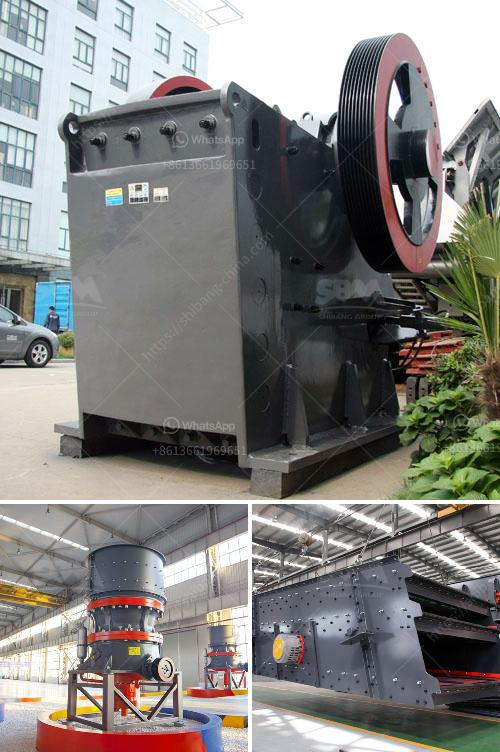

<h3>مطحنة طحن فائقة الدقة</h3>
تعتبر مطحنة طحن فائقة الدقة واحدة من الأدوات المهمة في صناعة التحويل والتصنيع. تستخدم هذه المطاحن لطحن المواد الخام إلى شكل نهائي دقيق جداً، مما يسمح بتحقيق أعلى جودة للمنتج النهائي. تتميز هذه المطاحن بقدرتها على إعطاء درجة عالية من الدقة والتحكم في حجم وشكل الجسيمات المطحونة.

تتميز مطاحن الطحن فائقة الدقة عن العمليات التقليدية بالقدرة على طحن المواد الصلبة والهشة في نطاق دقة لا يمكن تحقيقه بواسطة المطاحن الأخرى. تعتبر هذه المطاحن مثالية للصناعات التي تتطلب تحويل دقيق وتصنيع عالي الدقة مثل صناعة الأجهزة الطبية، والصناعات الدوائية، وصناعة الإلكترونيات.

تتكون مطاحن الطحن فائقة الدقة من أجزاء مختلفة تعمل معًا لتحقيق النتائج المرجوة. تشمل هذه الأجزاء الرئيسية جهاز التحكم وآلية التغذية والمغذي الأوتوماتيكي والمحركات والجسم الأساسي للمطحنة والقرص المطحن والشفرات ووحدة التحكم الهيدروليكي ووحدة التحكم الكهربائي. يعتمد أداء المطحنة على تكامل هذه الأجزاء وعلى قدرة المشغل على ضبط العوامل المختلفة مثل سرعة الدوران والضغط وحجم التغذية.

من أهم المزايا التي توفرها مطاحن الطحن فائقة الدقة هي القدرة على طحن المواد على نطاق واسع من الحجم بدقة فائقة. تتيح للمشغلين تحقيق أحجام جسيمات دقيقة جدًا، حيث يمكن أن يتم ضبط الأداة بدقة مع الاحتفاظ بأعلى مستويات الدقة. هذا يتيح للمشغلين تحقيق الحجم والشكل المطلوب للمواد المطحونة، وبالتالي تلبية احتياجات العملاء بأفضل النتائج الممكنة.

بشكل عام، تعد مطاحن الطحن فائقة الدقة حلاً مثاليًا لتحقيق عمليات التحويل والتصنيع ذات الدقة العالية. توفر هذه المطاحن طريقة فعالة لطحن المواد الخام بأعلى جودة ممكنة، وتسمح بتصنيع المنتجات النهائية بدقة وفعالية عالية. بفضل تكنولوجيا الطحن الفائقة الدقة، يتم تحسين كفاءة العمليات الإنتاجية وتحقيق أعلى معايير الجودة، مما يسهم في تعزيز تنافسية الشركات في السوق
<h3>Contact us</h3><ul><li><strong>Whatsapp:&nbsp;<a href="https://wa.me/8613661969651">+8613661969651</a></strong></li><li><a href="https://swt.shibang-china.com/?git&amp;zhl&amp;مطحنة طحن فائقة الدقة"><strong>Online Service(chat now)</strong></a></li></ul><h3>Related</h3><ul><li><a href='أسعار الشاشات الاهتزازية.md'>أسعار الشاشات الاهتزازية</a></li><li><a href='قائمة أسعار كسارات الفك.md'>قائمة أسعار كسارات الفك</a></li><li><a href='معدات تكسير الخرسانة.md'>معدات تكسير الخرسانة</a></li><li><a href='كسارة محمولة مستعملة للبيع في جنوب أفريقيا.md'>كسارة محمولة مستعملة للبيع في جنوب أفريقيا</a></li><li><a href='مطحنة الكرة في معالجة المعادن.md'>مطحنة الكرة في معالجة المعادن</a></li></ul>