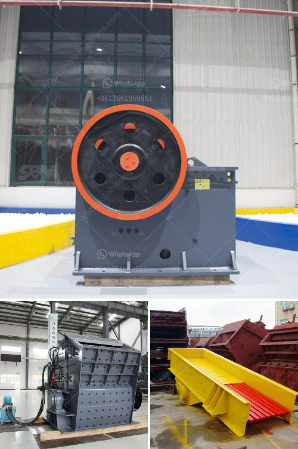

<h3>مطحنة طحن في ألمانيا</h3>
تعتبر مطاحن الطحن في ألمانيا من أكبر وأقدم المصانع التي تعمل في صناعة الغذاء. تتميز هذه المطاحن بتقديم منتجات عالية الجودة تلبي احتياجات السوق المحلي والدولي.

تاريخ مطاحن الطحن في ألمانيا يعود إلى العصور الوسطى، حيث كانت تعتبر مصدرًا مهمًا لتصنيع الدقيق. كانت هذه المطاحن تقوم بطحن الحبوب الزراعية مثل القمح والشعير بواسطة طواحين الماء التقليدية. بعد ذلك، شهدت مطاحن الطحن تقدمًا تكنولوجيًا كبيرًا، حيث بدأ استخدام الكهرباء في تشغيل الماكينات والأجهزة.

تتكون مطاحن الطحن الحديثة في ألمانيا من عدة مراحل تتبع نظامًا دقيقًا لضمان جودة الدقيق النهائي. تبدأ عملية الطحن بتنظيف الحبوب وإزالة أية شوائب ممكنة، ثم يتم طحن الحبوب بواسطة الأسطوانات الدوارة للحصول على الدقيق. يتم مراقبة هذه العملية بشكل دقيق لضمان حصول الدقيق على النعومة المطلوبة. بعد ذلك، يتم فحص الدقيق للتأكد من جودته وفصله عن القشور الزائدة.

تصنع مطاحن الطحن في ألمانيا أيضًا منتجات فرعية مثل السميد والقمح والشعير المطحون، وتستخدم هذه المنتجات في العديد من الصناعات مثل صناعة الخبز والحلويات والعجائن. يشتهر الخبازون الألمان بتفانيهم في استخدام الدقيق عالي الجودة في إعداد منتجات الخبز اللذيذة.

بفضل التكنولوجيا المتقدمة والمعايير العالية للجودة، تعد مطاحن الطحن في ألمانيا رائدة في هذا المجال. تُعْتَبَر الجودة والموثوقية العالية سمات تميز هذه المطاحن، حيث يتم اعتمادها لتصنيع المنتجات في جميع أنحاء العالم. توظف هذه المطاحن أيضًا تقنيات خضراء ومستدامة لتقليل تأثيرها البيئي وللحفاظ على الموارد الطبيعية.

باختصار، تعتبر مطاحن الطحن في ألمانيا دليلًا على الابتكار والتميز في صناعة الغذاء. تؤمن هذه المطاحن بأهمية توفير منتجات عالية الجودة وصحية للمستهلكين، وتسعى دائمًا لتحقيق الكفاءة والاستدامة في عملياتها.
<h3>Contact us</h3><ul><li><strong>Whatsapp:&nbsp;<a href="https://wa.me/8613661969651">+8613661969651</a></strong></li><li><a href="https://swt.shibang-china.com/?git&amp;zhl&amp;مطحنة طحن في ألمانيا"><strong>Online Service(chat now)</strong></a></li></ul><h3>Related</h3><ul><li><a href='ناقل حزام لتصميم الفحم في الهند.md'>ناقل حزام لتصميم الفحم في الهند</a></li><li><a href='آلة مطحنة الطحن المستخدمة.md'>آلة مطحنة الطحن المستخدمة</a></li><li><a href='التكلفة الرأسمالية لمصنع تحسين خام الكروم.md'>التكلفة الرأسمالية لمصنع تحسين خام الكروم</a></li><li><a href='كسارة أولية للدولوميت.md'>كسارة أولية للدولوميت</a></li><li><a href='تكلفة الحزام الناقل لكل متر.md'>تكلفة الحزام الناقل لكل متر</a></li></ul>