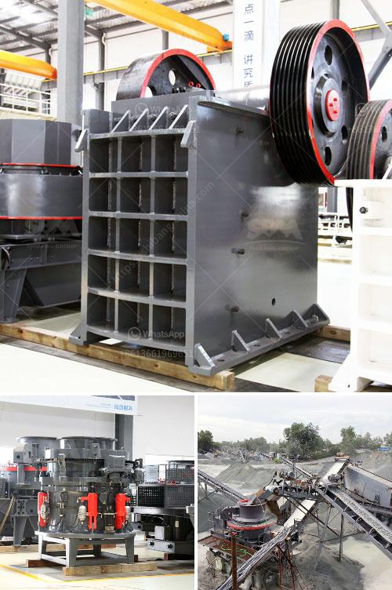

<h3>مطحنة طحن في الولايات المتحدة الأمريكية</h3>
تعتبر طحنية (مطحنة طحن) في الولايات المتحدة الأمريكية من الصناعات الأساسية التي تلعب دوراً مهماً في مجال إنتاج الأعلاف والغلال. تتخذ مطاحن الطحن أشكالًا متنوعة، تتراوح بين الصغيرة والمتوسطة والكبيرة، وتعمل بالكهرباء أو بالديزل وتعمل بتقنيات متطورة في عملية الطحن.

تهدف مطاحن الطحن إلى تحويل الحبوب الزراعية، مثل القمح والشعير والذرة، إلى مسحوق ناعم يُستخدم في صنع المنتجات الغذائية مثل الخبز والمعكرونة والحبوب الإفطار. كما تستخدم في صناعة الأعلاف لتغذية الماشية والدواجن والأسماك.

تتألف مطاحن الطحن من عدة أجزاء رئيسية، بما في ذلك الصواميل والأسطوانات والفراشات والعتاد. يبدأ العمل بتحميل الحبوب في صواميل المطحنة، حيث يتم سحقها وطحنها بالتدريج. يتم ضبط الأسطوانات وفراشات المطحنة لتحقيق النتيجة المطلوبة، بما يتناسب مع نوع الحبوب المراد طحنها.

تستخدم مطاحن الطحن التكنولوجيا الحديثة والتحكم الآلي لضمان جودة وسلامة المنتج النهائي. يتم قياس مستوى الرطوبة ودرجة الحرارة والجودة خلال عملية الطحن باستخدام أجهزة قياس متقدمة. تعتمد سرعة ووقت الطحن على النوعية المطلوبة للمنتج النهائي.

نظرًا للطلب المتزايد على المنتجات الغذائية في الولايات المتحدة الأمريكية، يعتبر قطاع مطاحن الطحن من أهم القطاعات الصناعية في البلاد.  وتعتبر ولاية ويسكونسن من ولايات الريف الصناعي في أمريكا، يتواجد فيها عدد كبير من المطاحن، فمن المعروف أن الريف الأمريكي يعتبر مستودعاً غذائياً هاماً للدولة، لذا يلعب القطاع الزراعي والصناعات المرتبطة به دوراً مهماً في اقتصاد الولايات المتحدة.

باختصار، تعد مطاحن الطحن في الولايات المتحدة الأمريكية جزءًا حيويًا من سلسلة التوريد الغذائي في البلاد. تعمل هذه المطاحن على تحويل الحبوب الزراعية إلى منتجات غذائية وأعلاف عالية الجودة، مما يلبي احتياجات السوق المحلية والعالمية. توظف مطاحن الطحن العديد من العمال وتقدم فرص عمل واقتصادية ملموسة، مما يعزز التنمية المستدامة والازدهار الاقتصادي في الولايات المتحدة.
<h3>Contact us</h3><ul><li><strong>Whatsapp:&nbsp;<a href="https://wa.me/8613661969651">+8613661969651</a></strong></li><li><a href="https://swt.shibang-china.com/?git&amp;zhl&amp;مطحنة طحن في الولايات المتحدة الأمريكية"><strong>Online Service(chat now)</strong></a></li></ul><h3>Related</h3><ul><li><a href='طاحونة عمودية للفحم.md'>طاحونة عمودية للفحم</a></li><li><a href='موردي آلة فحص الفحم.md'>موردي آلة فحص الفحم</a></li><li><a href='معدات معالجة الحجر الكاملة محطم 100 طن.md'>معدات معالجة الحجر الكاملة محطم 100 طن</a></li><li><a href='موردي آلات الأسمنت ووحدة الطحن.md'>موردي آلات الأسمنت ووحدة الطحن</a></li><li><a href='آلات كسارة الرقائق.md'>آلات كسارة الرقائق</a></li></ul>