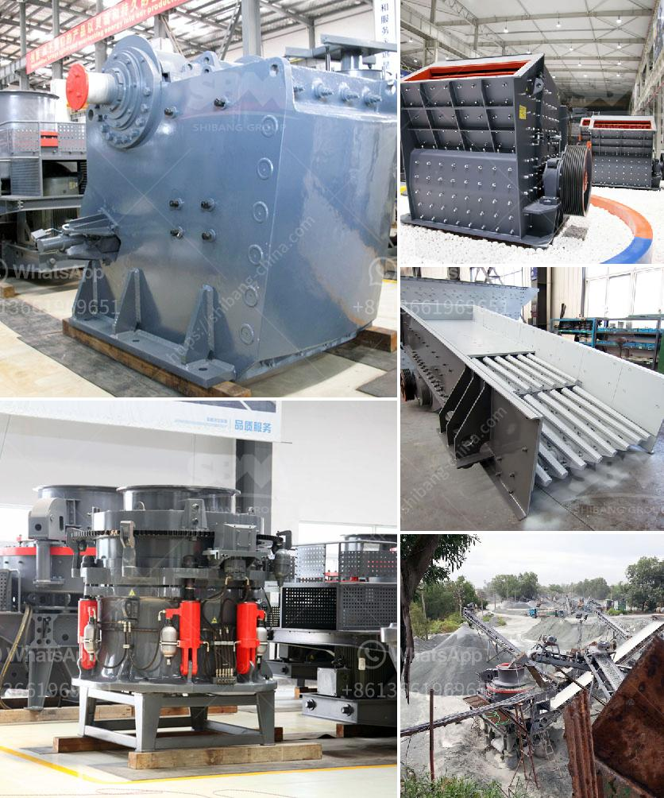

<h3>مطحنة طحن كربونات الكالسيوم</h3>
تُستخدم مطاحن طحن كربونات الكالسيوم لطحن المواد الخام المكونة من كربونات الكالسيوم إلى حجم الجسيمات المطلوب. تعتبر كربونات الكالسيوم مادة مهمة في العديد من الصناعات، مثل صناعة المعادن غير المعدنية، والإسمنت، والأدوية، والمستحضرات الغذائية.

تحتوي مطاحن طحن كربونات الكالسيوم على نظام دوار يسحق المواد الخام بواسطة قوة الطرد المركزي وقوة الاحتكاك. يتم إدخال المواد الخام من خلال فوهة التغذية إلى الجزء العلوي من المطحنة، حيث يتم سحقها ودفعها تدريجياً لأسفل بواسطة حركة الدوار المستمرة. يتم ضبط فتحة الخروج للسماح بالحصول على حجم الجسيمات المطلوب من المنتج النهائي.

واحدة من أهم الميزات لمطاحن طحن كربونات الكالسيوم هي الكفاءة العالية والدقة في الطحن. تسمح التصاميم الحديثة بتحقيق درجات عالية من النعومة والتجانس في حجم الجسيمات. كما أن هذه المطاحن قادرة على معالجة كميات كبيرة من المواد الخام بطرق مستدامة وفعالة.

تعتمد كفاءة مطاحن طحن كربونات الكالسيوم على عدة عوامل، مثل سرعة الطحن وحجم الكرات الطحن ونسبة الحشو. إضافةً إلى ذلك، يجب ضبط الظروف التشغيلية المثلى، مثل درجة حرارة المطحنة وضغط الهواء ونسبة المواد الخام. يُفضل استخدام نظام تحكم آلي لضمان تحقيق أفضل النتائج وضمان تكرارية العملية.

بشكل عام، يمكن القول أن مطاحن طحن كربونات الكالسيوم هي أدوات ضرورية في صناعات عديدة. بفضل تكنولوجيا الطحن المتقدمة، يتم تحقيق نتائج متميزة في إنتاج المساحيق الدقيقة. وبالتالي، يتم استخدام المنتجات النهائية الخاصة بمطاحن طحن كربونات الكالسيوم في العديد من التطبيقات المهمة التي تعتمد على خصائصها الفريدة.
<h3>Contact us</h3><ul><li><strong>Whatsapp:&nbsp;<a href="https://wa.me/8613661969651">+8613661969651</a></strong></li><li><a href="https://swt.shibang-china.com/?git&amp;zhl&amp;مطحنة طحن كربونات الكالسيوم"><strong>Online Service(chat now)</strong></a></li></ul><h3>Related</h3><ul><li><a href='كسارة لسحق الكوارتز.md'>كسارة لسحق الكوارتز</a></li><li><a href='نماذج كسارات الحجر في ماليزيا.md'>نماذج كسارات الحجر في ماليزيا</a></li><li><a href='كيفية صنع كسارة فك صغيرة لنفسك.md'>كيفية صنع كسارة فك صغيرة لنفسك</a></li><li><a href='كسارة صغيرة متنقلة للحصى.md'>كسارة صغيرة متنقلة للحصى</a></li><li><a href='تكسير الحجر المصنوع في ألمانيا.md'>تكسير الحجر المصنوع في ألمانيا</a></li></ul>