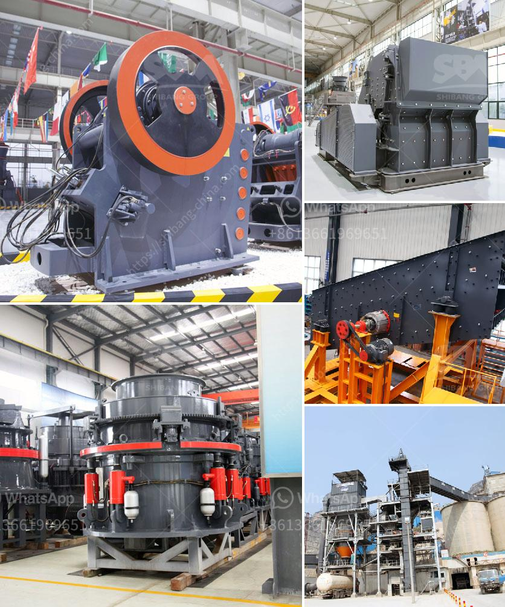

<h3>مطحنة طحن للكوارتز في الهند</h3>
تعتبر مطاحن طحن الكوارتز في الهند من أهم المصانع المتخصصة في إنتاج مسحوق الكوارتز الدقيق. وتعد الهند واحدة من أكبر المنتجين للكوارتز في العالم، حيث يتم استخراجها من المناجم وتصنيعها لتلبية الاحتياجات المحلية والعالمية.

تتميز مطاحن طحن الكوارتز في الهند بالتكنولوجيا الحديثة والمعدات المتطورة، مما يسهم في تحقيق جودة عالية للمنتج النهائي. يتم استخدام طواحين الكرات والكسارات الصخرية لسحق قطع الكوارتز الكبيرة إلى حجم أصغر. بعد ذلك، يتم نقل الكوارتز المسحوق إلى مطحنة الطحن الرئيسية، حيث يتم تنظيفها وطحنها بعناية للحصول على حبيبات دقيقة وموحدة.

يستخدم كوارتز المطحنة في العديد من الصناعات مثل صناعة الزجاج والسيراميك والإلكترونيات والبلاط والدهانات ومنتجات الألوان والبلاستيك، وغيرها الكثير. ويشتهر كوارتز المطحنة بخصائصه الميكانيكية الممتازة ومقاومته العالية للحرارة والتآكل والكيماويات.

تعتبر الهند واحدة من أكبر مصدري الكوارتز في العالم، حيث تنتج مجموعة واسعة من الألوان والدرجات المختلفة من الكوارتز. وتحظى مطاحن طحن الكوارتز في الهند بشعبية كبيرة في الأسواق العالمية نظرًا لجودة المنتج وتنوعه. بالإضافة إلى ذلك، تتميز بالتزامها بمعايير الجودة العالية والحفاظ على البيئة، مما يجعلها خيارًا مفضلاً للكثير من العملاء في جميع أنحاء العالم.

في الختام، تعد مطاحن طحن الكوارتز في الهند من أهم الصناعات والمصانع النوعية في العالم. تنتج منتجات عالية الجودة ومتنوعة، وتلبي متطلبات الأسواق المحلية والعالمية. كما تسعى إلى الابتكار المستمر في تقنيات الطحن وتطوير منتجاتها لتلبية احتياجات العملاء والمستهلكين.
<h3>Contact us</h3><ul><li><strong>Whatsapp:&nbsp;<a href="https://wa.me/8613661969651">+8613661969651</a></strong></li><li><a href="https://swt.shibang-china.com/?git&amp;zhl&amp;مطحنة طحن للكوارتز في الهند"><strong>Online Service(chat now)</strong></a></li></ul><h3>Related</h3><ul><li><a href='كسارة الصخور.md'>كسارة الصخور</a></li><li><a href='تقرير مشروع مصنع كسارة الحجر.md'>تقرير مشروع مصنع كسارة الحجر</a></li><li><a href='طحن مطحنة الاسمنت.md'>طحن مطحنة الاسمنت</a></li><li><a href='تجار الكسارات المحمولة في جنوب أفريقيا.md'>تجار الكسارات المحمولة في جنوب أفريقيا</a></li><li><a href='مواد مطحنة الهامر.md'>مواد مطحنة الهامر</a></li></ul>