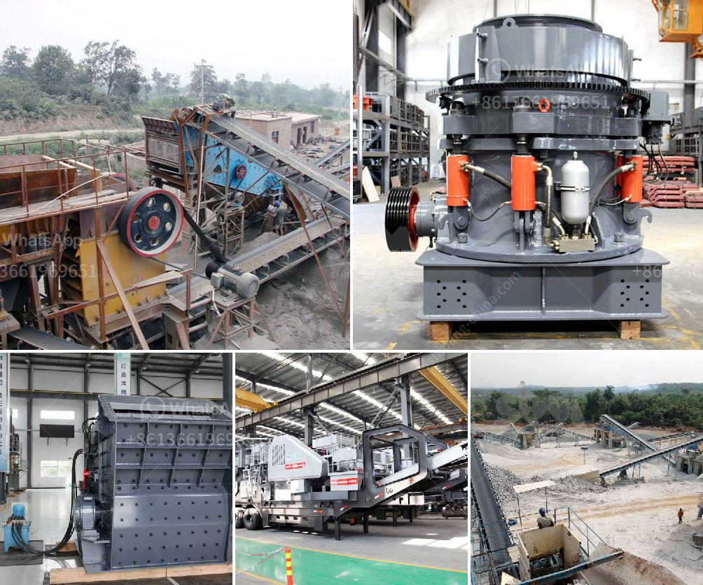

<h3>مطحنة عمودية للأسمنت</h3>
تسعى مطاحن الأسمنت عموماً إلى تجهيز المواد الخام وتحويلها إلى أسمنت نهائي جاهز للاستخدام في البناء والهندسة المدنية. ومن بين أنواع مطاحن الأسمنت التي تستخدم على نطاق واسع هناك مطحنة عمودية. تعتبر المطاحن العمودية ذات أهمية كبيرة في صناعة الأسمنت لعدة أسباب.

أولاً، فإن المطاحن العمودية تتميز بتصميمها الفريد الذي يعزز الكفاءة والإنتاجية. تستخدم هذه المطاحن الأسطوانة العمودية الدوارة التي تتميز بمسار مهمتها الأساسية وهي تكسير وطحن المواد الخام. يستخدم الجزء السفلي من الأسطوانة لتكسير المواد الخام بينما يتم طحنها في الجزء العلوي. هذا التصميم يضمن طحن مواد الأسمنت بشكل فعال وتقليل الفاقد في العملية.

ثانياً، فإن المطاحن العمودية تتميز بكفاءة عالية في استخدام الطاقة. تعتمد هذه المطاحن على مبدأ الطحن الضغطي، حيث يتم تطبيق ضغط عالي على المواد الخام لطحنها. هذا يؤدي إلى توفير الطاقة وتقليل التكاليف التشغيلية.

ثالثاً، فإن المطاحن العمودية تتميز بحجم صغير وتأثير بيئي منخفض. تعتبر هذه المطاحن مناسبة للمناطق ذات الكثافة السكانية العالية حيث يكون هناك قيود على المساحات المتاحة. بالإضافة إلى ذلك، فإنها تقلل من الضوضاء والاهتزاز وتحقق أداء بيئي أفضل.

أخيراً، فإن المطاحن العمودية تعتبر سهلة الصيانة والتشغيل. يعد تصميم هذه المطاحن بسيطًا ويمكن الوصول إليه بسهولة للصيانة والإصلاح عند اللزوم. وبفضل قدرتها على طحن المواد بشكل كامل بفضل تصميمها الداخلي المثالي، تستطيع استخدام الطاقة بفعالية وتحقيق أفضل أداء في الإنتاج.

وفي الختام، تعد مطاحن الأسمنت العمودية خيارًا ممتازًا لصناعة الأسمنت نظرًا لتصميمها الفريد وكفاءتها في استخدام الطاقة وحجمها الصغير وسهولة الصيانة والتشغيل. وتوفر هذه المطاحن الأسمنت نهجًا مبتكرًا وفعالًا لتلبية الحاجة المتزايدة للأسمنت في صناعة البناء.
<h3>Contact us</h3><ul><li><strong>Whatsapp:&nbsp;<a href="https://wa.me/8613661969651">+8613661969651</a></strong></li><li><a href="https://swt.shibang-china.com/?git&amp;zhl&amp;مطحنة عمودية للأسمنت"><strong>Online Service(chat now)</strong></a></li></ul><h3>Related</h3><ul><li><a href='الهيدروليك في مطحنة الكرة الرأسية.md'>الهيدروليك في مطحنة الكرة الرأسية</a></li><li><a href='بيع كسارة مخروط قديمة.md'>بيع كسارة مخروط قديمة</a></li><li><a href='تكلفة كسارة الحجر.md'>تكلفة كسارة الحجر</a></li><li><a href='آلة كسارة الحجر 250 400.md'>آلة كسارة الحجر 250 400</a></li><li><a href='شركة تصنيع وحدة طحن الأسمنت.md'>شركة تصنيع وحدة طحن الأسمنت</a></li></ul>