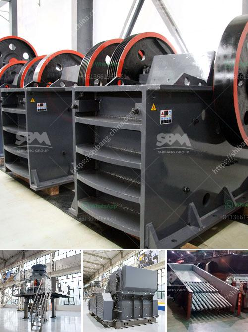

<h3>مطحنة عمودية للبيع في الولايات المتحدة</h3>
تعد المطاحن العمودية واحدة من أهم الآلات المستخدمة في صناعة الطحن والتجهيز في العديد من الصناعات، بما في ذلك صناعة الأسمنت وصناعة المعادن. وتعتبر الولايات المتحدة واحدة من أكبر الأسواق العالمية لبيع المطاحن العمودية.

تتميز المطاحن العمودية بعدة ميزات تجعلها الاختيار المثالي للعديد من المشاريع الصناعية. تصميمها المرن يجعلها قادرة على معالجة مجموعة واسعة من المواد بكفاءة ودقة عالية. تستخدم في العديد من عمليات الطحن والتجفيف والفصل والتصنيف، مما يساهم في تحقيق أداء ممتاز للعملية الصناعية بشكل عام.

في الولايات المتحدة، هناك العديد من الشركات المتخصصة التي تقدم مطاحن عمودية للبيع. تتراوح الطاقة الإنتاجية لهذه المطاحن عادة ما بين 200 و 400 طن في اليوم، ويمكن تعديلها وفقًا لاحتياجات العميل.

تمتاز المطاحن العمودية بأنها تعمل بكفاءة عالية وتحتل مساحة أقل مقارنة بالمطاحن التقليدية الأخرى. يتم توفير تكنولوجيا حديثة تسمح بتحكم دقيق في العملية وتقليل استخدام الطاقة، مما يساهم في تقليل تكاليف التشغيل والصيانة بشكل كبير.

من بين الشركات الرائدة في صناعة المطاحن العمودية في الولايات المتحدة، يمكن ذكر شركة "XYZ Machinery" كواحدة من الأمثلة. تقدم الشركة مجموعة واسعة من المطاحن العمودية بمختلف الطاقات الإنتاجية وتتميز بجودة عالية وأداء ممتاز.

إذا كنت تفكر في شراء مطحنة عمودية في الولايات المتحدة، فمن المهم التعاون مع شركة موثوقة تقدم منتجات عالية الجودة وتوفر خدمة ما بعد البيع الجيدة. يتعين أيضًا مراعاة الاحتياجات الخاصة بمشروعك والتأكد من توافق المطحنة مع تلك الاحتياجات.

في النهاية، يمكن القول إن المطاحن العمودية للبيع في الولايات المتحدة توفر حلاً فعالًا وموثوقًا لكثير من الصناعات المختلفة. تعتبر هذه الآلات ذات تصميم حديث وتكنولوجيا متقدمة، مما يساهم في تحسين الأداء العام وتحقيق الكفاءة في العملية الصناعية.
<h3>Contact us</h3><ul><li><strong>Whatsapp:&nbsp;<a href="https://wa.me/8613661969651">+8613661969651</a></strong></li><li><a href="https://swt.shibang-china.com/?git&amp;zhl&amp;مطحنة عمودية للبيع في الولايات المتحدة"><strong>Online Service(chat now)</strong></a></li></ul><h3>Related</h3><ul><li><a href='سعر كسارة تأثير الصخور.md'>سعر كسارة تأثير الصخور</a></li><li><a href='مصنع المعادن سحق خام البوكسيت.md'>مصنع المعادن سحق خام البوكسيت</a></li><li><a href='كسارة التعدين في تنزانيا.md'>كسارة التعدين في تنزانيا</a></li><li><a href='كسارة الحجر بوزولانا 100 طن في الساعة.md'>كسارة الحجر بوزولانا 100 طن في الساعة</a></li><li><a href='مكونات مصنع الحجر الجيري الأولي.md'>مكونات مصنع الحجر الجيري الأولي</a></li></ul>